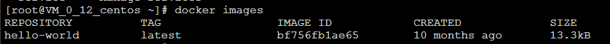

author: LeeMJ


# 1.Docker三要素

```
1.镜像
	Docker镜像(Image)就是一个只读的模板。镜像可以用来创建Docker容器，一个镜像可以创建很多容器。
	
2.容器
	Docker利用容器(Container)独立运行一个或一组应用。容器是用镜像创建的实例。
	它可以被启动，开始，停止，删除。每个容器都是相互隔离的。

3.仓库
	仓库是集中存放镜像文件的场所。
	仓库分为公开仓库和私有仓库。最大的公开仓库是Docker Hub(https://hub.docker.com)
```

# 2.Docker安装

```bash
参照文档 https://docs.docker.com/engine/install/
根据自己的系统选则安装步骤。
以CentOS7.*为例，步骤如下:
1.$ sudo yum remove docker \
                  docker-client \
                  docker-client-latest \
                  docker-common \
                  docker-latest \
                  docker-latest-logrotate \
                  docker-logrotate \
                  docker-engine

2.$ sudo yum install -y yum-utils

3.$ sudo yum-config-manager \
    --add-repo \
    https://download.docker.com/linux/centos/docker-ce.repo
    
4.$ sudo yum install docker-ce docker-ce-cli containerd.io

5.$ yum list docker-ce --showduplicates | sort -r ##查看可选则的docker引擎版本

6.$ sudo yum install docker-ce-<VERSION_STRING> docker-ce-cli-<VERSION_STRING> 			  containerd.io 
## <VERSION_STRING>为上一步中的版本号,例如我选则19.03.9这一版本,那么我的命令为:
## $ sudo yum install docker-ce-19.03.9 docker-ce-cli-19.03.9 containerd.io 
```

```bash
7.安装完成后,启动docker: 
	$ sudo systemctl start docker

8.用hello-world镜像验证: 
	首先要拉取hello-world镜像,国外的docker仓库访问慢,所以最好配置阿里云镜像加速.
	1)登录 https://promotion.aliyun.com/ntms/act/kubernetes.html
	2)点击"镜像搜索"
	3)点击左侧菜单栏"镜像加速器",按照文档进行配置
	运行 docker run hello-world
	如果出现 Hello from Docker!
This message shows that your installation appears to be working correctly.
	就是成功安装了。
```

# 3.Docker命令

## 3.1基础命令

```bash
查看docker版本: docker version
```

```
查看docker详细信息: docker info
```

```
帮助: docker --help
```

```
命令文档:https://docs.docker.com/engine/reference
```


## 3.2镜像命令

```
列出本地镜像: docker images
```


```
其中:
REPOSITORY  --镜像的仓库源;
TAG			--镜像的标签(版本号);
IMAGE ID	--镜像ID;
CREATED		--创建时间;
SIZE		--镜像大小;
```

```
docker images [options]
其中options的选项:
	-a: 列出本地所有镜像(含中间镜像层);
	-q: 只显示本地镜像ID;
	--digests : 显示镜像的摘要信息;
	--no-trunc : 显示完整信息;
```

```
查找镜像: docker search [options] 镜像名称
--filter=条件   			用来筛选 ;
--limit 				 限制条数;
--no-trunc 				 显示详细信息(不截取长字段);
--format "指定格式"		   按指定格式显示搜索结果;
--stars					 显示不少于指定值条结果;

例: 搜索AUTOMATED的的tomcat镜像的完整信息，并且星数不少于10
docker search --filter=stars=10 --filter=is-AUTOMATED=true --no-trunc tomcat

例: 搜索tomcat镜像，只显示5条结果
docker search --limit 5 tomcat

format: 用指定模板格式自定义格式显示搜索结果
其中
镜像名称 :   .Name
镜像描述 :   .Description
星数    :	   .StarCount
officail是ok: .IsOfficial
automated是ok: .IsAutomated
例： docker search --format "{{.Name}} : {{.StarCount}}" nginx
```

```
下载镜像:
docker pull 镜像名称:版本号
若直接docker pull 镜像名称，则默认拉取latest
```

```
删除镜像:
docker rmi 镜像名称:tag
	若不加tag,就删除latest,若该镜像在本地只有一个,可不加;
docker rmi imageID 也可以
若要删除一个正运行着容器的镜像,用 -f
	docker rmi -f 容器id

```

## 3.3容器命令

```bash
新建并启动容器:
docker run [OPTIONS] IMAGE [COMMAND] [ARG...]
常用: docker run -p 宿主机端口号:容器端口号 镜像名称

例如: docker run -p 80:8080 tomcat
	成功启动后访问宿主机80端口,如下图所示:![3.1.1]
```


```
查看容器:
docker ps [OPTIONS]
	若没有参数,则列出所有正在运行着的容器.
	-a :列出所有容器(不仅仅是正在运行的)
	-l :列出最近一个被创建的容器.
	-n num :列出最近num个被创建的容器.
```

```
退出容器:
	docker stop 正常关闭正在运行的容器;
	docker kill 直接kill正在运行的容器;
	docker rm 容器(若容器正在运行中,则要强制-f);
```

```
查看容器:
	查看容器细节: docker inspect 容器id;
	登录一个正在运行的容器: docker attach 容器id,
		或者 docker exec -it 容器id /bin/bash
		例如登录到一个正在运行者的centos容器(以命令行方式);
```

```
复制容器内文件到宿主机:
	docker cp 容器id:容器类文件路径 宿主机路径
```

```
commit:
	有时候对一个容器进行了更改，例如修改了一个tomcat容器里的配置文件,下次还要用这个改后的配置，那么就可以这个改动创建一个新的镜像，以便下次使用。
	docker commit -m="说明" -a="作者" 容器id 新镜像名称

```

## 3.4其他命令

```bash
查看日志: docker logs

[root@VM_0_12_centos ~]# docker logs --help

Usage:  docker logs [OPTIONS] CONTAINER

Fetch the logs of a container

Options:
      --details        Show extra details provided to logs
  -f, --follow         Follow log output
      --since string   Show logs since timestamp (e.g. 2013-01-02T13:23:37Z) or
                       relative (e.g. 42m for 42 minutes)
  -n, --tail string    Number of lines to show from the end of the logs (default "all")
  -t, --timestamps     Show timestamps
      --until string   Show logs before a timestamp (e.g. 2013-01-02T13:23:37Z) or
                       relative (e.g. 42m for 42 minutes)
```

```bash
查看容器中进程信息: docker top 容器id
[root@VM_0_12_centos ~]# docker top 5fc555d9e5a2
UID		PID		PPID		C		STIME		TTY		TIME		CMD
root	20236	20216		0		15:41		pts/0	00:00:00	/bin/bash
```

```

```


# 4.容器数据卷

## 4.1概念

```
docker容器产生的数据，如果不通过docker commit生成新的镜像，使得数据做为镜像的一部分保存下来，那么当容器删除后，数据就饿没有了。
为了能保存数据，就在docker中使用卷。
```
```
卷就是目录或文件，存在于一个或多个容器中，由docker挂载到容器，但不属于联合文件系统，因此能够绕过Union File System提供一些用于持续存储或共享数据的特性：
卷的设计目的就是数据的持久化，完全独立于容器的生存周期，因此Docker不会在容器删除时删除其挂载的数据卷。
特点：
	1.数据卷可在容器之间共享或重用数据
	2.卷中的更改可以直接生效
	3.数据卷的生命周期一直持续到没有容器使用它为止
```