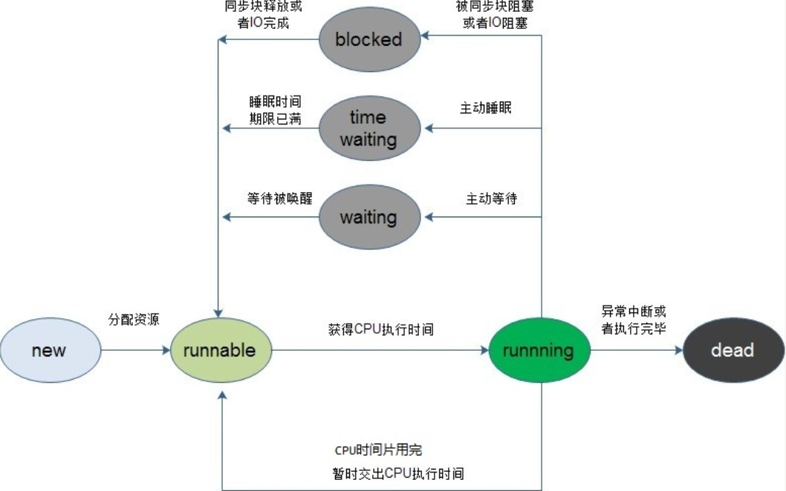

# 									Java SE

## 1 数据类型

​					分为基本数据类型：整数(byte, short, int, long)，

​													  浮点数(float, double)，

​                                                      字符(char)，

​													   布尔(boolean)。

​						    引用数据类型：类，

​											           接口，

​                                                       数组。

### 1.1 基本数据类型

​						以下为整数型

| 类型英文 | 占用空间(字节数) |     取值范围     |
| :------: | :--------------: | :--------------: |
|   byte   |        1         |  -2^7  ~  2^7-1  |
|  short   |        2         | -2^15  ~  2^15-1 |
|   int    |        4         | -2^31  ~  2^31-1 |
|   long   |        8         | -2^63  ~  2^63-1 |

​					以下为浮点型

| 类型英文 | 占用空间(字节数) |        取值范围        |
| :------: | :--------------: | :--------------------: |
|  float   |        4         | -3.403E38  ~  3.403E38 |
|  double  |        8         | -1.798E308 ~ 1.798E308 |

​					以下为字符型

| 类型英文 | 占用空间(字节数) |            取值范围             |
| :------: | :--------------: | :-----------------------------: |
|   char   |        2         | 表示一个字符，如('a', 'A','家') |

​					以下为布尔型

| 类型英文 | 占用空间(字节数) |     取值范围      |
| :------: | :--------------: | :---------------: |
| boolean  |        1         | true   /    false |


<u>注意！！！：</u>

​				<u>整数默认为 int;</u>

​				<u>浮点数默认为 double;</u>

​				<u>定义long类型的数据时，要加L或l,建议加L;</u>

​				<u>定义float类型的数据时，要加F或f,建议加F；</u>

​				<u>变量声明后未赋值，则不能使用；</u>

​				<u>变量只属于它所在的大括号；</u>


### 1.2 类型转换

#### 1.2.1 隐式转换

​				几个类型不同的变量混合运算时，往大的转，如下所示：

​				byte,short,char --->	int --->	long --->	float --->	double

#### 1.2.2 强制转换

​				用法：目标类型	变量名 =  (目标类型)	(被转换的数据);


//嗯，中间略过了很多


## 2 常用API


## 3 static

​				static: 是一个关键字，用于修饰成员变量和成员方法。

​				特点：(1)被所有对象所共享;

​							(2)可以被类名调用;

​							(3)静态的加载优先于对象，随着类的加载而加载;

​				static注意事项: 

​							静态可以调用静态；非静态可以调用静态；静态不能调用非静态;

​							静态方法中没有this ！！！


​				static优点: 对对象的共享数据提供单独空间的存储，节省空间，没必要每个对象都存储一份;可以直接被类名调用，不用再堆内存创建对象;

​				static缺点: 访问局限性(静态智能访问静态);

## 4.代码块

### 4.1局部代码块

​				存在于代码中，用来控制变量的生命周期(作用域);

### 4.2构造代码块

​				存在于类中，提取构造方法中的共性，每次创建对象都会执行，并且先于构造方法执行.

### 4.3静态代码块

​				比构造代码块前面多个了static.

​				由于是静态，所以随着类的加载而加载(只加载一次，和多少个对象没有关系)。

​				用途: 比如加载类时要做初始化，比如加载驱动。

### 4.4代码块面试题

​				代码块加载顺序: (1)首先是静态代码块，随着类的加载而执行，只执行一次，和对象的数量没关系;

​											 (2)然后如果new 对象了，就后悔执行构造代码块，每new一个对象就执行一次;

​											 (3)然后执行new 对象的无参或带参构造;


## 5.继承和抽象类

### 5.1 继承的概述

​					多个类有共同的成员变量和成员方法，抽取到另外一个类（父类）中，再让多个类去继承这个父类，这多个类就可以获取到父类中的成员了。

### 5.2 继承的特点

​					- java只支持单继承，只能继承一个父类；

​					- java支持多层继承；

### 5.3 继承中成员变量的特点

​					- 子类只能获取父类非私有成员；

   - 成员变量采用就近原则，如果子类中有，就用子类的，如果子类中没有，那就使用父类的。 

​					- 关键字super:父类的引用(用法类似于this)，可以获取父类的成员变量和成员方法。

### 5.4 继承中成员方法特点

​				- 方法的重写：再同一个类中，方法名相同，参数列表不同，与返回值无关。

​				- 方法的重写: 在子父类中，子类的方法和父类的方法完全一样。当子类重写父类方法后，子类对象调用的就是子类重写后的方法。

​				-如果子类中没有这个方法，就调用父类的。

​				- 如果子类重写了这个方法，那就调用子类重写后的方法；

### 5.5 方法重写的应用场景和注意事项

​				应用场景：当父类方法不能满足子类使用时，子类重写父类方法，并且可以在子类方法中使用super关键字来调用父类方法。

​				注意事项：- 不能重写父类私有的方法；

​								   - 子类重写后的方法的权限必须大于等于父类方法的权限；

### 5.6 继承中构造方法的执行顺序

​				有子父类继承关系的类，创建子类对象，调用子类的构造方法，如果子类构造方法的第一行代码没有调用父类的构造方法，则会默认调用父类的无参构造。

​				我们可以在子类的构造方法中使用 super(...) 来调用父类中的构造方法；

​				肯定会执行父类的构造(无参或有参)，因为先要给父类的成员变量初始化；

### 5.7 this和super的区别

​				this：当前对象的引用；

​				super：子类对象的父类引用；

### 5.8 继承的优缺点

​				优点：- 提高了代码的复用性；

​							- 提高了代码的可维护性；

​				缺点：- 类的耦合性变大了；

### 5.9 抽象类的概述

​				关键字abstract: 用于修饰方法和类。

​			   抽象方法：不同类的方法都相似，但是具体内容又不同，所以我们抽取方法的声明，而没有具体的方法体。这就是抽象方法，

​				抽象类：有抽象方法的类必须是抽象类。

​				注意：一个非抽象类继承了一个抽象类，就必须重写这个抽象类里的所有抽象方法，抽象类里可以有非抽象方法，继承抽象类后，可以不重写抽象类里的非抽象方法。

​				抽象类可以继承抽象类，子抽象类可以不重写父抽象类中的抽象方法；

### 5.10 抽象类的特点

​				- 抽象方法只能在抽象类里面；

​				- 抽象方法和抽象类必须用abstact修饰；

​				- 抽象类不能创建对象(不能实例化)；

​				- 抽象类中可以有非抽象方法；

				- 一个类继承了抽象类，那么它要么重写父抽象类中的所有抽象方法，要么它自己本身也是抽象类；

### 5.11抽象类的成员特点

​				-成员变量:

​						可以有成员变量；

​						可以有常量；

​				-成员方法：

​						可以又抽象方法或非抽象方法；

​				-构造方法：

​						可以有构造方法，对抽象类的成员变量进行初始化；

### 5.12抽象类的细节

​		

## 6.接口与多态

### 6.1接口

#### 6.11什么是接口

​				由于java是单继承的，为了处理单一继承的局限性，java提供了接口；

​				接口是一个比抽象类还抽象的类，接口里所有的方法都是抽象方法，关键字interface；

​				接口和类的关系是实现（关键字implements）；

#### 6.12接口的成员特点

​				只能有常量；

​				接口里的成员变量默认使用public static final修饰；

​				只能有抽象方法；

​				接口不能创建对象(不能实例化)；

​				一个类实现接口，必须实现接口的所有方法；

​				接口里的方法默认使用private abstract 修饰，并且只能用private abstract 修饰；

#### 6.13类与接口之间的关系

​				一个类可以实现多个接口；

​				一个接口可以继承多个接口，也可以多层继承；

#### 6.14 接口的优点

​				-打破了java中单一继承的局限性;

​				-对外提供规则；

​				-降低了程序的耦合性 （可以实现模块化开发，定好规则，每个人实现自己的模块，提高了开发效率）；

#### 6.15接口和抽象类的区别

​				共性：不断地抽取，抽取出抽象的概念；

​				区别1：一个类可以实现多个接口；一个类只能继承一个抽象类；

​				区别2：

​					

|          |               抽象类               |                             接口                             |
| -------- | :--------------------------------: | :----------------------------------------------------------: |
| 成员变量 |    可以有成员变量，也可以有常量    |                          只能有常量                          |
| 成员方法 | 可以有抽象方法，也可以有非抽象方法 | 只能有抽象方法（注：java8中变了），且方法有默认修饰符public abstract |
| 构造方法 |             有构造方法             |                         没有构造方法                         |

注意！：java8里面改了，接口里面可以有用default修饰的实体方法，也可以有用static修饰的实体方(由接口名直接调用),代码如下图所示：

```java
interface IA{
    void method1();//抽象方法

    default void method2(){
        System.out.println("可以有default修饰的实体方法");
    }

    static void method3(){
        System.out.println("可有static修饰的方法，由接口名直接调用");
    }
}

class Impl implements IA{

    @Override
    public void method1() {
        System.out.println("抽象方法必须重写");
    }

    public void method2(){
        System.out.println("接口中default修饰的方法可以被子类重写，"
                            +"也可以不重写"
                            +"若没有重写，则子类对象调用的就是接口中的方法"
                          );
    }

}
```


#### 6.16 final

​				final所修饰的类：不能被继承；

​				final所修饰的方法：不能被重写；

​				final所修饰的变量：不能被修改，是常量；


​				常量：

​							-字面值常量：1，2，3；

​							-自定义常量；

​						注意：自定义常量必须初始化，显示初始化或构造初始化；

### 6.2多态

#### 6.21多态的前提

​				-子父类继承关系(或者实现接口)；

​				-方法的重写；

​				-父类引用指向子类对象；

#### 6.21多态的成员特点

|          | 编译时 | 运行时 |
| :------: | :----: | :----: |
| 成员变量 | 看左边 | 看左边 |
| 成员方法 | 看左边 | 看右边 |
| 静态方法 | 看左边 | 看左边 |

#### 6.22多态向上和向下转型

​				向上转型：由小辈转成长辈；（多态本身就是向上转型）

​				向下转型：由长辈转成小辈；(本身是什么类型就转回成什么类型，不能转成其他类型)

#### 6.23多态优缺点

​				缺点：无法访问子类特有的成员(比如子类中有的成员在父类中没有,就没法访问调用)。

​				优点：提高可维护性（多态前提所保证的），提高代码的可扩展性。


## 7.包和修饰符

### 7.1包

​				包的特点：-可以有多层；

​								   -不同包下的文件名可以重复；

​								   -包的声明必须是第一行代码；

### 7.2 包之间的互相访问

​				-相同包下的类可以直接访问；


​		类的全名：包名.类名（例：java.util.ArrayList）。

​				-不同包下的类互相访问:

​						1)使用类的全名；

​						2)导包；

### 7.3 权限修饰符

​			用来修饰成员

|           | 当前类 | 同包不同类 | 不同包 |
| --------- | :----: | :--------: | :----: |
| public    |   ok   |     ok     |   ok   |
| default   |   ok   |     ok     |        |
| private   |   ok   |            |        |
| protected |   ok   |     ok     |        |

其中default与protected区别：

​		default:	当前包下使用；

​		protected:	让子类对象使用；


### 7.4 所有修饰符

​				所有修饰符可以修饰的范围

|           |  类  | 成员变量 | 成员方法 | 构造方法 |
| --------- | :--: | :------: | :------: | :------: |
| public    |  ok  |    ok    |    ok    |    ok    |
| default   |  ok  |    ok    |    ok    |    ok    |
| protected |      |    ok    |    ok    |    ok    |
| private   |      |    ok    |    ok    |    ok    |
| abstract  |  ok  |          |    ok    |          |
| static    |      |    ok    |    ok    |          |
| final     |  ok  |    ok    |    ok    |          |


## 8.内部类


## 9.常用API

### 9.1Object

​				toString();


​				equals();

### 9.2 System类

### 9.3 StringBuffer类和StringBuilder类

​				为了避免频繁地创建新的String而浪费内存空间（方法区常量池），可以用StringBuffer和StringBuilder来替代。

​				-StringBuffer 中的方法大都采用了 synchronized 关键字进行修饰，因此是线程安全的.

​				-而 StringBuilder 没有这个修饰，可以被认为是线程不安全的。 

​				-在单线程程序下，StringBuilder效率更快，因为它不需要加锁，不具备多线程安全

而StringBuffer则每次都需要判断锁，效率相对更低。

### 9.4Date类

### 9.5SimpleDateFormat

### 9.6Calendar类

### 9.7正则表达式


## 10.泛型与常见数据结构

### 10.1集合的体系结构

```java
                Connection接口
                      |
      ————————————————————————————————————
      |                                  |
    List接口                           Set接口
```


### 10.2迭代器

​				Collection的遍历方式（三种）:

​						- toArray(), 把集合转换成 Object 数组，然后遍历数组即可。

​						- 或者iterator(),返回一个迭代器对象，可以通过迭代器对象来迭代集合;

​						- 增强 for 循环；

### 10.3并发修改异常

​				迭代器是依赖于集合的，相当于集合的一个副本，当迭代器在操作的时候，如果发现和集合不一样，则抛出异常。

​				所以在使用迭代器进行遍历的时候，用迭代器来修改。

### 10.4泛型

### 10.5增强for循环

​				foreach: 增强for循环，一般用于遍历集合或数组

```java
for( E e : 集合或数组对象 ){
    //...
}
```

​				注意！在增强for循环中不能修改元素，否则会出现并发修改异常。

### 10.6 List

​			List的实现类，比如ArrayList和LinkedList特点：

​			-有序，能通过索引访问；

​			-元素允许重复；

​			-List的实现类，比如ArrayList和LinkedList,里面的元素是有序的，可以通过索引访问，所以遍历List的实现类，除了使用Collection的3个遍历方法外，还可以用索引循环遍历。

​			-ArrayList 基于顺序存储结构，LinkedList基于链式存储结构；


## 11.多线程

### 11.1继承Thread类

​					方法1：一个类继承Thread 类，重写run 方法，创建这个类的对象，并调用这个对象的start方法。代码如下所示:

```java
public class Demo1 {
    public static void main(String[] args) {
        Thread1 t1 = new Thread1(); //创建线程实例
        t1.start(); //启动线程
    }
}

class Thread1 extends Thread{//继承Thread
    @Override//重写run方法
    public void run() {
        System.out.println("Thread1运行");
    }
}
```

注：主方法 public static void main(String[] args) {...} 是单线程的。

### 11.2实现runnable接口

​				方法2：一个类实现 runnable 接口，实现 run 方法。然后创建该类的实例，创建 Thread 时作为一个参数来传递并启动。代码如下:

```java
public class Demo3 {
    public static void main(String[] args) {

        //创建线程实例
        MyThreadd mt = new MyThreadd();
        Thread t1 = new Thread(mt);
        t1.setName("哈哈哈");

        //启动线程
        t1.start();
    }
}

class MyThreadd implements Runnable{
    @Override
    public void run() {
        for ( int i=0; i<100; i++ ){
            System.out.println(Thread.currentThread().getName()+":"+i);
        }
    }
}
```


### 11.3同步

​				synchronized : 同步(锁)，可以修饰代码块和方法，被修饰的代码块和方法一旦被某个线程访问，则直接锁住，其他线程将无法访问。


​				同步代码块：

```java
			synchronized ( 锁对象 ){
                ...
            }
```

​				注意：-锁对象需要被所有的线程所共享。


​				同步方法: 使用关键字synchronized 修饰的方法，一旦被一个线程访问，则整个方法全部锁住，其他线程无法访问。

​				注意:   -非静态同步方法的锁对象是 this 。

​						   -静态同步方法的锁对象是 当前类的字节码对象。

### 11.4线程的生命周期

​				

## 12.Map与Set

### 12.1遍历Set

​				由于Set继承了Connection，所以 Collection的三种遍历方方法，Set也可以使用：

​						- toArray(), 把集合转换成 Object 数组，然后遍历数组即可。

​						- 或者iterator(),返回一个迭代器对象，可以通过迭代器对象来迭代集合;

​						- 增强 for 循环；

### 12.2Set的特点

​				-无序（存储和遍历得顺序可能不一样）,没有索引;

​				-不允许重复（要求元素唯一）,最多能有一个null ;

### 12.3HashSet add()方法分析

​				通过查看源码，一步步找到 HashSet   的  add 方法的具体实现。

```java
    public boolean add(E e) {
        return map.put(e, PRESENT)==null;
    }
```

```java
    public V put(K key, V value) {
        return putVal(hash(key), key, value, false, true);
    }
```

```java
    /**
     * Implements Map.put and related methods
     *
     * @param hash hash for key
     * @param key the key
     * @param value the value to put
     * @param onlyIfAbsent if true, don't change existing value
     * @param evict if false, the table is in creation mode.
     * @return previous value, or null if none
     */
    final V putVal(int hash, K key, V value, boolean onlyIfAbsent,
                   boolean evict) {
        Node<K,V>[] tab; Node<K,V> p; int n, i;
        if ((tab = table) == null || (n = tab.length) == 0)
            n = (tab = resize()).length;
        if ((p = tab[i = (n - 1) & hash]) == null)
            tab[i] = newNode(hash, key, value, null);
        else {
            Node<K,V> e; K k;
            if (p.hash == hash &&
                ((k = p.key) == key || (key != null && key.equals(k))))
                e = p;
            else if (p instanceof TreeNode)
                e = ((TreeNode<K,V>)p).putTreeVal(this, tab, hash, key, value);
            else {
                for (int binCount = 0; ; ++binCount) {
                    if ((e = p.next) == null) {
                        p.next = newNode(hash, key, value, null);
                        if (binCount >= TREEIFY_THRESHOLD - 1) // -1 for 1st
                            treeifyBin(tab, hash);
                        break;
                    }
                    if (e.hash == hash &&
                        ((k = e.key) == key || (key != null && key.equals(k))))
                        break;
                    p = e;
                }
            }
            if (e != null) { // existing mapping for key
                V oldValue = e.value;
                if (!onlyIfAbsent || oldValue == null)
                    e.value = value;
                afterNodeAccess(e);
                return oldValue;
            }
        }
        ++modCount;
        if (++size > threshold)
            resize();
        afterNodeInsertion(evict);
        return null;
    }


```

简而言之，步骤就是:

-1.先通过要添加的新元素的 hashCode()返回值计算出 hash 值；

-2.获取当前集合中已有的每一个元素，和新添加的元素比较，若重复，则返回，若不重复，则添加新元素；

那么，第2步中，如何比较元素是否重复呢？

​		-首先比较哈希值是否一样，若不一样，就是不重复；

​		-如果哈希值一样，则比较地址值或用equals()方法进行比较；

​		-若上一步的值是 true,则就是重复，不添加该新元素，若上一步值是true,则不重复，就添加该新元素；


### 12.4Collections工具类

​				Collections是一个工具类，用来操作集合。

​				相关方法见 API 文档。

### 12.5Map接口概述

​				将键映射到值的对象。一个映射不能包含重复的键；每个键最多只能映射到一个值。

### 12.6Map的keySet()和values()

```java
public class Demo5 {
    public static void main(String[] args) {
        Map<String, String> map = new HashMap<String, String>();
        map.put("001","张三");
        map.put("002","里斯");
        map.put("003","王五");

        System.out.println(map);

        Set<String> keys = map.keySet();//获取所有的key
        System.out.println(keys);

        Collection<String> values = map.values();//获取所有value
        System.out.println(values);
    }
}
```

### 12.7遍历Map的三种方法

```java
public class Demo6 {
    public static void main(String[] args) {

        Map<String,String> map = new HashMap<String,String>();
        map.put("郭靖","黄蓉");
        map.put("杨过","小龙女");
        map.put("张无忌","赵敏");


        //方式1.先获取所有的key,再通过key找value
        //获取key的集合
        Set<String> keys = map.keySet();
        //遍历key获取value
        for ( String key : keys) {
            System.out.println(key+"==="+map.get(key));
        }


        //方式2.通过values()方法获取到所有的key,但是没法获取对应的key


        //方式3.通过“结婚证”来获取key和value
        //获取结婚证对象
        Set<Map.Entry<String, String>> entries = map.entrySet();
        //遍历结婚证对象集合
        for ( Map.Entry<String,String> entry: entries) {
            System.out.println(entry.getKey()+"+++"+entry.getValue());
        }
    }
}
```


## 13 IO流

### 13.1概述

​				IO流用于把数据写到文件中或者读取文件中的数据。

### 13.2输入输出

​				输入流：把数据输入到内存中，读数据。

​				输出流：内存中数据写到文件中，写数据。

​				注：判断输入输出，以内存为参照。

### 13.3FileWriter

​				用来写入字符文件的便捷类。

```java
public class test01 {
	public static void main(String[] args) throws IOException {

		/**
		 * 1.调用系统资源创建了一个文件 （D:\\a.txt）
		 * 2.创建了以恶搞输出流对象（fw）
		 * 3.把输出流对象指向文件
		 */
		FileWriter fw = new FileWriter("d:\\a.txt");

		//调用输出流对象的写数据方法
		fw.write("IO流测试");

		/**
		 *数据其实没有直接写入文件，其实写到了内存缓冲区，
		 * 所以需要刷新缓冲区
		 */
		fw.flush();
		
		//释放资源(通知系统释放和该文件相关的资源)
		fw.close();
	}

}
```

​				flush()和close()的1区别：

​				-flush():刷新缓冲区；

​				-close():先刷新缓冲区，再通知系统释放资源，流对象就不能再使用了；


### 13.4FileWriter写数据的5种方法

​				-void write(String str):写一个字符串数据;

​				-void write(String str,int index,int len):写一个字符串中的一部分数据;

​				-void write(int ch):写一个字符数据,这里写int类型的好处是既可以写char类型的数					据，也可以写char对应的int类型的值。'a',97;

​				-void write(char[] chs):写一个字符数组数据;

​				-void write(char[] chs,int index,int len):写一个字符数组的一部分数据;

### 13.5FileReader

```java
public class Test01 {
	public static void main(String[] args) throws IOException {
		
		//创建输入流对象
		FileReader fr = new FileReader("fr.txt");
		
		//调用输入流对象的读数据方法
		
		//一次读取一个字符
//		int ch = fr.read();
//		System.out.println(ch);
//		System.out.println((char)ch);
//		
//		ch = fr.read();
//		System.out.println(ch);
//		System.out.println((char)ch);
//		
//		System.out.println(fr.read());
//		System.out.println(fr.read());
//		System.out.println(fr.read());
		
        //方式一：一次读一个字符
		//int ch;
		//while( (ch=fr.read()) != -1 ) {
		//	System.out.print((char)ch);
		//}
        
        //方式二：一次读一个字符数组
        char[] chs = new char[1024];
		int len;
		while( (len=fr.read(chs)) != -1  ) {
			System.out.print(new String(chs,0,len));	
		}
        
		
		//释放资源
		fr.close();
	}

}
```

### 13.6复制文件

```java
public class Copy {
	public static void main(String[] args) throws IOException {
		
		//创建输入流对象
		FileReader fr = new FileReader("fr.txt");
		
		//创建输出流对象
		FileWriter fw = new FileWriter("dest.java");
		
		//方式一：读写数据,一次读写一个字符
		//int ch;
		//while( (ch=fr.read()) != -1 ) {
		//	fw.write(ch);
		//}
        
        //方式二：读写数据，一次读写一个字符数组
        char[] chs = new char[1024];
        int len;
        while ( (len=fr.read(chs))!=-1 ){
            fw.write(chs,0,len);
        }
		
		//释放资源
		fw.close();
		fr.close();
	}

}
```

### 13.7缓冲流的基本使用

```java
public class BufferedStreamDemo {
    public static void main(String[] args) throws IOException {

        /*//创建输出缓冲流对象
        BufferedWriter bw = new BufferedWriter(new FileWriter("a.txt"));
        bw.write("Hello");
        bw.flush();
        bw.close();*/

        //创建输入缓冲流对象
        BufferedReader br =new BufferedReader(new FileReader("a.txt"));

        /*//一次读写一个字符
        int ch;
        while( (ch=br.read())!=-1 ){
            System.out.print((char)ch);
        }*/

        //一次读写一个字符数组
        char[] chs = new char[1024];
        int len;
        while( (len=br.read(chs))!=-1 ){
            System.out.print(new String(chs,0,len));
        }


        //释放资源
        br.close();
    }
}
```

### 13.8缓冲流复制文本的2种方式

​				-一次读写一个字符；

​				-一次读写一个字符数组；

```java
public class CopyFileDemo {
    public static void main(String[] args) throws IOException {

        //创建输入缓冲流对象
        BufferedReader br = new BufferedReader(new FileReader("a.txt"));

        //创建输出缓冲流对象
        BufferedWriter bw = new BufferedWriter(new FileWriter("a副本.txt"));

        //读写数据
        /*
        //一次读写一个字符
        int ch;
        while ( (ch=br.read())!=-1 ){
            bw.write(ch);
        }
        */


        //一次读写一个字符数组
        char[] chs = new char[1024];
        int len;
        while ( (len=br.read(chs))!=-1 ){
            bw.write(chs,0,len);
        }

        //释放资源
        bw.close();
        br.close();
    }
}
```


### 13.9缓冲流的特殊功能

​				BufferedWriter：void newLine()；写一个换行符；

​				BufferedReader：String readLine()：一次读一行数据，但是不读换行符；

```java
public class BufferedStreamDemo {
    public static void main(String[] args) throws IOException {

        BufferedWriter bw = new BufferedWriter(new FileWriter("a.txt"));
        for( int i=0; i<10; i++ ){
            bw.write("hello"+i);
//            bw.write("\r\n");
            bw.newLine();
            bw.flush();
        }
        bw.close();


        BufferedReader br = new BufferedReader(new FileReader("a.txt"));
        String line;
        while ( (line=br.readLine())!=null ){
            System.out.println(line);
        }

        br.close();
    }
}
```

### 13.10缓冲流特殊功能复制文本文件

```java
public class CopyFileDemo {
    public static void main(String[] args) throws IOException {
        //创建输入缓冲流对象
        BufferedReader br = new BufferedReader(new FileReader("a.txt"));
        //创建输出缓冲流对象
        BufferedWriter bw = new BufferedWriter(new FileWriter("a副本2.txt"));

        //读写数据，一次读写一行
        String line;
        while ( (line=br.readLine())!=null ){
            bw.write(line);
            bw.newLine();
            bw.flush();
        }

        //释放资源
        bw.close();
        br.close();
    }
}
```

### 13.11复制文本文件的5种方式

```java
/**
 * @author LeeMJ
 * @Date 2020 - 01 - 29 - 21:56
 *
 * 复制文本文件的5种方式
 * 数据源：a.txt
 * 目的地：a_dest.txt
 */
public class CopyFileTest {
    public static void main(String[] args) throws IOException{
        String src = "a.txt";
        String dest = "a_dest.txt";

        method1(src,dest);//基本流一次读写一个字符
        method2(src,dest);//基本流一次读写一个字符数组
        method3(src,dest);//缓冲流一次读写一个字符
        method4(src,dest);//缓冲流一次读写一个字符数组
        method5(src,dest);//缓冲流一次读写一个字符串
    }

    /**
     * 缓冲流一次读取一个字符串
     * @param src
     * @param dest
     * @throws IOException
     */
    public static void method5(String src,String dest) throws IOException {
        Date startDate = new Date();
        long start = startDate.getTime();
        //创建输入缓冲流对象
        BufferedReader br = new BufferedReader(new FileReader(src));
        //创建输出缓冲流对象
        BufferedWriter bw = new BufferedWriter(new FileWriter(dest));
        //一次读写一个字符串
        String line;
        while ( (line=br.readLine())!=null ){
            bw.write(line);
            bw.newLine();
            bw.flush();
        }
        //释放资源
        bw.close();
        br.close();
        Date endDate = new Date();
        long end = endDate.getTime();
        System.out.println("method5耗时(毫秒):"+(end-start));
    }

    /**
     * 缓冲流一次读写一个字符数组
     * @param src
     * @param dest
     * @throws IOException
     */
    public static void method4(String src,String dest) throws IOException {
        Date startDate = new Date();
        long start = startDate.getTime();
        //创建输入缓冲流对象
        BufferedReader br = new BufferedReader(new FileReader(src));
        //创建输出缓冲流对象
        BufferedWriter bw = new BufferedWriter(new FileWriter(dest));
        //一次读写一个字符数组
        char[] chs = new char[1024];
        int len;
        while ( (len=br.read(chs))!=-1 ){
            bw.write(chs,0,len);
        }
        //释放资源
        bw.close();
        br.close();
        Date endDate = new Date();
        long end = endDate.getTime();
        System.out.println("method4耗时(毫秒):"+(end-start));
    }

    /**
     * 缓冲流一次读写一个字符
     * @param src
     * @param dest
     * @throws IOException
     */
    public static void method3(String src,String dest) throws IOException {
        Date startDate = new Date();
        long start = startDate.getTime();
        //创建输入缓冲流对象
        BufferedReader br = new BufferedReader(new FileReader(src));
        //创建输出缓冲流对象
        BufferedWriter bw = new BufferedWriter(new FileWriter(dest));
        //一次读写一个字符
        int ch;
        while ( (ch=br.read())!=-1 ){
            bw.write((char)ch);
        }
        //释放资源
        bw.close();
        br.close();
        Date endDate = new Date();
        long end = endDate.getTime();
        System.out.println("method3耗时(毫秒):"+(end-start));
    }

    /**
     * 基本流一次读写一个字符数组
     * @param src
     * @param dest
     * @throws IOException
     */
    public static void method2(String src,String dest) throws IOException {
        Date startDate = new Date();
        long start = startDate.getTime();
        //创建输入流对象
        FileReader fr = new FileReader(src);
        //创建输出流对象
        FileWriter fw = new FileWriter(dest);
        //一次读写一个字符数组
        char[] chs = new char[1024];
        int len;
        while ( (len=fr.read(chs))!=-1 ){
            fw.write(chs,0,len);
        }
        //释放资源
        fw.close();
        fr.close();
        Date endDate = new Date();
        long end = endDate.getTime();
        System.out.println("method2耗时(毫秒):"+(end-start));
    }


    /**
     * 基本流一次读写一个字符
     * @param src
     * @param dest
     */
    public static void method1(String src,String dest) throws IOException {
        Date startDate = new Date();
        long start = startDate.getTime();
        //创建输入流对象
        FileReader fr = new FileReader(src);
        //创建输出流对象
        FileWriter fw = new FileWriter(dest);
        //一次读写一个字符
        int ch;
        while ( (ch=fr.read())!=-1 ){
            fw.write((char)ch);
        }
        //释放资源
        fw.close();
        fr.close();
        Date endDate = new Date();
        long end = endDate.getTime();
        System.out.println("method1耗时(毫秒):"+(end-start));
    }
}
```


## 14异常

### 14.1异常体系结构

​				Throwable(最顶层)

​								Error：出现的不能够处理的严重问题；

​								Exception：可以处理的问题；

### 14.2JVM处理异常的方式

​				如果出现异常我们没有处理，jvm会处理，会把异常的类型，原因和位置打印出来。并且终止程序，后面的代码将不再执行。

### 14.3处理异常的方式

​				-捕获处理；

```java
    	try {
			有可能出现问题的代码
		} catch (异常类型 e) {
			处理异常
		}
//执行顺序：
//先执行try语句，如果try里面的语句出现异常，则异常那一行后面的代码就不执行了，跳入catch语句。
//如果try里面没有异常，则走完try,不进入catch。
```


​				-抛出异常；

```java
    //当我们不想处理异常，或者没有能力处理异常，可以选择抛出异常,谁调用方法谁就处理异常。
    //使用关键字throws在方法声明处抛出异常
	public void method() throws IOException {
    	FileWriter fw = new FileWriter("a.txt");
    }
```

### 14.4处理多个异常

```java
public class Demo2 {
	public static void main(String[] args) {
		
		//可以使用一个 try 多个 catch
		try {
			String s = null;
			System.out.println(s.length());
			
			int[] arr = new int[3];
			System.out.println(arr[5]);
		} catch (NullPointerException e) {
			System.out.println("空指针异常");
		} catch (ArrayIndexOutOfBoundsException e) {
			System.out.println("数组索引越界异常");
		}catch (Exception e) {
			System.out.println("异常");
		}
		
		//多个catch之间的关系：
			//多个catch之间可以有子父类
			//平级之间没有顺序关系
		    //如果有子父类，父类异常必须放在后面
		
	}
}
```

### 14.5Thorwable

​				- String	getMessage()     获得原因;

​				- String	toString()			获得类型和原因；

​				- void	printStackTrace() 打印类型和原因和异常代码位置；

### 14.6finally

​				finally的代码一定会执行；

```java
public static void main(String[] args) {
    try {

    } catch (Exception e) {
        // TODO: handle exception
    } finally {
        //finaly里的代码一定会执行，无论try里面有没有出现异常
    }
}
```

### 14.7异常的分类

​				-运行时期异常：RuntimeException的子类，再编译时期可以选择处理或不处理；

​				-编译时期异常：是Exception的子类，并且非RuntimeException得子类，再编译时期必须处理.

​				注：RuntimeException是Exception得子类；

### 14.8自定义异常

```java
/**
 * thorw 制造异常，并结束方法;
 * 注意：如果throw的是编译时期异常，必须在方法声明出抛出(throws);
 * 
 * 如何自定义一个异常类:
 * 		只要写一个类去继承Exception或RuntimeException,然后实现多个构造
 * @author Leemi
 *
 */
public class Demo5 {
	public static void main(String[] args) {
		try {
			check(900);
		} catch (Exception e) {
			e.printStackTrace();
		}
	}
	
	public static void check(int score) throws Exception {
		if( score<0 || score>100 ) {
			throw new MyException("成绩范围不对");
		}
		System.out.println("分数正常");
	}
}

/**
 * 自定义异常类
 * @author Leemi
 *
 */
class MyException extends RuntimeException{

	public MyException() {
		super();
	}

	public MyException(String message) {
		super(message);
	}
	
}

```


## 15IO流高级

### 15.1 File类

​				文件和目录路径名的抽象表示形式，一个File对象指向一个文件或一个目录。 

​				File类常用功能：

```java
/**
 * File类创建和删除功能
 *  boolean createNewFile():指定路径不存在该文件时时创建文件,返回true,否则返回false
 *  boolean mkdir():当指定的单级文件夹不存在时创建文件夹并返回true，否则返回false  
 *	boolean mkdirs():当指定的多级文件夹某一级文件夹不存在时,创建多级文件夹并返回true,否则返回false
 *	boolean delete():删除文件或者删除单级文件夹
 */

/**
 * File类的判断功能
 *	boolean exists():判断指定路径的文件或文件夹是否存在
 *	boolean isAbsolute():判断当前路路径是否是绝对路径
 *	boolean isDirectory():判断当前的目录是否存在
 *	boolean isFile():判断当前路径是否是一个文件
 *	boolean isHidden():判断当前路径是否是隐藏文件
 */

/**
 * File类的获取功能和修改名字功能
 *	  File getAbsoluteFile():获取文件的绝对路径,返回File对象
 *	  String getAbsolutePath():获取文件的绝对路径,返回路径的字符串
 *	  String getParent():获取当前路径的父级路径,以字符串形式返回该父级路径
 *	  File getParentFile():获取当前路径的父级路径,以字File对象形式返回该父级路径
 *	  String getName():获取文件或文件夹的名称
 *	  String getPath():获取File对象中封装的路径
 *	  long lastModified():以毫秒值返回最后修改时间
 *	  long length():返回文件的字节数
 *	  boolean renameTo(File dest): 将当前File对象所指向的路径 修改为 指定File所指向的路径
 */
		
/**
 * File类的其它获取功能
 *	String[] list():以字符串数组的形式返回当前路径下所有的文件和文件夹的名称
 *	File[] listFiles():以File对象的形式返回当前路径下所有的文件和文件夹的名称
 *	static File[] listRoots():获取计算机中所有的盘符
 */
```

```java
public class Demo2 {
	public static void main(String[] args) {
		File f = new File("src");
		method(f);
		
		File f2 = new File("D:\\deleteTest");
		method2(f2);
	}
	
	/**
	 * 输出指定目录下所有的java文件(包含子目录)
	 * @param file
	 */
	public static void method(File file) {
		if( file.isDirectory() ) {
			File[] files = file.listFiles();
			for( File f : files) {
				//判断是否是文件对象
				if( f.isFile() ) {
					if( f.getName().endsWith(".java") ) {
						System.out.println(f.getName());
					}
				}else {
					//是一个目录对象
					method(f);
				}
			}
		}
	}
	
	
	/**
	 * 删除指定目录
	 * 注：如果要删除一个目录，则需要删除这个目录下所有的子文件和子目录
	 * @param file
	 */
	public static void method2(File file) {
		if( file.isDirectory() ) {
			//删除自己所有的子文件和子目录
			File[] files = file.listFiles();
			for( File f : files ) {
				if( f.isFile() ) {
					System.out.println(f.getName());
					f.delete();
				}else {
					method2(f);
				}
			}
			//删除自己
			System.out.println(file.getName());
			file.delete();
		}
	}
}

```

### 15.2 IO流的分类

```java
/*
 * IO流分类：
 * 			流向
 * 					输入流	读取数据	FileReader	Reader
 * 					输出流	写出数据	FileWriter	Writer
 * 			数据类型
 * 					字节流	
 * 							字节输入流		读取数据	InputStream
 * 							字节输出流		写出数据	OutputStream
 * 					字符流
 * 							字符输入流		读取数据	Reader
 * 							字符输出流		写出数据	Writer
 */
```

### 15.3使用字节流复制图片

```java
/**
 * 二进制文件只能用字节流进行复制
 * @author Leemi
 *
 */
public class Demo3 {
	public static void main(String[] args) throws IOException {
		
		//创建字节输入流对象
		FileInputStream fis = new FileInputStream("测试图片.png");
		//创建字节输出流对象
		FileOutputStream fos = new FileOutputStream("d:\\图片副本.png");
		
		//一次读写一个字符数组
		int len;
		byte[] bys = new byte[1024];
		while( (len=fis.read(bys)) != -1 ) {
			fos.write(bys,0,len);
		}
		
		//字节流不需要刷新缓冲区
		
		//释放资源
		fos.close();
		fis.close();
	}

}
```

### 15.4 标准输入输出流

### 15.6 打印流

### 15.7对象操作流

### 15.8 Serializable接口

### 15.9 Properties

```java
/**
 * Properties:表示了一个持久的属性集，属性列表中每个键及其对应值都是字符串
 * @author leemj
 *
 */
public class Demo2 {
	public static void main(String[] args) {
		
		//创建属性列表对象
		Properties prop = new Properties();
		
		//添加映射关系
		prop.put("001", "张三");
		prop.put("002", "里斯");
		prop.put("003", "王武");
		
		//遍历属性对象
		Set<Object> keys = prop.keySet();
		for( Object key : keys ) {
			System.out.println( key+"==="+prop.get(key) );
		}
		
	}
}
```

```java
public class Demo3 {
	public static void main(String[] args) throws IOException {
//		method1();
//		method2();
//		method3();
	}

	private static void method3() throws IOException {
		//创建属性列表对象
		Properties prop = new Properties();
		//添加映射关系
		prop.put("杨过", "小龙女");
		prop.put("郭靖", "黄蓉");
		prop.put("令狐冲", "任盈盈");
		//创建输出流对象
		FileWriter fw = new FileWriter("e.txt");
		
		prop.store(fw, "Hello!!!");
	}

	private static void method2() throws FileNotFoundException, IOException {
		//创建属性列表对象
		Properties prop = new Properties();
		//创建一个输入流对象
		FileReader fr = new FileReader("d.txt");
		
		prop.load(fr);
		
		//释放资源
		fr.close();
		System.out.println(prop);
	}

	private static void method1() throws FileNotFoundException {
		//创建属性列表对象
		Properties prop = new Properties();
		//添加映射关系
		prop.setProperty("老大", "刘备");
		prop.setProperty("老二", "关羽");
		prop.setProperty("老三", "张飞");
		//创建打印流对象
		PrintWriter out = new PrintWriter("d.txt");
		prop.list(out);
		//释放资源
		out.close();
	}
}
```


## 16网络编程

### 16.1网络通信三要素

​				- IP地址；

​				- 端口；

​				- 传输协议（UDP，TCP）；

### 16.2 InetAddress类

### 16.3 UDP收发数据

```java
public class Demo2 {
	public static void main(String[] args) throws IOException {
		
		//创建发送端Socket对象
		DatagramSocket ds = new DatagramSocket();
		
		//创建数据并打包
		String s = " I'm coming! ";
		byte[] bys = s.getBytes();
		int length = bys.length;
		InetAddress address = InetAddress.getByName("LAPTOP-903TEHP4");//发送给自己
		int port = 8888;
		//打包
		DatagramPacket dp = new DatagramPacket(bys, length,address,port);
		
		//发送数据
		ds.send(dp);
		
		//释放资源
		ds.close();
	}
}
```

```java
public class Demo3 {
	public static void main(String[] args) throws IOException {
		
		//创建接收端对象
		DatagramSocket ds = new DatagramSocket(8888);
		
		//接收数据
		byte[] bys = new byte[1024];
		DatagramPacket dp = new DatagramPacket(bys, bys.length);
		ds.receive(dp);
		
		//解析数据
		InetAddress address = dp.getAddress();
		byte[] data = dp.getData();
		int length = dp.getLength();
		
		//输出数据
		System.out.println("发送端是："+address.getHostAddress());
		System.out.println(new String(data,0,length));
		
		
		//释放资源
		ds.close();
	}
}
```

### 16.4TCP收发数据

```java
public class Client {
	public static void main(String[] args) throws UnknownHostException, IOException {
		
		//创建发送端 Socket对象,(创建连接)
		Socket s = new Socket(InetAddress.getByName("LAPTOP-903TEHP4"),10086);
		
		//创建输出流对象
		OutputStream os = s.getOutputStream();
		
		//发送数据
		os.write("tcp coming!".getBytes());
		
		//释放资源
		os.close();
		s.close();
	}
}
```

```java
public class Server {
	public static void main(String[] args) throws IOException {
		
		//创建接收端Socket对象
		ServerSocket ss = new ServerSocket(10086);
		
		//监听 (阻塞)
		Socket s = ss.accept();
		//获取输入流对象
		InputStream is = s.getInputStream();
		
		//获取数据
		byte[] bys = new byte[1024];
		int len;
		len = is.read(bys);
		
		//输出数据
		System.out.println(new String(bys,0,len));
		
		//释放资源
		s.close();
	}
}
```


## 17 反射

### 17.1类的加载

​				当程序要使用某个类时，如果该类还未被加载到内存中，则系统会通过加载，连接，初始化三步来实现对这个类进行初始化。

​				-加载：

​					就是指将class文件读入内存，并为之创建一个Class对象。

​					任何类被使用时系统都会建立一个Class对象。

​				-连接：

​					验证是否有正确的内部结构，并和其他类协调一致。

​					准备 负责为类的静态成员分配内存，并设置默认初始化值。

​					解析 将类的二进制数据中的符号引用替换为直接引用。

​				-初始化： 

​					就是我们以前讲过的初始化步骤。

### 17.2类的加载时机

以下的情况，会加载这个类。

a. 创建类的实例
b. 类的静态变量，或者为静态变量赋值
c. 类的静态方法
d. 使用反射方式来强制创建某个类或接口对应的java.lang.Class对象
e. 初始化某个类的子类
f. 直接使用java.exe命令来运行某个主类


### 17.3类加载器

​				-负责将.class文件加载到内在中，并为之生成对应的Class对象。

​				-虽然我们不需要关心类加载机制，但是了解这个机制我们就能更好的理解程序的运行

### 17.4类加载器组成

​				-Bootstrap ClassLoader 根类加载器:

​					也被称为引导类加载器，负责Java核心类的加载。

​					比如System,String等。在JDK中JRE的lib目录下rt.jar文件中。

​				-Extension ClassLoader 扩展类加载器：

​					负责JRE的扩展目录中jar包的加载。

​					在JDK中JRE的lib目录下ext目录。

​				-System ClassLoader 系统类加载器：

​					负责在JVM启动时加载来自java命令的class文件，以及classpath环境变量所指定的jar包和类路径。


通过这些描述就可以知道我们常用的类，都是由谁来加载完成的。

到目前为止我们已经知道把class文件加载到内存了，那么，如果我们仅仅站在这些class文件的角度，我们如何来使用这些class文件中的内容呢?

这就是我们反射要研究的内容。


### 17.5反射的概念及作用

​				JAVA反射机制是在运行状态中，对于任意一个类，都能够知道这个类的所有属性和方法；对于任意一个对象，都能够调用它的任意一个方法和属性；这种动态获取信息以及动态调用对象的方法的功能称为java语言的反射机制。

​				要想解剖一个类,必须先要获取到该类的字节码文件对象。而解剖使用的就是Class类中的方法.所以先要获取到每一个字节码文件对应的Class类型的对象。

### 17.6 class文件对象

```java
/**
 * 获取一个类的class文件对象的三种方式
 * 1.对象获取
 * 2.类名获取
 * 3.Class类的静态方法获取
 * @author Leemi
 *
 */
public class Demo1 {
	public static void main(String[] args) throws ClassNotFoundException {
		
		//1.通过该类的对象获取
		Person p = new Person();
		Class class1 = p.getClass();
		System.out.println(class1);
		
		//2.通过类名获取
		Class class2 = Person.class;
		System.out.println(class2);
		System.out.println(Double.class);
		System.out.println(String.class);
		System.out.println(ArrayList.class);
		
		//3.Class类的静态方法获取
		Class class3 = Class.forName("com.fanshe.day01.Person");//一定要写全路径
		System.out.println(class3);
		System.out.println(Class.forName("java.util.Calendar"));
	}
}
```

### 17.7反射获得构造方法

```java
public class Demo2 {
	public static void main(String[] args) throws Exception{
		Class c = Class.forName("com.fanshe.day01.Person");
		
		//获取public空参构造方法
		Constructor con =  c.getConstructor();
		System.out.println(con);
		//运行空参数构造方法
		Object obj = con.newInstance();
		System.out.println(obj);
		
		//获取public有参构造
		Constructor con2 = c.getConstructor(String.class,int.class);
		System.out.println(con2);
		//运行有参构造方法
		Object obj2 = con2.newInstance("张三",18);
		System.out.println(obj2);
	}
}
```

```java
/**
 * 反射获取构造方法并运行，有快捷方式
 * 前提：
 * 		被反射的类必须有public空参构造
 * @author Leemi
 *
 */
public class Demo3 {
	public static void main(String[] args) throws Exception {
		Class c = Class.forName("com.fanshe.day01.Person");
		Object obj = c.newInstance();
		System.out.println(obj);
	}
}
```

### 17.8反射获得私有构造方法

```java
public class Demo4 {
	public static void main(String[] args) throws Exception {
		Class c = Class.forName("com.fanshe.day01.Person");
		
		//获得所有构造方法，包括私有的
		Constructor[] cons = c.getDeclaredConstructors();
		for( Constructor con : cons ) {
			System.out.println(con);
		}
		
		//获得指定的私有构造
		Constructor con = c.getDeclaredConstructor(String.class);
		con.setAccessible(true);
		System.out.println(con.newInstance("张三"));
	}
}
```

### 17.9field获得成员变量

```java
public class Demo5 {
	public static void main(String[] args) throws Exception {
		Class c = Class.forName("com.fanshe.day01.Person");
		
		//获得所有public成员变量
		Field[] fields = c.getFields();
		for( Field f : fields ) {
			System.out.println(f);
		}
		
		//获得指定public成员变量
		Field f = c.getField("address");
		Object obj = c.newInstance();
		f.set(obj, "张江");
		System.out.println(obj);
		
		//注： 获取private成员变量参照上面
	}
}
```

### 17.10反射获取成员方法

```java
public class Demo6 {
	public static void main(String[] args) throws Exception {
		Class c = Class.forName("com.fanshe.day01.Person");
		
		//获取所有public方法，包括继承的public方法。
		Method[] methods = c.getMethods();
		for( Method m : methods ) {
			System.out.println(m);
		}
		
		System.out.println("==============");
		
		//获得指定方法
		Method m = c.getMethod("eat", String.class);
		System.out.println(m);
		m.invoke(c.newInstance(), "奥利奥");
		
		//注：获得private方法参照上面
	}
}
```

### 17.11泛型擦除

```java
/**
 * 编译后的class文件中是没有泛型约束的
 * 实用意义不大，主要考察对反射的掌握程度
 * @author Leemi
 *
 */
public class Demo7 {
	public static void main(String[] args) throws Exception {
		ArrayList<String> list = new ArrayList<String>();
		list.add("a");
		
		//获得ArrayList类的class文件对象
		Class c = list.getClass();
		//获取ArrayList.class中的add()方法
		Method m = c.getMethod("add", Object.class);
		m.invoke(list, 10);
		m.invoke(list, 10.5);
		m.invoke(list, 'x');
		
		System.out.println(list);
	}
}
```


## 18.补充

### 18.1 HashMap详解

```

```

### 18.2 Java自带工具

```
jps
```

```
jstack
```

```
jconsole
```

```
jstat
```

### 18.3 Object类

```java
public native int hashCode();

返回一个对象的哈希值.
```

```java
public final native Class<?> getClass()

获得类对象,反射中使用
```

```java
public boolean equals(Object obj) {
        return (this == obj);
}

判断内存中的位置是否相同
此方法经常被重写，例如String类
```

```java
protected native Object clone() throws CloneNotSupportedException;

首先是浅拷贝和深拷贝的区别;

Object类里的clone方法是浅拷贝;

浅拷贝是指拷贝对象时仅仅拷贝对象本身（包括对象中的基本变量），而不拷贝对象包含的引用指向的对象。深拷贝不仅拷贝对象本身，而且拷贝对象包含的引用指向的所有对象。通过clone方法复制对象时，若不对clone()方法进行改写，则调用此方法得到的对象为浅拷贝。

```

```java
public String toString() {
    return getClass().getName() + "@" + Integer.toHexString(hashCode());
}

改方法用于返回一个对象的字符串表示.
```

```java
public final native void wait(long timeout) throws InterruptedException;

wait的作用是让当前线程进入等待状态，同时，wait()方法也会让当前线程释放它持有的锁，直到其他线程调用此对象的notify()或notifyAll()方法，当前线程就被唤醒。
```

```java
public final native void notify();

notify方法只唤醒一个等待（对象的）线程并使该线程开始执行。所以如果有多个线程等待一个对象，这个方法只会唤醒其中一个线程，选择哪个线程取决于操作系统对多线程管理的实现
```

```java
public final native void notifyAll();

notifyAll 会唤醒所有等待(对象的)线程，尽管哪一个线程将会第一个处理取决于操作系统的实现。如果当前情况下有多个线程需要被唤醒，推荐使用notifyAll 方法。比如在生产者-消费者里面的使用，每次都需要唤醒所有的消费者或是生产者，以判断程序是否可以继续往下执行。
```

```java
wait()和sleep的区别：

sleep
让当前线程休眠指定时间。
休眠时间的准确性依赖于系统时钟和CPU调度机制。
不释放已获取的锁资源，如果sleep方法在同步上下文中调用，那么其他线程是无法进入到当前同步块或者同步方法中的。
可通过调用interrupt()方法来唤醒休眠线程。
    
wait
让当前线程进入等待状态，当别的其他线程调用notify()或者notifyAll()方法时，当前线程进入就绪状态
wait方法必须在同步上下文中调用，例如：同步方法块或者同步方法中，这也就意味着如果你想要调用wait方法，前提是必须获取对象上的锁资源
当wait方法调用时，当前线程将会释放已获取的对象锁资源，并进入等待队列，其他线程就可以尝试获取对象上的锁资源。
```


|            | wait                                                         | sleep                                             |
| ---------- | ------------------------------------------------------------ | ------------------------------------------------- |
| 同步       | 只能在同步上下文中调用wait方法，否则或抛出IllegalMonitorStateException异常 | 不需要在同步方法或同步块中调用                    |
| 作用对象   | wait方法定义在Object类中，作用于对象本身                     | sleep方法定义在java.lang.Thread中，作用于当前线程 |
| 释放锁资源 | 是                                                           | 否                                                |
| 唤醒条件   | 其他线程调用对象的notify()或者notifyAll()方法                | 超时或者调用interrupt()方法体                     |
| 方法属性   | wait是实例方法                                               | sleep是静态方法                                   |

### 18.4 Thread类

```
摘自: https://www.cnblogs.com/albertrui/p/8391447.html
```

```
	在正式学习Thread类中的具体方法之前，我们先来了解一下线程有哪些状态，这个将会有助于后面对Thread类中的方法的理解。

　　线程从创建到最终的消亡，要经历若干个状态。一般来说，线程包括以下这几个状态：创建(new)、就绪(runnable)、运行(running)、阻塞(blocked)、time waiting、waiting、消亡（dead）。

　　当需要新起一个线程来执行某个子任务时，就创建了一个线程。但是线程创建之后，不会立即进入就绪状态，因为线程的运行需要一些条件（比如内存资源，譬如程序计数器、Java栈、本地方法栈都是线程私有的，所以需要为线程分配一定的内存空间），只有线程运行需要的所有条件满足了，才进入就绪状态。

　　当线程进入就绪状态后，不代表立刻就能获取CPU执行时间，也许此时CPU正在执行其他的事情，因此它要等待。当得到CPU执行时间之后，线程便真正进入运行状态。

　　线程在运行状态过程中，可能有多个原因导致当前线程不继续运行下去，比如用户主动让线程睡眠（睡眠一定的时间之后再重新执行）、用户主动让线程等待，或者被同步块给阻塞，此时就对应着多个状态：time waiting（睡眠或等待一定的事件）、waiting（等待被唤醒）、blocked（阻塞）。

　　当由于突然中断或者子任务执行完毕，线程就会被消亡。

　　下面这副图描述了线程从创建到消亡之间的状态：
```



```
start()方法：
start()用来启动一个线程，当调用start方法后，系统才会开启一个新的线程来执行用户定义的子任务，在这个过程中，会为相应的线程分配需要的资源。
```

```
run()方法：
run()方法是不需要用户来调用的，当通过start方法启动一个线程之后，当线程获得了CPU执行时间，便进入run方法体去执行具体的任务。注意，继承Thread类必须重写run方法，在run方法中定义具体要执行的任务。
```

```
sleep(...)方法：
sleep相当于让线程睡眠，交出CPU，让CPU去执行其他的任务。
　　如果需要让当前正在执行的线程暂停一段时间，并进入阻塞状态，则可以通过调用Thread类的静态sleep()方法来实现。
　　当当前线程调用sleep()方法进入阻塞状态后，在其睡眠时间内，该线程不会获得执行机会，即使系统中没有其他可执行线程，处于sleep()中的线程也不会执行，因此sleep()方法常用来暂停程序的执行
　　但是有一点要非常注意，sleep方法不会释放锁，也就是说如果当前线程持有对某个对象的锁，则即使调用sleep方法，其他线程也无法访问这个对象。
```

```
yield()方法：
yield()方法和sleep()方法有点相似，它也是Thread类提供的一个静态方法，它也可以让当前正在执行的线程暂停，但它不会阻塞该线程，它只是将该线程转入到就绪状态。即让当前线程暂停一下，让系统的线程调度器重新调度一次，完全可能的情况是：当某个线程调用了yield()方法暂停之后，线程调度器又将其调度出来重新执行。
　　调用yield方法会让当前线程交出CPU权限，让CPU去执行其他的线程。它跟sleep方法类似，同样不会释放锁。但是yield不能控制具体的交出CPU的时间，另外，当某个线程调用了yield()方法之后，只有优先级与当前线程相同或者比当前线程更高的处于就绪状态的线程才会获得执行机会。
　　注意，调用yield方法并不会让线程进入阻塞状态，而是让线程重回就绪状态，它只需要等待重新获取CPU执行时间，这一点是和sleep方法不一样的。
```

```java
join()方法：
假如在main线程中，调用thread.join方法，则main方法会等待thread线程执行完毕或者等待一定的时间。
如果调用的是无参join方法，则等待thread执行完毕，如果调用的是指定了时间参数的join方法，则等待指定的时间。

public class Demo1 {
	public static void main(String[] args) throws IOException {
		System.out.println("进入线程" + Thread.currentThread().getName());
		Demo1 test = new Demo1();
		MyThread thread1 = test.new MyThread();
		thread1.start();
		try {
			System.out.println("线程" + Thread.currentThread().getName() + "等待");
			thread1.join();
			System.out.println("线程" + Thread.currentThread().getName() + "继续执行");
		} catch (InterruptedException e) {
			// TODO Auto-generated catch block
			e.printStackTrace();
		}
	}

	class MyThread extends Thread {
		@Override
		public void run() {
			System.out.println("进入线程" + Thread.currentThread().getName());
			try {
				Thread.currentThread().sleep(5000);
			} catch (InterruptedException e) {
				// TODO: handle exception
			}
			System.out.println("线程" + Thread.currentThread().getName() + "执行完毕");
		}
	}
}

==========================控制台输出如下==========================
线程main等待
进入线程Thread-0
线程Thread-0执行完毕
线程main继续执行
====================================================   
    
可以看出，当调用thread1.join()方法后，main线程会进入等待，然后等待thread1执行完之后再继续执行。
```

```java
interrupt():
interrupt，顾名思义，即中断的意思。单独调用interrupt方法可以使得处于阻塞状态的线程抛出一个异常，也就说，它可以用来中断一个正处于阻塞状态的线程；另外，通过interrupt方法和isInterrupted()方法来停止正在运行的线程。
    
public class Demo2 {
	public static void main(String[] args) throws IOException {
		Demo2 test = new Demo2();
		MyThread thread = test.new MyThread();
		thread.start();
		try {
			Thread.currentThread().sleep(2000);
		} catch (InterruptedException e) {

		}
		thread.interrupt();
	}

	class MyThread extends Thread {
		@Override
		public void run() {
			try {
				System.out.println("进入睡眠状态");
				Thread.currentThread().sleep(10000);
				System.out.println("睡眠完毕");
			} catch (InterruptedException e) {
				System.out.println("得到中断异常");
			}
			System.out.println("run方法执行完毕");
		}
	}
}

==========================控制台输出如下==========================
进入睡眠状态
得到中断异常
run方法执行完毕
====================================================   
    
从这里可以看出，通过interrupt方法可以中断处于阻塞状态的线程。那么能不能中断处于非阻塞状态的线程呢？看下面这个例子：

public class Demo3 {
	public static void main(String[] args) throws IOException {
		Demo3 test = new Demo3();
		MyThread thread = test.new MyThread();
		thread.start();
		try {
			Thread.currentThread().sleep(2000);
		} catch (InterruptedException e) {

		}
		thread.interrupt();
	}

	class MyThread extends Thread {
		@Override
		public void run() {
			int i = 1;
			while (i < Integer.MAX_VALUE) {
				System.out.println(i + " while循环");
				i++;
			}
		}
	}
	
}

运行该程序会发现，while循环会一直运行直到变量i的值超出Integer.MAX_VALUE。所以说直接调用interrupt方法不能中断正在运行中的线程。
```

```
interrupted方法：
interrupted()函数是Thread静态方法，用来检测当前线程的interrupt状态，检测完成后，状态清空。通过下面的interrupted源码我们能够知道，此方法首先调用isInterrupted方法，而isInterrupted方法是一个重载的native方法private native boolean isInterrupted(boolean ClearInterrupted) 通过方法的注释能够知道，用来测试线程是否已经中断，参数用来决定是否重置中断标志。
```


### 18.5 ThreadLocal

```
从Java官方文档中描述:
	ThreadLocal类用来提供线程内部的局部变量。这种变量在多线程环境下访问时能保证各个线程的变量相对独立于其他线程内的变量。ThreadLocal实例通常来说都是private static类型的，用于关联线程和线程上下文。
	我们可以得知ThreadLocal的作用是:提供线程内的局部变量，不同线程之间不会互相干扰，这种变量在线程的生命周期内起作用，减少同一个线程内多个函数或组件之间一些公共变量传递的复杂度。
```

```java
/**
 * ThreadLocal: 
 * 		set(): 将变量绑定到当前线程中。
 * 		get(): 获取当前线程绑定的变量。
 *
 */
public class Demo1 {
	
	ThreadLocal<String> t1 = new ThreadLocal<>();
	
	private String content;

	public String getContent() {
//		return content;
		return t1.get();
	}

	public void setContent(String content) {
//		this.content = content;
		//变量绑定到当前线程
		t1.set(content);
	}
	
	public static void main(String[] args) {
		Demo1 demo1 = new Demo1();
		for( int i=0; i<5; i++ ) {
			Thread t = new Thread( new Runnable() {
				@Override
				public void run() {
					demo1.setContent(Thread.currentThread().getName()+"的数据");
					System.out.println("=================");
					System.out.println(Thread.currentThread().getName()+"====>"+demo1.getContent());
				}
			} );
			
			t.setName("线程"+i);
			t.start();
		}
	}
}
```

```
ThreadLocal类与synchronized区别:
```

|        |                         synchronized                         |                         ThreadLocal                          |
| :----: | :----------------------------------------------------------: | :----------------------------------------------------------: |
|  原理  | 同步机制采用"以时间换空间的方式"，只提供了一份变量，让不同的线程排队访问。 | 采用“以空间换时间”的方式，为每一个线程都提供了一份变量的副本，从而实现同时访问而互不干扰。 |
| 侧重点 |                 使多线程之间访问资源的同步。                 |            多线程中让每个线程之间的数据相互隔离。            |

```
应用场景:
```

```java

```

```
ThreadLocal的优势:
1.传递数据:保存每个线程绑定的数据，在需要的地方可以直接获取，避免参数直接传递带来的代码耦合问题.
2.线程隔离:各线程之间的数据相互隔离却又具有并发性，避免同步方式带来的性能损失.
```

```
ThreadLocal内部结构:

jdk8之前,每个ThreadLocal都创建一个map,线程做为这个map的key,要存储的局部变量做为value。

jdk8开始,每个Thread维护一个ThreadLocalMap,这个map的key是ThreadLocal实例本身,value才是要真正要存储值的Object.
具体过程是这样的:
1).每一个Thread线程内部都有一个map，就是ThreadLocalMap;
2).Map里存储了ThreadLocal对象(key)和线程变量副本(value);
3).ThreadLocal内部的map是由ThreadLocal维护的,由ThreadLocal负责向map获取和设置线程的变量值.
4).对于不同的线程，每次获取副本时，别的线程并不能获取到当前线程的副本值,形成了副本的隔离,互不干扰.

新旧方案对比:
1).jdk8开始，每个map存储的entry变少。jdk8之前，每个map的key是各个线程，有多少个线程就有多少个entry。jdk8开始，每个map的key是threadLoacl对象。一般而言,threadLocal对象远少于线程数。
2).jdk8开始，当Thread销毁的时候，ThreadLocalMap随之销毁，减少内存的使用。

```


### 18.6 Java8新特性

```
lambda表达式:

lambda表达式是一个匿名函数，我们可以把它理解为是一段可传递的代码。可以写出更简洁灵活的代码。
```

```java
/**
 * lambda表达式：
 * 		java8中引入了一个新的操作符 "->",
 * 		该符号称为箭头操作符或lambda操作符，
 * 		箭头操作符将lambda表达式拆分为两部分
 * 	左侧:lambda表达式的参数列表;
 *  右侧:lambda体;
 *  	
 *  lambda表达式需要函数式接口
 *  	若接口中只有一个抽象方法,
 *  	那么就称之为函数式接口。
 *      可以使用注解@FunctionalInterface修饰,
 *      @FunctionalInterface修饰的接口必须有且只能有一个抽象方法
 */
public class Demo2 {

	/**
	 * 语法格式1: 无参数，无返回值
	 * 		() -> System.out.println("Hello");
	 */
	@Test
	public void test1() {
		Runnable r1 = new Runnable() {
			@Override
			public void run() {
				System.out.println("Hello1");
			}
		};
		
		Runnable r2 = ()-> System.out.println("Hello2");
		r1.run();
		r2.run();
	}
	
	/**
	 * 语法格式2：有一个参数，无返回值
	 * 		(x) -> System.out.println(x);
	 * 		若只有一个参数，小括号可以不写
	 */
	@Test
	public void test2() {
//		Consumer<String> con = (x) -> System.out.println("test2  "+x);
		//若只有一个参数，小括号可以不写
		Consumer<String> con = x -> System.out.println("test2  "+x);
		con.accept("666");
	}
	
	/**
	 * 语法格式3:有多个参数，并且lambda体中有多条语句
	 */
	@Test
	public void test3() {
		Comparator<Integer> comp = (x,y) -> {
			System.out.println("hello");
			System.out.println("world");
			System.out.println("java");
			return Integer.compare(x, y);
		};
		
		Integer res = comp.compare(111, 222);
		System.out.println(res);
	}
	
	/**
	 * 语法格式4:有返回值，但lambda体中只有一条语句，那么return和大括号可以不写
	 */
	@Test
	public void test4() {
		Comparator<Integer> comp = (x,y) -> Integer.compare(x, y);
		Integer res = comp.compare(222, 66);
		System.out.println(res);
	}
	
	/**
	 * 语法格式6:参数的数据类型可以不写，
	 * 		       因为jvm编译器通过上下文推断出数据类型,
	 *         
	 */
}
```

```
java8四大内置核心函数式接口:

```

```java
/**
 * Java8 内置的四大核心函数式接口
 * Consumer<T> :消费型接口
 * 		void accecpt(T t)
 * 
 * Supplier<T> :供给型接口
 * 		T  get()
 * 
 * Function<T, R> :函数型接口
 * 		R  apply(T t)
 * 
 * Pridicate<T>	:断言型接口
 * 		boolean test(T t)
 */
public class Demo4 {
	
	//Consumer<T> :消费型接口
	//void accecpt(T t)
	@Test
	public void test1() {
		happy(998F, m -> System.out.println("大保健,每次 "+m+" 元") );
	}
	
	public void happy( double money, Consumer<Double> con ) {
		con.accept(money);
	}

	
	//Supplier<T> :供给型接口
	//get()
	@Test
	public void test2() {
		List<Integer> res = getNumList(10, ()->(int)(Math.random()*100));
		System.out.println(res);
	}
	
	public List<Integer> getNumList(int num, Supplier<Integer> supplier){
		List<Integer> list = new ArrayList<>();
		for( int i=0; i<num; i++ ) {
			list.add(supplier.get());
		}
		return list;
	}
	
	//Function<T, R> :函数型接口
	//  		R  apply(T t)
	@Test
	public void test3() {
		String res = handlerStr("WorLD",x->x.toLowerCase());
		System.out.println(res);
	}
	
	public String handlerStr(String str, Function<String,String> fun) {
		return fun.apply(str);
	}
	
	//Pridicate<T>	:断言型接口
	// 		boolean test(T t)
	@Test
	public void test4() {
		List<String> list = Arrays.asList("Hello","world","java");
		List<String> res = filterStr(list,x->x.length()>4);
		System.out.println(res);
	}
	
	public List<String> filterStr( List<String> list, Predicate<String> pre){
		List<String> strList = new ArrayList<>();
		for( String s : list ) {
			if(pre.test(s)) {
				strList.add(s);
			}
		}
		return strList;
	}
}
```


```
方法引用与构造器引用:
```

```java
/**
 * 一. 方法引用:
 * 		若lambda体中的内容有方法已经实现了,可以使用"方法引用"
 * 
 * 主要有3种格式:
 * 		1.对象::实例方法名
 * 		2.类名::静态方法名
 * 		3.类名::实例方法名
 *
 *
 *二. 构造器引用
 *		格式: className::new
 *
 *三. 数组引用
 *		格式: Type[]::new
 */
public class Demo1 {

	//对象::实例方法名
	@Test
	public void test1() {
		PrintStream ps = System.out;
		Consumer<String> con = x -> ps.println(x);
		//改成方法引用
		PrintStream ps1 = System.out;
		Consumer<String> con1 = ps1::println;
	}
	
	//类:静态方法名
	@Test
	public void test2() {
		Comparator<Integer> com = (x,y) -> Integer.compare(x, y);
		Comparator<Integer> com1 = Integer::compare;
	}
	
	//类:实例方法名
	@Test
	public void test3() {
		BiPredicate<String,String> bp = (x,y) -> x.equals(y);
		BiPredicate<String,String> bp1 = String::equals;
	}
	
	//构造器引用
	@Test
	public void test4() {
		Supplier<Object> sup = ()->new Object();
		Supplier<Object> sup1 = Object::new;
	}
	
	//数组引用
	@Test
	public void test5() {
		Function<Integer,String[]> fun = (x) -> new String[x];
		Function<Integer,String[]> fun1 = String[]::new;
	}

}
```


```
Stream:
```

```java
/**
 * 一. 创建Stream流的三个操作
 * 
 *   1.创建Stream
 *   
 *   2.中间操作
 *   
 *   3.终止操作
 *
 */
public class Demo1 {
	
	//创建Stream
	@Test
	public void test01() {
		//1.通过Collection
		List<String> list = new ArrayList<>();
		Stream<String> stream1 = list.stream();
		//2.通过Arrays中的静态方法 stream() 获取数组流
		Object[] arr = new Object[10];
		Stream<Object> stream2 = Arrays.stream(arr);
		//3.通过Stream中的静态方法  of()
		Stream<String> stream3 = Stream.of("AA","BB","CC");
		//4.创建无限流
		//迭代
		Stream<Integer> stream4 = Stream.iterate(0, (x)->x+2);
		stream4.limit(10)
			   .forEach(System.out::println);
		//生成
		Stream.generate(()->Math.random())
				.limit(5)
				.forEach(System.out::println);
	}
}
```


```
Optional类:
```

```java
public class Demo1 {
	
	@Test
	public void test1() {
		Optional<Student> opt = Optional.of(new Student());
//		Optional<Student> opt = Optional.of(null);
		Student stu = opt.get();
		System.out.println(stu);
	}
	
	@Test
	public void test2() {
		Optional<Object> empty = Optional.empty();
		System.out.println(empty.get());
	}
	
	@Test
	public void test3() {
		Optional<Student> opt = Optional.ofNullable(null);
		if( opt.isPresent() ) {
			System.out.println(opt.get());
		}
		Student stu = opt.orElse(new Student("张三",18));
		System.out.println(stu);
	}
	
}

```


```
接口默认方法与静态方法
```

```java
public interface IMy {
	
	//用default修饰的默认实例方法,子类可以不重写这个方法
	//若和类中的方法一样(方法名和参数列表),则类中的方法优先
	//若一个类实现了多个接口，这多个接口有相同的默认方法，则这个类必须重写这个方法
	default String getName() {
		return "哈哈哈";
	}
	
	//静态方法,直接用接口名调用
	public static void staMethod() {
		System.out.println("接口中的静态方法");
	}

}
```


```
新的时间API
```

```java
public class Demo1 {

	@Test
	public void test1() {
		LocalDateTime ldt = LocalDateTime.now();
		System.out.println(ldt);
		
		LocalDateTime ldt2 = LocalDateTime.of(2013, 9, 12, 13, 43, 23);
		System.out.println(ldt2);
		
		LocalDateTime ldt3 = ldt.plusYears(2);
		System.out.println(ldt3);
		
		LocalDateTime ldt4 = ldt.minusMonths(2);
		System.out.println(ldt4);
		
		System.out.println(ldt.getYear()+"---"+ldt.getMonth()+"---"+ldt.getMonthValue());
	}
	
	// Instant: 时间戳(1970-01-01 00:00:00 到某个时间的毫秒值)
	@Test
	public void test2() {
		Instant ins1 = Instant.now();//默认获取utc时区
		System.out.println(ins1);
		OffsetDateTime odt = ins1.atOffset(ZoneOffset.ofHours(8));
		System.out.println(odt);
	}
	
	@Test
	public void test3() throws Exception{
		Instant ins1 = Instant.now();
		Thread.sleep(2000);
		Instant ins2 = Instant.now();
		//计算两个时间之间的间隔
		Duration duration = Duration.between(ins1, ins2);
		System.out.println(duration);
		System.out.println(duration.toMillis());
	}
	
	@Test
	public void test4() {
		LocalDate ld1 = LocalDate.of(2017, 3, 21);
		LocalDate ld2 = LocalDate.now();
		//计算两个日期之间的间隔
		Period period = Period.between(ld1, ld2);
		System.out.println(period);
		System.out.println(period.getYears());
		System.out.println(period.getMonths());
		System.out.println(period.getDays());
	}
	
	@Test
	public void test5() {
		LocalDate ldt = LocalDate.now();
		System.out.println(ldt);
		
		LocalDate ldt2 = ldt.withDayOfMonth(3);
		System.out.println(ldt2);
		
		LocalDate ldt3 = ldt.with(TemporalAdjusters.next(DayOfWeek.WEDNESDAY));
		System.out.println(ldt3);
		
		//自定义，得到下一个工作日
		LocalDate nextWorkLdt = ldt.with( (l)->{
							LocalDateTime temp = (LocalDateTime) l;
							DayOfWeek dow = temp.getDayOfWeek();
							if(dow.equals(DayOfWeek.FRIDAY)) {
								return temp.plusDays(3);
							} else if(dow.equals(DayOfWeek.SATURDAY)) {
								return temp.plusDays(2);
							} else {
								return temp.plusDays(1);
							}
		} );
		System.out.println(nextWorkLdt);
	}
	
	@Test
	public void test6() {
		
	}
	
}
```


```

```

