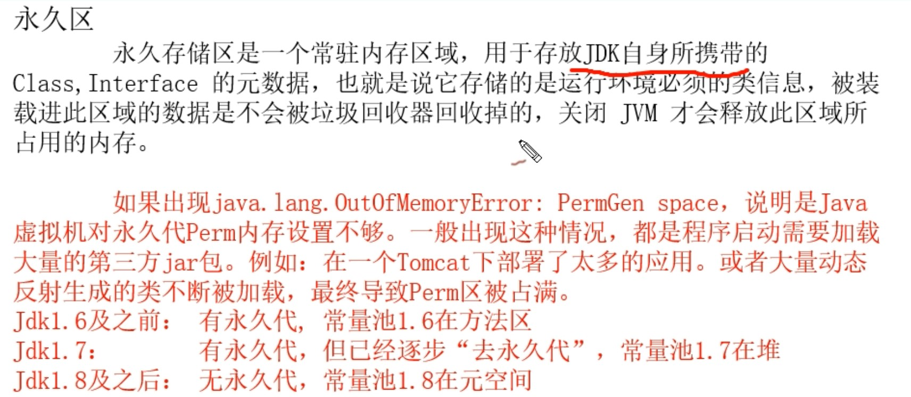
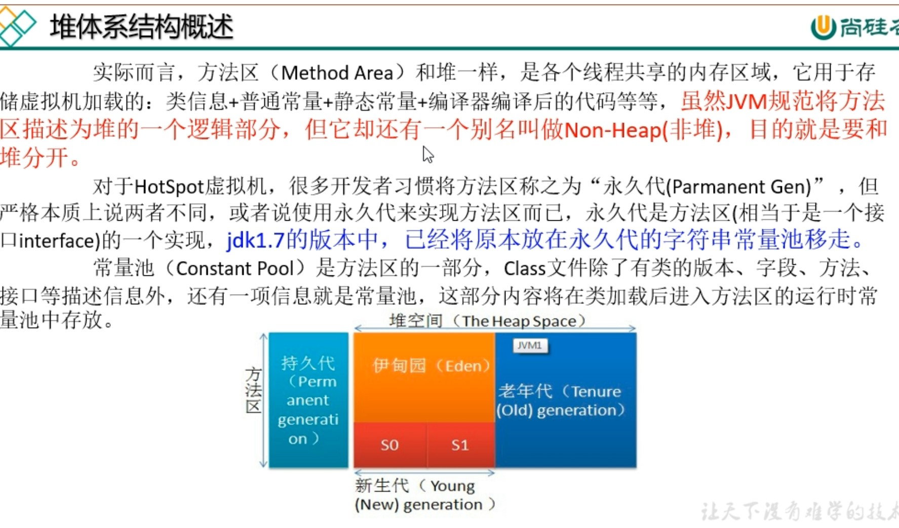

# 1.JVM体系结构概述

```

```

# 2.本地方法栈

```

```

# 3.PC寄存器

```
每个线程都有一个程序计数器，是线程私有的，就是一个指针，指向方法区中的方法字节码(用来存储指向下一条指令的地址，也即将要执行的指令代码)，由执行引擎读取下一条指令，是一个非常小的内存空间，几乎可以忽略不计。
```

# 4.方法区

```
  方法区是被所有线程共享的，所有字段和方法字节码，以及一些特殊的方法如构造函数，接口代码也在此定义。简单说，所有定义的方法的信息都保存在该区域，此区属于共享空间。
  静态变量+常量+类信息+运行时常量池存在于方法区中。
  但是实例变量存在堆内存中，和方法区无关。
```

# 5.Java Stack

```
栈也叫栈内存，主管java程序的运行，是在线程创建时创建。它的生命周期跟随线程的生命周期。线程结束，栈内存也释放，对于栈来说没有垃圾回收问题，生命周期和线程一致，是线程私有的。8种基本类型变量+引用类型的变量+实例方法都放在栈中。
```

# 6.Java Heap

```

```


```

```



```

```



```

```

# 7.堆参数调优

```

```

# 8.GC

```
minor GC : 回收新生代；
full  GC : 回收老年代；
```

```
当对象在Eden区出生后，在经过一次minor GC 后，如果对象还存活，并且能够被s1区所容纳，则使用复制算法将这些仍存活的对象复制到s1区，然后清理Eden区和s0区，并将这些对象的年龄+1，以后对象每经过一次minor GC 没死，就将年龄+1，当对象年龄达到某个值(默认是15岁)，这些对象就会成为老年代。
```

