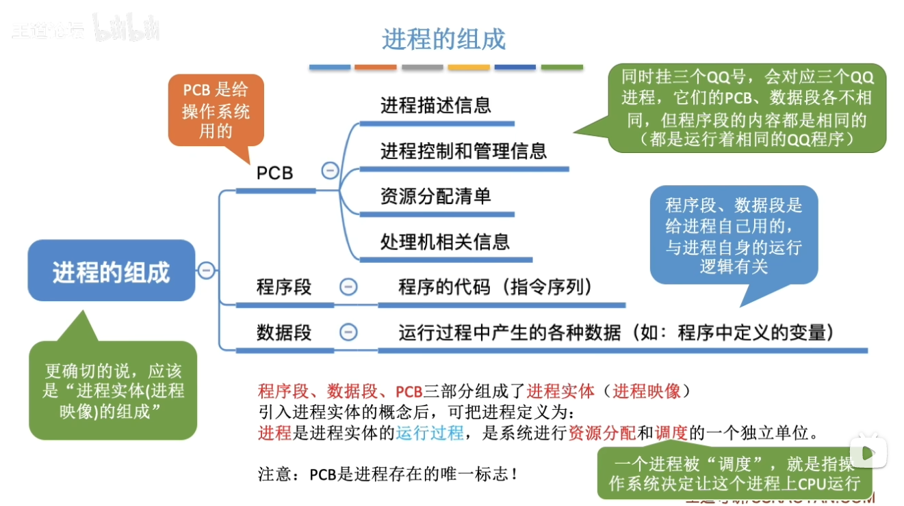
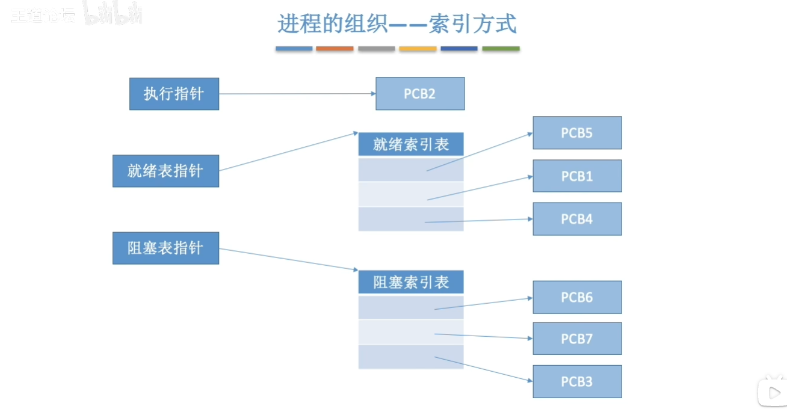
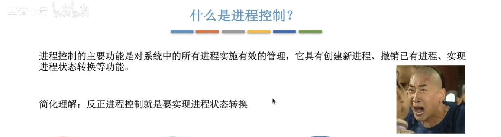
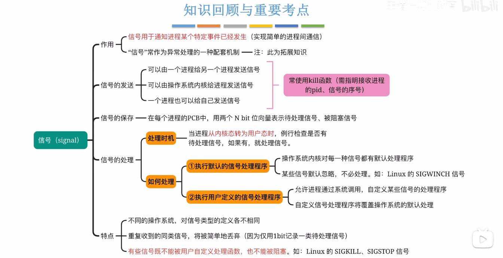
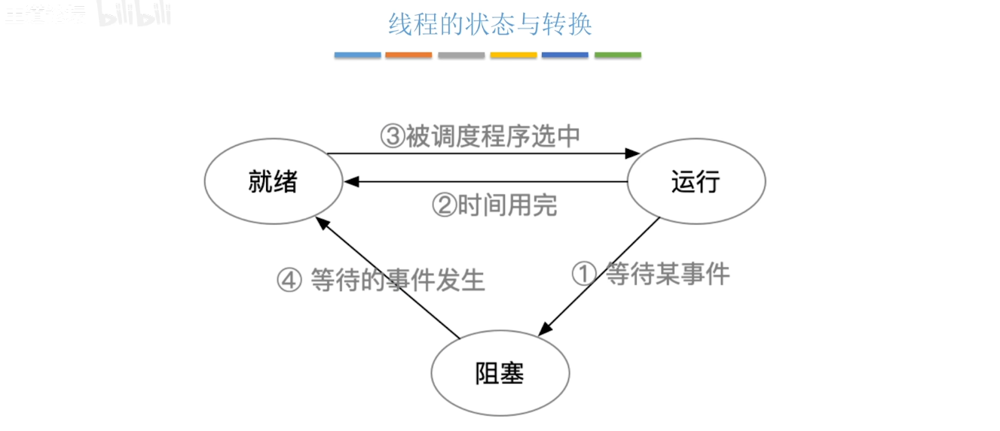
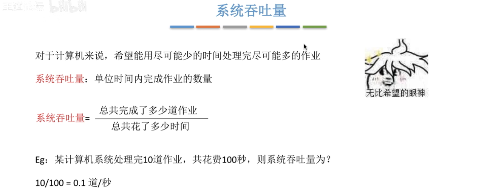

# 1.操作系统概述

### 1.1.1 操作系统概念

### 1.1.3 操作系统的特征

## 

## 1.2 操作系统的发展与分类

### 1.3.1 操作系统的运行机制

### 1.3.2 中断和异常

### 1.3.3 系统调用

## 1.4 操作系统的体系结构

## 1.5 操作系统引导

## 1.6 虚拟机

# 2.进程管理

### 2.1.1 进程的概念

### 2.1.2 进程的组成,特征

### 2.1.3 进程的状态与转换

### 2.1.4 进程控制

### 2.1.5-1 进程通信

### 2.1.5-2 信号

### 2.1.6-1 线程的概念与特点

### 2.1.6-2 线程的实现方式和多线程模型

### 2.1.6-3 线程的状态与转换

### 2.2.1 调度的概念,层次

### 2.2.2-1 进程调度的时机,切换过程和调度方式

### 2.2.2-2 调度器和闲逛进程

### 2.2.3 调度算法的评价指标

