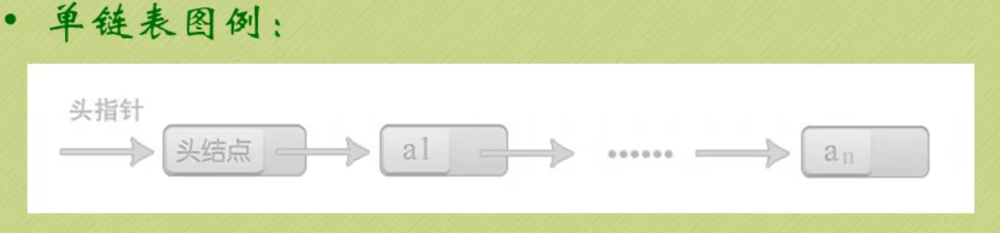
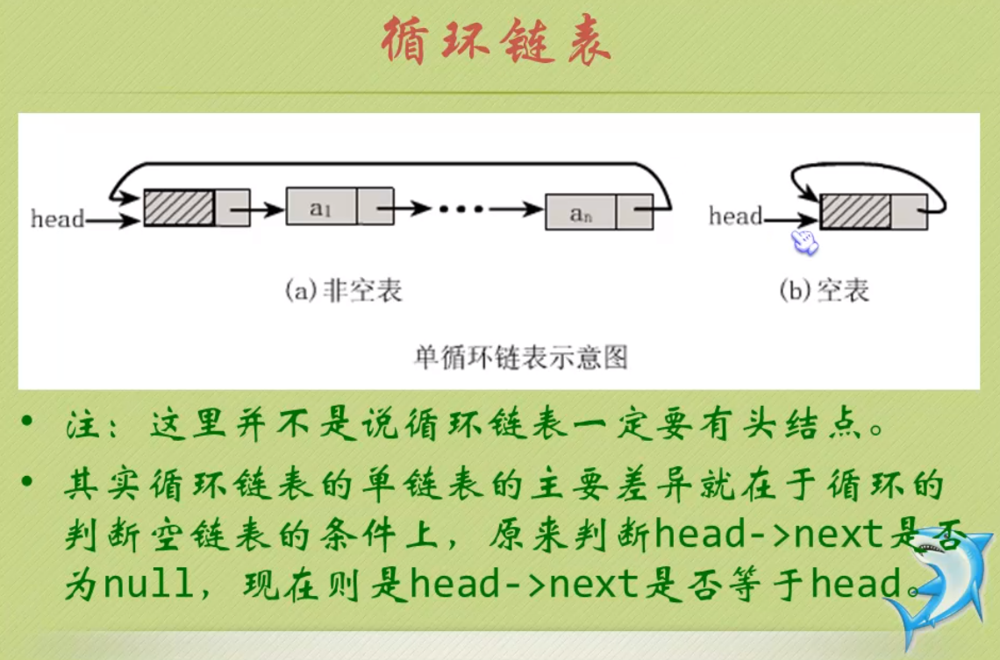
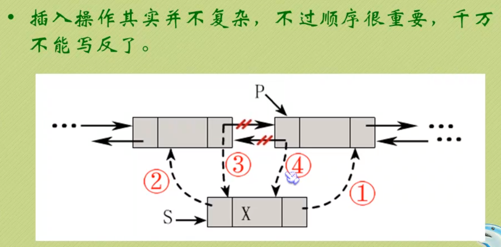
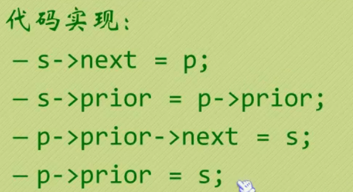
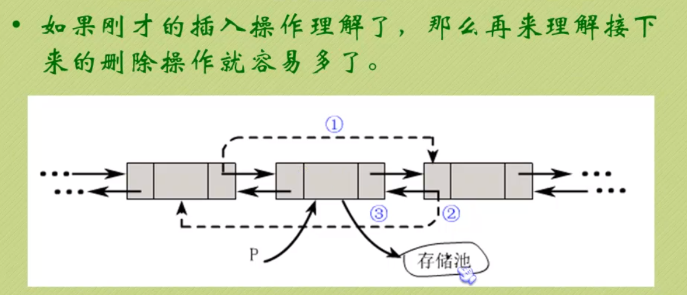
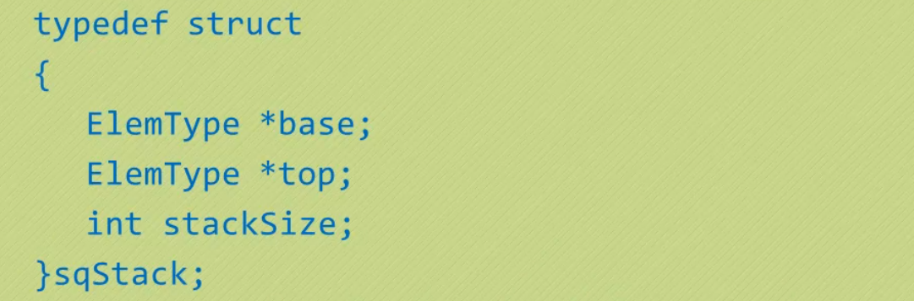

# 					数据结构与算法  笔记

## 1. 绪论

### 1.1 什么是算法

​					算法是解决特定问题求解步骤的描述，在计算机表现为指令的有限序列，并且每条指令表示一个或多个操作。

### 1.2 算法的特征

​					输入；输出；有穷性；确定性；可行性；

#### 1.2.1 输入

​					算法具有零个或多个输入。

#### 1.2.2 输出

​					算法至少有一个或多个输出。

#### 1.2.3 有穷性

​					指算法在执行有限步骤之后，自动结束。

#### 1.3.4 确定性

​					1) 算法的每一个步骤都具有确定的含义，不会出现二义性。             					2) 算法在一定的条件下，只有一条执行路径，相同的输入只能有						唯一的输出结果。                                                                            					3) 算法的每个步骤都应该被精确定义而无歧义。

#### 1.3.5 可行性

​					算法的每一步都必须是可行的，也就是说，每一步都能够通过执行有限次数完成。

## 

## 2. 复杂度

### 2.1 时间复杂度

#### 2.1.1 定义

​					在进行算法分析时，语句总的执行次数T(n) 是关于问题规模n的函数，进而分析T(n)随n的变化情况并确定T(n)的数量级。算法的时间复杂度，也就是算法的时间量度，记作T(n)=O(f(n))。它表示随问题规模n的增大，算法执行时间的增长率和f(n)的增长率相同，称作算法的渐进时间复杂度，简称为时间复杂度。其中f(n)是问题规模n的某个函数。

#### 2.2.2  各种阶

​					常数阶   O(1);	线性阶   O(n);    平方阶   O(n^2);	对数阶  O(log(n));	nlogn阶  O(nlog(n));	立方阶  O(n^3);	指数阶   O(2);

| 例子              | 时间复杂度 | 阶      |
| ----------------- | ---------- | ------- |
| 666               | O(1)       | 常数阶  |
| 3*n+4             | O(n)       | 线性阶  |
| 3**n^2+4**n+5     | O(n^2)     | 平方阶  |
| 3*log(n) +4       | O(logn)    | 对数阶  |
| 2*n+3*n*log(n)+14 | O(nlogn)   | nlogn阶 |
| n^3+2*n^2+4*n+6   | O(n^3)     | 立方阶  |
| 2^n               | O(2^n)     | 指数阶  |

O(1)	<	O(logn)	<	O(n)	<	O(nlogn)	<	O(n^2)	<	O(n^3)	<	O(2^n)	<	O(n!)	<	O(n^n)

#### 2.2.3最坏情况与评价情况

### 2.2 空间复杂度

#### 2.2.1 定义

​					算法的空间复杂度通过计算算法所需的存储空间实现，算法的空间复杂度的计算公式记作: S(n) = O(f(n)) ,其中，n为问题的规模，f(n)为语句关于n所占存储空间的函数。

## 

## 3.线性表

### 3.1 定义

​					由零个或多个数据元素组成的有限序列。

​					1)首先它是一个序列，也就是说元素之间是有先来后到的

​					2)若元素纯在多个，则第一个元素无前驱，而最后一个元素无后继，其他元素都有且只有一个前驱和后继。

​					3)另外，线性表强调元素的个数是有限的。

### 3.2 顺序存储结构

#### 3.2.1 定义

​					线性表的顺序存储结构，指的是用一段地址连续的存储单元依次存储线性表的数据元素。

#### 3.3.2 属性

​					1) 存储空间的起始位置

​					2) 线性表的最大存储容量

​					3) 线性表的当前长度

​				注意：数组的长度与线性表的当前长度需要区分以下：数组的长度是存放线性表的存储空间的总长度，一般初始化后不变。而线性表的当前长度是线性表中元素的个数，是会变化的。

#### 3.3.3 地址计算方法

​					假设e占用的是c个存储单元，那么对于第i个元素ai的存储位置可以由第一个元素a0推算得出:

​					Loc(ai) = Loc(a0) + (i - 1)*c ;

所以，对于线性表中任意一个元素的位置，计算它的地址都是相同的时间，时间存储性能为 O(1) ,我们通常称为随机存储结构。

#### 3.3.4 插入操作

​					- 如果插入位置不合理，抛出异常；

​					- 如果线性表长度大于等于数组长度，则抛出异常或动态增加数组容量；

​					- 从最后一个元素开始向前遍历到第 i 个位置，分别将它们都向后移动一个位置；

​					- 将要插入的元素填入位置 i 处；

​					- 线性表长度 +1 ;

#### 3.3.5 删除操作

​					- 如果删除位置不合理。抛出异常；

​					- 取出要删除的那个元素；

​					- 从删除元素位置开始遍历到最后一个元素，分别将它们都向前移动一个位置;

​					- 表长 - 1 ；

#### 3.3.6 插入和删除的时间复杂度

​					最好的情况: 插入和删除操作刚好在线性表的最后一个位置，因此不需要移动任何元素，所以此时的时间复杂度为 O(1) 。

​					最坏的情况: 差人和删除的位置是第一个元素，那就意味着要移动所有元素向前或向后，所以此时的时间复杂度为 O(n) 。

​					按概率统计计算得到平均情况的时间复杂度为 O( (n-1)/2 )。

​					所以，平均时间复杂度简化后还是 O(n) 。

#### 3.3.7 顺序存储结构的优缺点

​					线性表的舒徐存储结构，在存，读数据时，不管在哪个位置，时间复杂度都是 O(1) 。而在插入或删除时，时间复杂度都是 O(n)。

​					比较适合元素个数比较稳定，不经常插入和删除元素，而更多的操作是存取数据的应用。

​					1）优点:

​						   无须为表示表中元素之间的逻辑关系而增加额外的存储空间；

​						   可以快速地存取表中任意位置的元素；

​					2）缺点:

​							插入和删除造作需要移动大量元素；

​							当线性表长度变化较大时，难以确定存储空间的容量;

​							容易造成存储空间的“碎片”。

### 3.3 链式存储结构

#### 3.3.1 定义

​					链式存储结构的特点是用一组任意的存储单元存储线性表中的数据元素，这组存储单元可以存在内存中未被占用的任意位置。

​					把存储数据元素信息的域称为数据域，把存储直接后继位置的域称为指针域。指针域中存储的信息称为指针或链。这两部分信息组成数据元素称为存储映像，称为结点( Node ) 。

​					如果链表的每个节点只包含一个指针域，就称此链表为 单链表。

​					把链表中的第一个节点的存储位置叫做头指针  ，最后一个节点的指针为空(null)。

#### 3.3.2 头指针

​					1) 头指针是指链表指向第一个节点的指针，若链表有头节点，则是指向头节点的指针。

​					2) 头指针具有标识作用，所以常用头指针冠以链表的名字(指针变量的名字)。

​					3) 无论链表是否为空，头指针均不为空。

​					4) 头指针是链表的必要元素。

#### 3.3.3 头节点

​					1) 头节点是为了操作的统一和方便而设立的，放在第一个元素的节点之前，其数据域一般无意义(但也可以用来存放链表的长度)。

​					2) 有了头节点，对在第一元素节点前插入节点和删除第一节点起操作与其他节点的操作就统一了。

​					3) 头节点不一定是链表的必须要素。

单链表图例（如下图所示）:

空链表图例（如下图所示）：

#### 3.3.4 单链表的读取

​				获得链表第i个数据的算法思路：

​				-声明一个结点p指向链表的第一个结点，初始化j从1开始；	

​				-当j<i时，就遍历链表，让p的指针向后移动，不断指向下一结点，j+1;

​				-若到链表末尾p为空，则说明第i个元素不存在；

​				-若查找成功，返回结点p的数据；

​				简而言之就是：从头开始找，找到第 i 个元素为止，时间复杂度为 O(n)。

#### 3.3.5 单链表的插入

​					单链表第 i 个数据后面插入节点的算法思路:

​					1) 声明一结点p指向链表头节点，初始化j从1开始；

​					2) 当j<1时，就遍历链表，让p的指针向后移动，不断指向下一个节点，j 累加1；

​					3) 若到链表末尾p为空，则说明第 i 个元素不存在；

​					4) 否则查找成功，在系统中生成一个空节点s;

​					5) 将数据元素e 赋值给 s -> data;

​					6) 将第 i个元素的指针域的值赋值给 新节点 s 的指针域的值  ,再将第新节点s的地址值赋值给第 i 个节点的指针域额值;

#### 3.3.6 单链表的删除

​					假设元素 a 的节点为 q ,要实现删除节点q的操作，其实就是将节点q的前继节点的指针 直接指向 节点q的后继节点即可，也就是将节点q的后继节点的地址值赋值给节点q的前继节点的指针域。

​					单链表第 i 个数据删除节点的算法思路 :

​					1) 声明节点p指向链表的第一个节点，初始化 j = 1;

​					2) 当 j<1 时，就遍历链表，让p的指针向后移动，不断指向下一个节点，j 累加 1;

​					3) 若到链表末尾p为空，则说明第i 个元素不存在；

​					4) 否则查找成功，将 欲删除的而节点 p 的后一个节点的地址值赋值给 节点 p 的前一个节点的指针域；

​					5) 将q结点(被删除的结点)中的数据赋值给e,作为返回；

​					6) 释放q结点;

#### 3.3.7 单链表 vs顺序存储结构 效率PK

​					单链表无论是插入还是删除算法，其实都是由两部分构成：

​					1）遍历查找第 i 个元素;

​					2）找到后 实现插入或删除;

​					时间复杂度为 O(n);

​					如果我们不知道第 i 个元素的指针位置，单链表数据结构在插入和删除操作上，与线性表的顺序存储结构是没有太大优势的。

​					但如果，我们希望从第 i 个位置开始，插入连续 10 个元素，对于顺序存储结构意味着，梅伊西插入都需要移动 （n-1）个位置，所以每次都是 O(n);				而单链表，我们只需在第一次时，找到第 i 个位置的指针，找到它的时间复杂度为 O(n) ,接下来的插入和删除只是通过赋值移动指针而已，接下来的每次时间复杂度都是 O(1)。

​					显然，对于插入或删除数据越频繁的操作，单链表的效率优势就越明显。

#### 3.3.8 单链表的整表创建

​					单链表不像顺序存储结构那样 数据集中，单链表的数据可以是分散在内存各个角落的，它的增长也是动态的。对于每个链表来说，它所占空间的大小和位置是不需要预先分配的，可以根据系统的情况和实际的需求即时生成。

​					创建单链表的过程是一个动态生成链表的过程，从"空表"的初始状态起，以此建立各个元素结点并逐个插入链表。

​					单链表整表创建的算法思路如下：

​					1）声明一个节点 p 和计数变量 i;

​					2）初始化一个空链表 L;

​					3）让 L 的头结点的指针指向 null ,即建立一个带头结点的单链表;

​					4）循环实现后继结点的赋值和插入；

#### 3.3.9 头插法建立单链表

​					头插法从一个空表开始，生成新结点，读取数据存放到新结点的数据域中，然后将新结点插入到当前链表的表头上，依次直到插完所有数据。

​					简单来说，就是把新加入的元素放在表头后的第一个位置：先让新结点 的 next 指向头结点之后， 然后让表头的next指向新结点。

​					就是插队，始终让新结点插在队伍第一的位置。

#### 3.3.10 尾插法建立单链表

​					头插法建立链表虽然算法简单，但生成的链表中 结点的次序和输入的顺序相反。

​					！！！！！！！！！！！！！待补充！！！！！

#### 3.3.11 单链表的整表删除

​					1）声明结点 p 和 q ；

​					2）将单链表的第一个结点赋值给 p ,将下一个结点赋值给 q;

​					3）循环执行释放 p ，将 q 赋值给 p 的操作；

#### 3.3.12 单链表与顺序存储结构的 优缺点

​					分别从 存储分配方式，时间性能，空间性能三方面来做对比。

​				    存储分配方式:

​					1）顺序存储结构用一段连续的存储单元依次存储线性表的数据元素。

​					2）单链表采用链式存储结构，用一组任意的存储单元存放线性表的元素。

​					时间性能：

​					1）- 查找：

​							顺序存储结构为 O(1).

​							单链表为 O(n).

​					2）- 插入和删除

​							顺序存储结构需要平均移动表长一半的元素，时间为 O(n).

​							单链表在计算出某个位置的指针后，插入和删除的时间仅为 O(1).

​					空间性能：

​					顺序存储结构需要预分配存储空间，分大了，容易造成空间浪费，分小了，容易发生溢出。

​					单链表不需要分配存储空间，只要有就可以分配，元素个数也不受限制。

#### 3.3.13 静态链表

​					用数组描述的链表叫做静态链表，这种描述方法叫做游标实现法。

#### 3.3.14循环链表

​					定义：将单链表的终端结点的指针端由空指针改为指向头节点，就使整个单链表形成一个环，这种头尾相接的单链表成为单循环链表，简称循环链表。

#### 3.3.15 单链表面试题

​			题目：如何快速找到未知长度单链表得中间结点？

​			答案：

​			-普通方法：首先遍历一遍单链表以确定单链表的长度L。然后再次从头结点出发循环L/2次找到单链表的中间结点。算法的复杂度为：O( L+L/2 ) = O(  3L/2 )；

​			-nb方法：利用快慢指针。

​		      利用快慢指针原理：设置两个指针 *search, *mid都是指向单链表的头节点。其中 *search的移动速度是 *mid的两倍。当 *search指向末尾结点的时候，mid正好就在中间了。这也是标尺的思想。

### 3.4 循环链表

#### 3.4.1定义

​				对于单链表，由于每个结点只存储了向后的指针，到了尾部标识就停止了向后链接的操作。按照这样的方式，只能索引后继结点而不能索引前驱结点。

​				这样会带来一个问题：如果不从头结点出发，就无法访问到全部结点。

​				所以就有了循环链表：

​						将单链表终端结点的指针由空指针改为指向头结点，就使整个单链表形成一个环，这种头尾相接的单链表称为单循环链表，简称循环链表。如下图所示：

#### 3.4.2约瑟夫环问题

#### 3.4.3魔术师发牌问题

### 3.5双向链表

​				比单链表多了前驱结点，如下图所示：

#### 3.5.1双向链表的插入

#### 3.5.2双向链表的删除

## 4.栈和队列

### 4.1栈

#### 4.1.1定义

​				栈（stack）是一个后进先出（Last in first out,简称LIFO）的线性表，它要求只在表尾进行删除和插入操作。

​				所谓的栈，其实也就是一个特殊的线性表,但是它在操作上有一些特殊的要求和限制：

​					-栈的元素必须 “先进后出”；

​					-栈的操作只能在这个线性表的表尾进行；

​					-对于栈来说，这个表尾称为栈的栈顶（top）,相应的表头称为栈底（bottom）。

#### 4.1.2栈的插入和删除

​				-栈的插入操作（push）叫做进栈，也称为压栈，入栈。类似于子弹压入弹夹的动作；

​				-栈的删除操作（pop）叫做出栈，也称为弹栈。如同子弹从弹夹中出来；

#### 4.1.3栈的顺序存储结构

​				因为栈的本质是一个线性表，线性表有两种存储形式，那么栈也有分为栈的顺序存储结构个栈的链式存储结构。

​				最开始的栈中不含任何数据，叫做空栈，此时栈顶就是栈底。然后数据从栈顶进入，栈顶栈底分离，整个栈的当前容量变大。数据出栈时从栈顶弹出，栈顶狭义，整个栈的当前容量变小。

这里定义了一个顺序存储的栈，它包含三个元素：base, top, stackSize。

其中base是指向栈底的指针变量，top是指向栈顶的指针变量，stackSize指示栈的当前可使用的最大容量。

创建一个栈,如下图所示：

#### 4.1.4入栈操作

​				-入栈操作又称压栈操作，就是向栈中存放数据。

​				-入栈操作要在栈顶进行，每次向栈中压入一个数据，top指针就要+1，直到栈满为止。

#### 4.1.5出栈操作

​				-出栈操作就是在栈顶取出数据，栈顶指针随之下移的操作。

​				-每当从栈内弹出一个数据，栈的当前容量就 -1。

#### 4.1.6清空一个栈

​				所谓清空一个栈，就是将栈中的元素全部作废，但栈本身的物理空间并不发生改变(不是销毁)。

​				因此我们只要将 s—>top 的内容赋值为 s—>base 即可，这样 s—>base 等于s—>top，也就表明整个栈是空的了。

#### 4.1.7销毁一个栈

​				销毁一个栈与清空一个栈不同，销毁一个栈是要释放掉该栈所占据的物理内存空间，因此不要把销毁一个栈与清空一个栈这两种操作混淆。

#### 4.1.8计算栈的当前容量

​				-计算栈的当前容量也就是计算栈中元素的个数，因此只要返回 s.top - s.base即可。

​				-注意：栈的最大容量是指该栈占据内存空间的大小，其值是 s.stackSize，它与栈的当前容量不是一个概念。