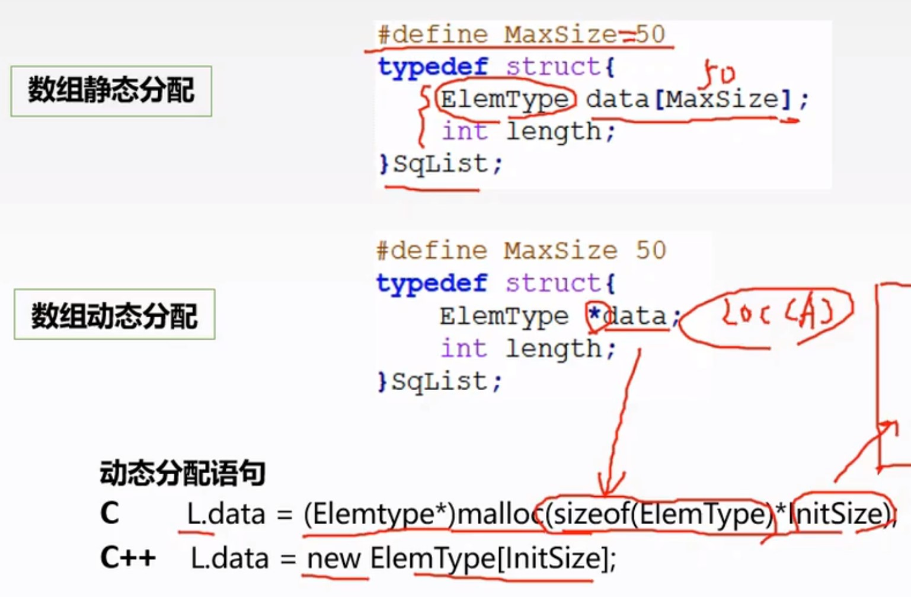
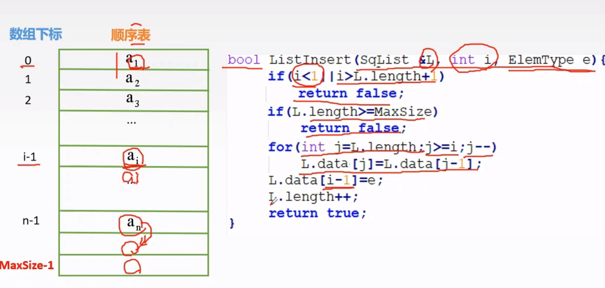
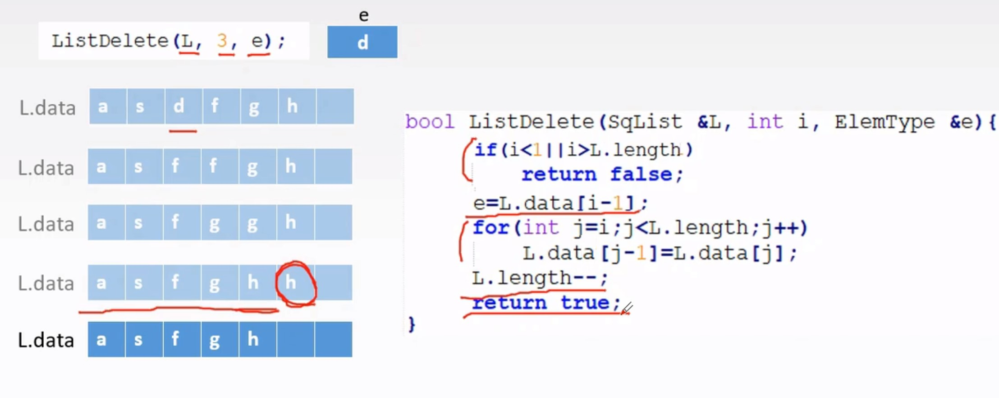
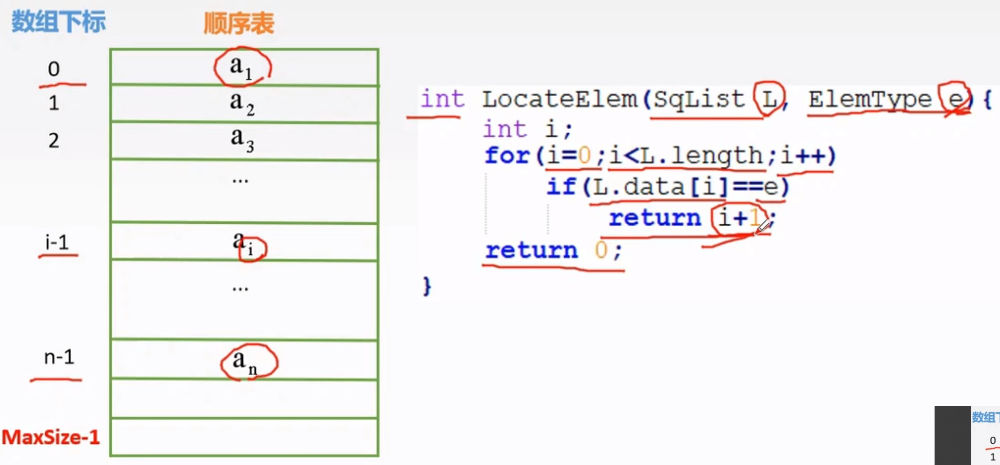
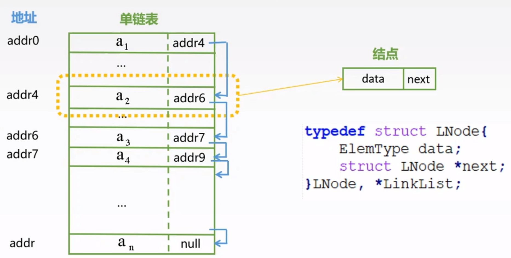
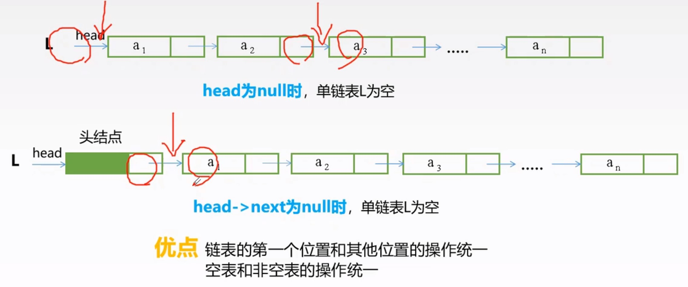
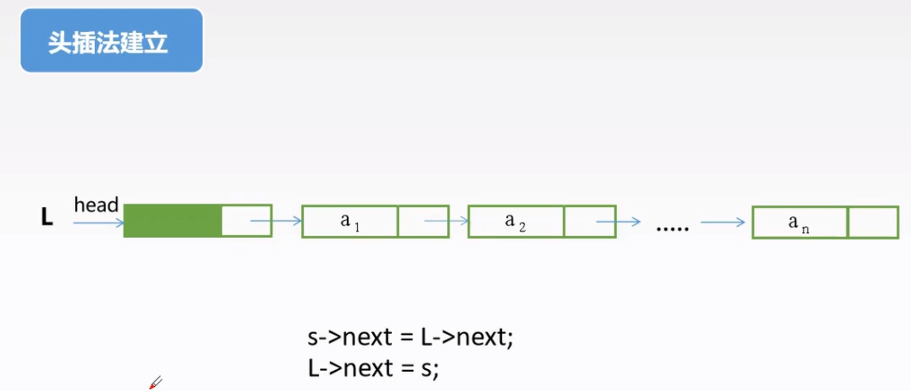
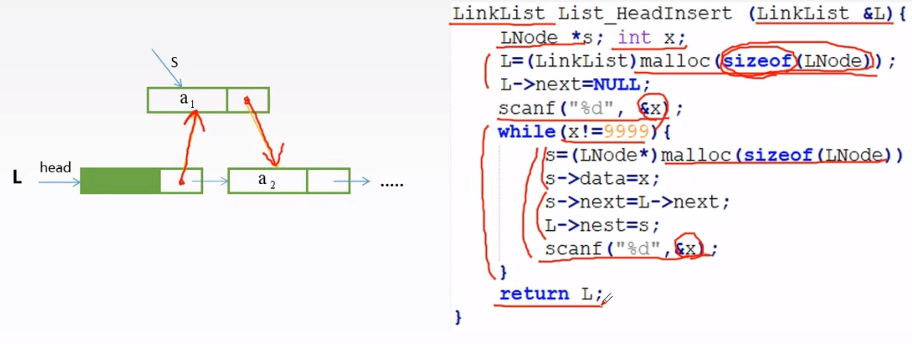
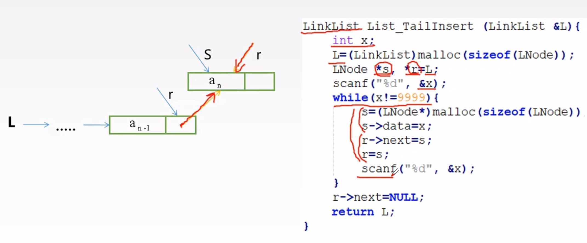
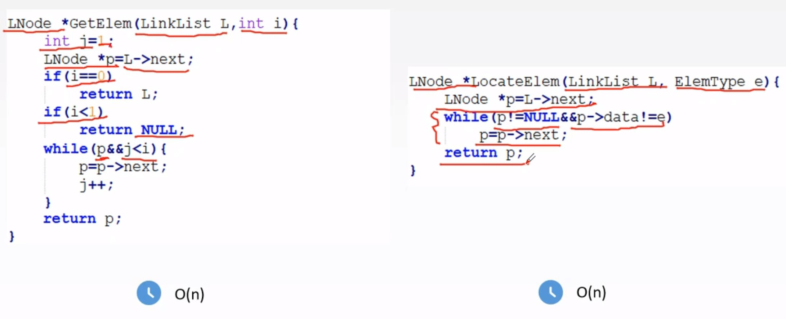

# 第2章.线性表


## 2.1线性表的定义和基本操作

```
线性表是具有相同类型的 n (n>=0) 个元素的有限序列，其中 n 为表长，当 n=0 时，该表为空表。
```


## 2.2顺序表

### 2.2.1顺序表的定义

```
定义:
```



### 2.2.2顺序表基本操作

```
顺序表的插入操作：
在顺序表的第 i 个位置插入元素e(顺序表下标从1开始，数组下标从0开始)
```



```
平均时间复杂度为 O(n/2),也就是 O(n). 最坏时间复杂度为 O(n),也就是插在第一个位置。
```


```
顺序表的删除操作：
删除顺序表的第i个元素(顺序表下标从1开始，数组下标从0开始)
```



```
平均时间复杂度为 O(n/2),也就是 O(n). 最坏时间复杂度为 O(n),也就是删除第一个元素。
```


```
按值查找：
查找元素e在顺序表中的下标(顺序表下标从1开始，数组下标从0开始)
```



```
平均时间复杂度为 O(n/2),也就是 O(n). 最坏时间复杂度为 O(n),也就是查到最后一个元素。
```


## 2.3链表

### 2.3.1单链表的定义

```
定义:
```



```

```




### 2.3.2单链表基本操作

```
头插法建立单链表:
```





```
时间复杂度：O(n)
```


```
尾插法建立单链表:
```



```
时间复杂度：O(n)
```


```
按序号查找和按值查找:
```



```
时间复杂度都是 O(n)
```


```
单链表的插入：前插法 & 后插法
```

```
单链表删除结点：
```

```
单链表求表长:
```

