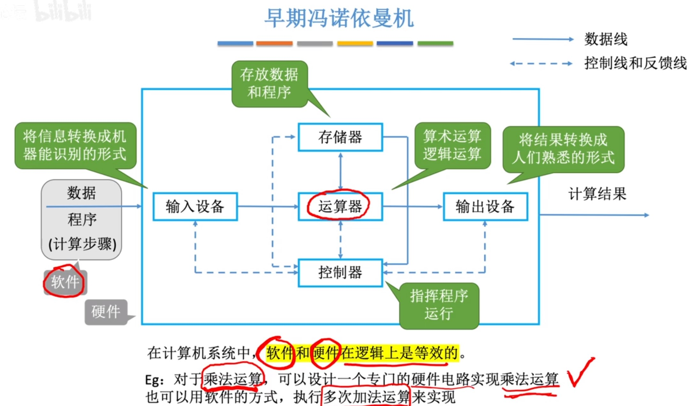
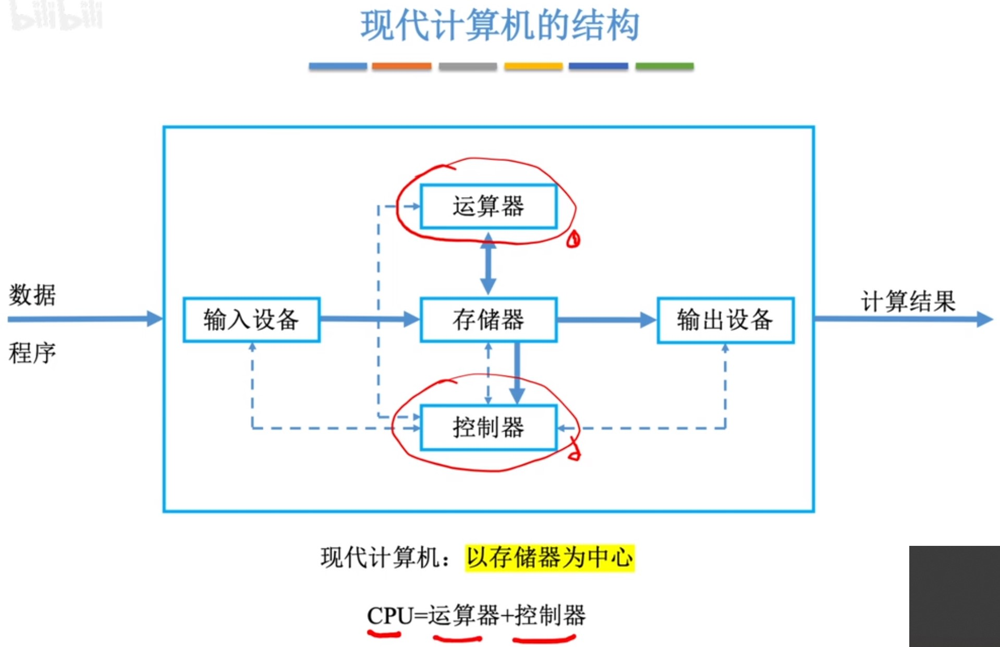
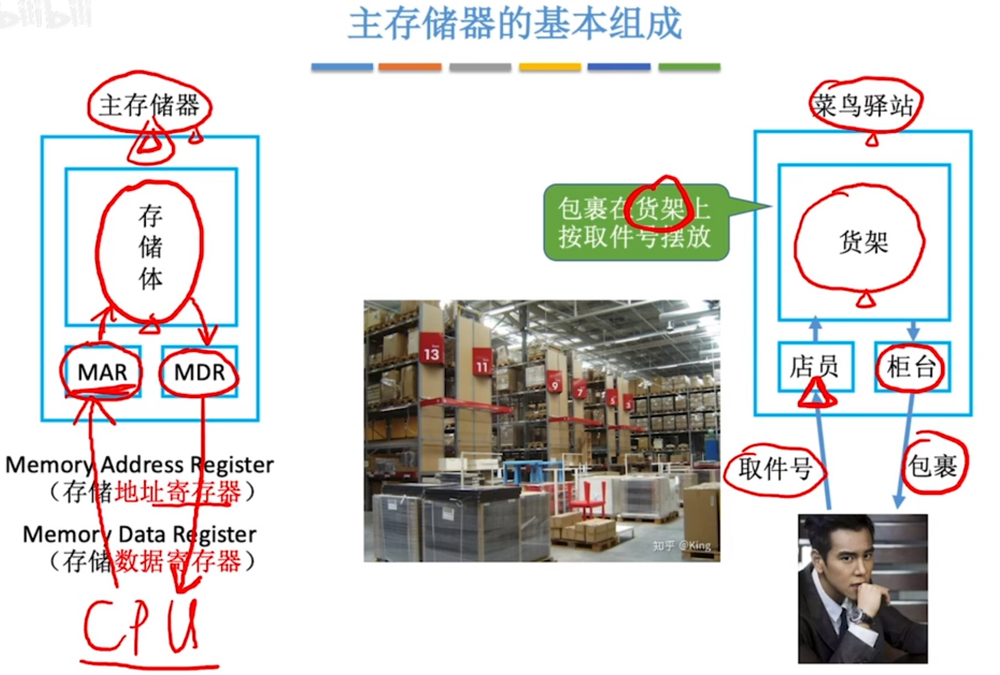
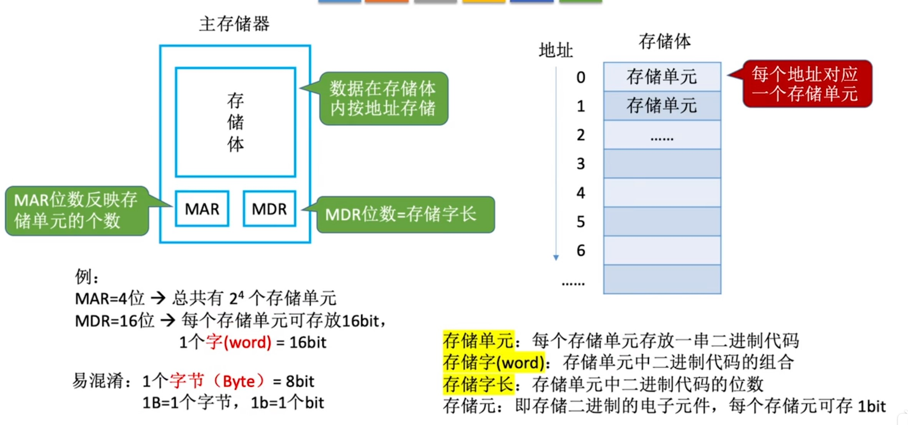
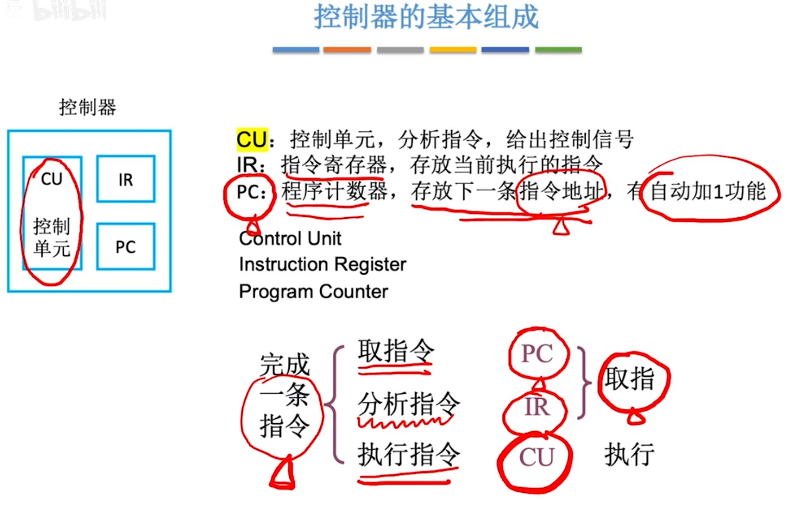

# 1.第一章.概述

## 1.1计算机的发展

```

```


## 1.2硬件基本组成

```

```



```
冯诺依曼计算机的特点:

1.计算机由5大部件组成。
2.指令和数据以同等地位存于存储器，可按地址寻访。
3.指令和数据用二进制表示。
4.指令由操作码和地址码组成。
5.存储程序。
6.以运算器为中心。
```



```

```


## 1.3各个硬件

```
主存储器基本组成:
```



```

```



```
运算器基本组成:
```


```
控制器的基本组成
```



```

```


## 1.4层次结构

```

```


## 1.5性能指标

```

```


# 2.第二章

## 2.1进位计数制度

```

```


## 2.2BCD码

```

```


## 2.2字符与字符串

```

```


## 2.2奇偶校验码

```

```


## 2.2海明校验码

```

```


## 2.3循环冗余校验码

```

```


## 2.4定点数的表示

```

```

