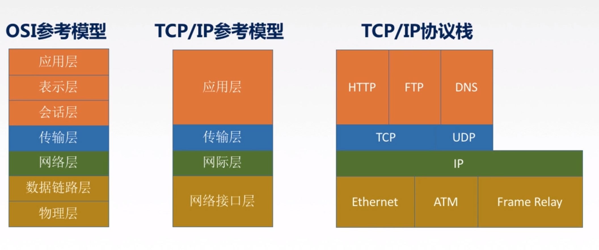
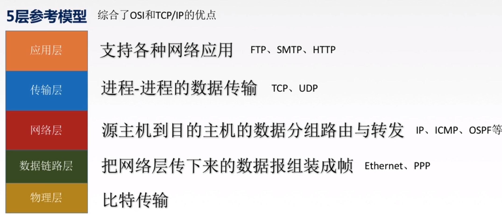

# 第一章

## 1.1概念

```
计算机网路:
	是将一个分散的，具有独立功能的计算机系统，通过通信设备与线路连接起来，由功能完善的软件实现资源共享和信息传输的系统。
	计算机网络是互连的，自治的计算机集合。
```

```
计算机网络的功能:
	1.数据通信.
	2.资源共享.
	3.分布式处理.
	4.提高可靠性.
	5.负载均衡.
	....
```

```
计算机网络组成:
	1.组成部分:硬件，软件，协议。
	2.工作方式:
		边缘部分，核心部分.
	3.功能组成：
		通信子网(实现数据通信)，
		资源子网(实现资源共享)
```

```
计算机网络分类:
	1.按分布范围分:广域网WAN，城域网MAN，局域网LAN,个人区域网PAN.
	2.按使用者分：公用网，专用网.
	3.按交换技术分:电路交换，报文交换，分组交换。
	4.按拓扑结构分:总线型，星型，环型，网状型。
	5.按传输技术分:广播式网络，点对点网络。
```


## 1.2标准化工作及其相关组织

```

```


## 1.3性能指标

```
速率:
	速率即数据率或称数据传输率或比特率.
```

```
带宽:
	(1)"带宽"原本指某个信号具有的频带宽度，即最高频率与最低频率之差，单位是赫兹Hz。
	(2)而在计算机网络中，带宽用来表示网络的通信线路传输数据的能力，通常是指单位时间内从网络中的某一点到另一点所能通过的"最高数据率"。单位是"比特/秒",b/s, kb/s, Mb/s, Gb/s
	
```

```
吞吐量:
	表示在单位时间内通过某个网络(或信道，接口)的数据量。单位 b/s, kb/s, Mb/s等。
```

```
时延:
	指数据从网络的一端传送到另一端所需的时间。也叫延迟或迟延，单位是秒。

1.发送时延；从发送分组的第一个比特算起，到该分组的最后一个比特发送完毕所需的时间。
		  发送时延 = 数据长度/信道带宽

2.传播时延: 取决于电磁波传播速度和链路长度。
		   传播时延 = 信道长度/电磁波在信道上的额传播速率
		   
3.排队时延:等待输出/入链路可用

4.处理时延:检错，找出口。
```

```
时延带宽积：

	时延带宽积 = 传播时延 * 带宽
	
时延带宽积又称以比特为单位的链路长度。即"某段链路现在有多少比特"。
```

```
往返时延RTT:

	从发送方发送数据开始，到发送方收到接收方的确认总共经历的时延。

RTT包括:
	往返传播时延 = 传播时延*2
	末端处理时间
```

```
利用率:

	信道利用率 = 有数据通过的时间/(有+无)数据通过时间
	网络利用率 = 信道利用率加权平均值

```


## 1.3分层结构 协议 接口 服务

```
为什么要分层?

发送文件前要完成的工作：
1.发起通信的计算机必须将数据通信的通路进行激活。
2.要告诉网络如何试别目的主机。
3.发起通信的计算机要查明目的主机是否开机，并且与网络连接正常。
4.发起通信的计算机要弄清楚，对方计算机中文件管理程序是否已经做好准备工作。
5.确保差错和意外可以解决。
```

```
怎么分层?

分层的基本原则:
1.各层之间相互独立，每层只实现一种相对独立的功能.
2.每层之间的界面自然清晰，易于理解，相互交流尽可能少.
3.结构上可分割开，每层都采用最合适的技术来实现.
4.保持下层对上层的独立性，上层单向使用下层提供的服务.
5.整个分层结构应该能促进标准化工作.

正式认识分层结构:
1.实体:第n层中的活动元素称为n层实体，同一层的实体叫对等实体.
2.协议:为进行网络中的对等实体数据交换而建立的规则，标准或约定称为网络协议。
		语法：规定传输数据的格式。
		语义：规定所要完成的功能
		同步：规定各种操作的顺序
3.接口(访问服务点SAP):上层使用下层服务的入口.
4.服务:下层为相邻上层提供的功能调用.
```


## 1.4 OSI参考模型

```
OSI七层:

--应用层	7
--表示层	6
--会话层	5
--传输层	4
--网络层	3
--数据链路层2
--物理层	1

由下至上简称为 :物联网淑惠试用

1,2,3属于通信子网， 5,6,7属于资源子网
```

```
应用层：
	所有能和用户交互产生网络流量的程序。
```

```
表示层:
	用于处理在两个通信系统中交换信息的表示方式。
	功能1：数据格式变换
	功能2：数据加密解密
	功能3：数据压缩和恢复
```

```
会话层:
	向表示层实体/用户进程提供建立连接并在连接上有序地传输数据。这是会话,也是建立同步(SYN).
	功能1：建立，管理，终止会话.
	功能2：使用校验点可使会话在通信失败时从校验点/同步点继续恢复通信，实现数据同步。
```

```
传输层:
	负责主机中两个进程的通信，即端到端的通信。传输单位是报文段或用户数据报。
	功能1：可靠传输,不可靠传输.
	功能2：差错控制.
	功能3：流量控制.
	功能4：复用分用.
```

```
网络层:
	主要任务是把分组从源端传输到目的端，为分组交换网上的不同主机提供通信服务。网络层的传输数据是数据报.
	功能1：路由选择。
	功能2：流量控制。
	功能3：差错控制。
	功能4：拥塞控制。
```

```
数据链路层:
	主要任务是把网络层传下来的数据包组装成帧。数据链路层的传输单位是帧。
	功能1：成帧(定义帧的开始和结束).
	功能2：差错控制.
	功能3：流量控制.
	功能4：访问(接入)控制.
```

```
物理层:
	主要任务是在物理媒体上实现比特流的透明传输，单位是比特。
	功能1：定义接口特性.
	功能2：定义传输模式.
	功能3：定义传输速率.
	功能4：比特同步.
	功能5：比特编码.
```


## 1.5 tcp/ip参考模型和5层参考模型

```

```



```
OSI参考模型与TCP/IP参考模型相同点:
1.都分层.
2.基于独立的协议栈概念.
3.可以实现异构网路互联.

OSI参考模型与TCP/IP参考模型不同点:
1.OSI定义三点:服务，协议，接口.
2.OSI先出现，参考模型先于协议发明，不偏向特定协议.
3.TCP/IP设计之初就考虑到互联网异构问题,将IP作为重要层次.
4.见下表.
```

|        |   OSI参考模型   |   TCP/IP模型    |
| :----: | :-------------: | :-------------: |
| 网络层 | 无连接+面向连接 |     无连接      |
| 传输层 |    面向连接     | 无连接+面向连接 |

```
5层参考模型:
```



```

```


# 第二章

## 2.1物理层基本概念

```
物理层解决如何在连接各种计算机的传输媒体上传输数据比特流，而不是指具体的传输媒体。
```


## 2.2通信基础

```

```


## 2.3码元,波特,速率,带宽

```

```


## 2.4奈氏准则和香农定理

```

```


## 2.5编码与调制

```

```


## 2.6物理层传输介质

```

```


## 2.7物理层设备

```

```

