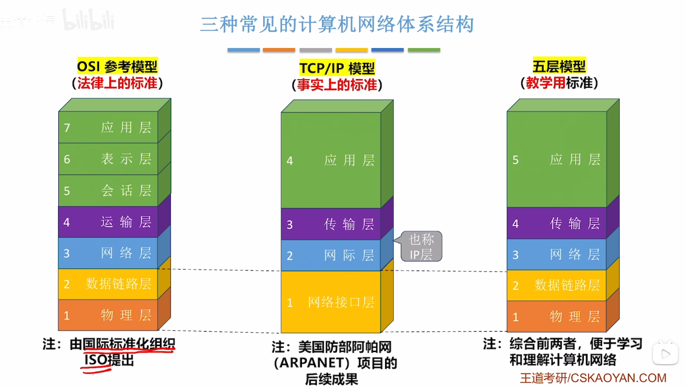
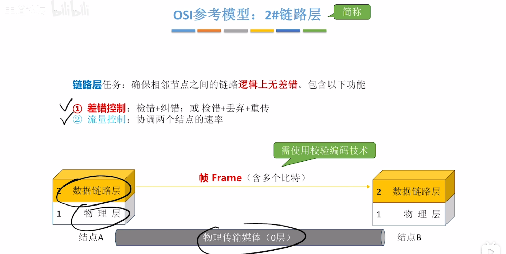
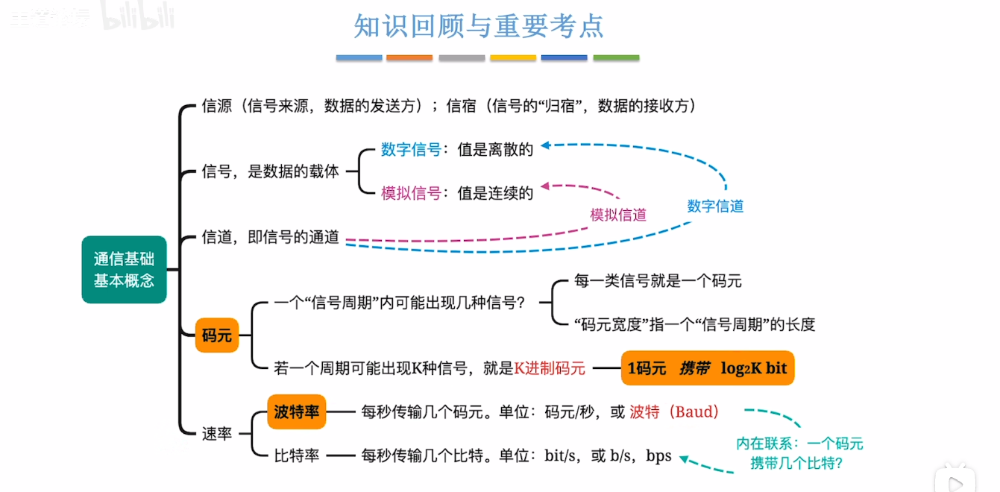
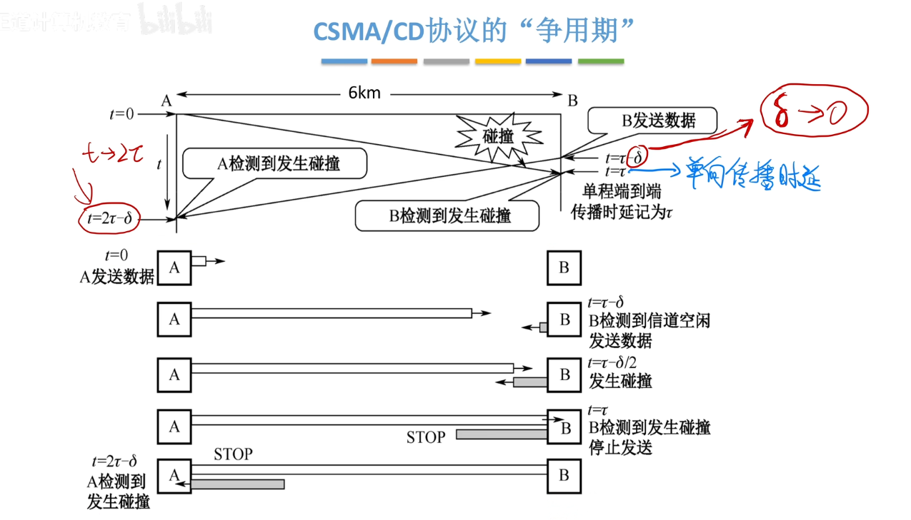
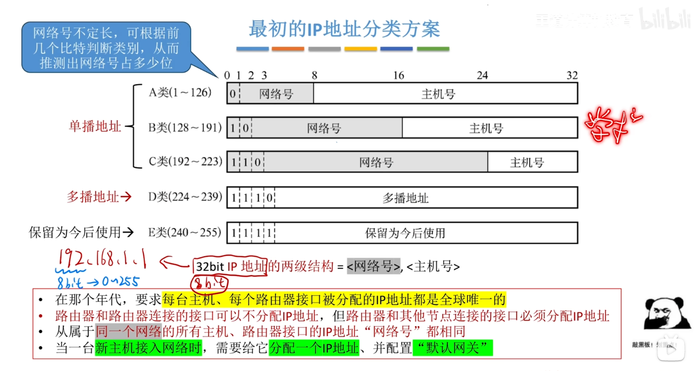
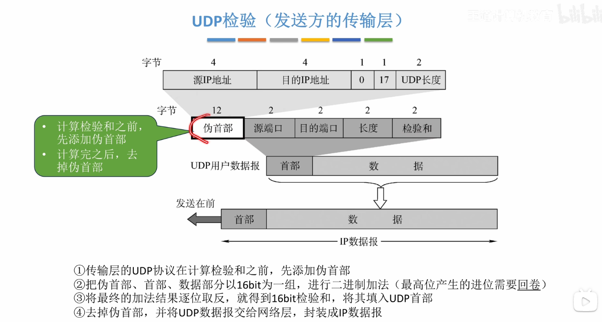

# 1. 计算机网络的体系结构

### 1.1.2 计算机网络的组成

  

### 1.1.3 三种交换

### 1.1.4 计算机网络分类

****

### 1.1.5 计算机网络性能指标

### 1.2.1 计算机网络分层结构

### 1.2.3 OSI 参考模型

### 1.2.4 TCP IP模型

# 2. 物理层

### 2.1.1 通信基础的基本概念

### 2.1.2 信道的极限容量

### 2.1.3 编码和调制

## 2.2 传输介质

## 2.3 物理层设备

# 3. 数据链路层

## 3.1 功能

## 3.2 组帧

## 3.3 差错控制

### 3.3.1 - 1 检错编码 奇偶校验码

### 3.3.1 - 2 检错编码 循环冗余校验码

### 3.3.2 纠错编码 - 海明校验码

## 3.4 流量控制与可靠传输机制

### 3.4.1 流量控制,可靠传输与滑动窗口机制

### 3.4.2 停止等待协议

### 3.4.3 后退N帧协议

### 3.4.4 选择重传协议

### 3.4.5 三种协议的信道利用率分析

### 3.5.1 信道划分,介质访问控制

### 3.5.2 - 1 随机访问介质访问控制

### 3.5.2 - 2 CSMA CD 协议

### 3.5.2 - 3 CSMA CA 协议

### 3.5.3 令牌传递协议

## 3.6 局域网与IEEE 802

### 3.6.1 局域网的基本概念和体系结构

### 3.6.2 以太网与IEEE 802.3

### 3.6.3 VLAN的基本概念与基本原理

### 3.6.4 IEEE 802.11 无限局域网

## 3.7 广域网

## 3.8 以太网交换机

# 4. 网络层

## 4.1 网络层的功能

### 4.2.1 IPV4分组

### 4.2.2 IP地址

### 4.2.3 子网划分和子网掩码

### 4.2.4 无分类编址 CIDR

### 4.2.5 路由聚合

### 4.2.6 网络地址转换 NAT

### 4.2.7 地址解析协议 ARP

### 4.2.8 动态主机配置协议DHCP

### 4.2.9 ICMP 网际控制报文协议

### 4.3.1 IPv6 地址

# 5. 传输层

## 5.1 传输层提供的服务

## 5.2 UDP

### 5.2.1 UDP 数据报

### 5.2.2 UDP校验

## 5.3 TCP

### 5.3.1 TCP协议的框架梳理

