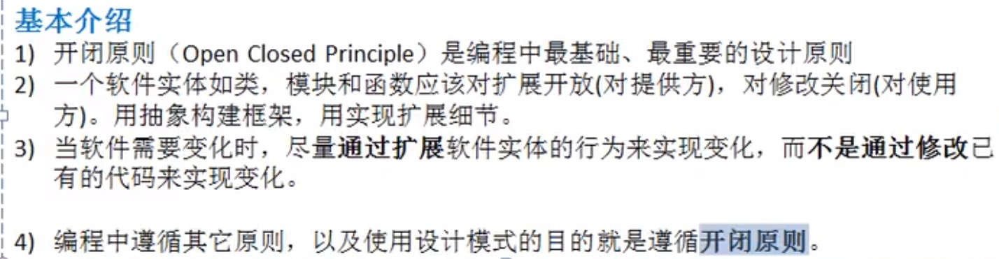

# 1.原则

## 1.1原则介绍

```

```

## 1.2.单一职责原则

```
例子引入：一个类A负责两个不同的职责T1和T2,当职责T1的需求改动需要修改时，可能会影响到T2。
下面通过三个案例来描述:
```

```java
public class Demo1 {
	public static void main(String[] args) {
		Vehicle vehicle = new Vehicle();
		vehicle.run("汽车");
		vehicle.run("摩托车");
		vehicle.run("飞机");
	}
}

//交通工具类
//违反了单一职责原则，飞机不能再公路上跑
class Vehicle{
	public void run(String vehicle) {
		System.out.println(vehicle+"    在公路上跑");
	}
}
```

```java
public class Demo2 {
	public static void main(String[] args) {
		new RoadVehicle().run("摩托车");
		new AirVehicle().run("波音747");
		new WaterVehicle().run("航母");
	}
}

//遵守了单一职责原则，但是改动较大，类太多

//路上跑的交通工具
class RoadVehicle{
	public void run(String vehicle) {
		System.out.println(vehicle+"    在公路上跑");
	}
}

//空中交通工具
class AirVehicle{
	public void run(String vehicle) {
		System.out.println(vehicle+"    在天上飞");
	}
}

//水中交通工具
class WaterVehicle{
	public void run(String vehicle) {
		System.out.println(vehicle+"    在水上运行");
	}
}
```

```java
public class Demo3 {
	public static void main(String[] args) {
		Vehicle2 vehicle2 = new Vehicle2();
		vehicle2.run("汽车");
		vehicle2.fly("飞艇");
		vehicle2.swim("帆船");
	}
}

//没有增加新的类，只是对原来的类修改;
//这次虽然没有在类级别上遵单一职责原则,但是在方法级别上遵守亿职责原则
class Vehicle2{
	public void run(String vehicle) {
		System.out.println(vehicle+"    在公路上跑");
	}
	public void fly(String vehicle) {
		System.out.println(vehicle+"    在空中飞");
	}
	public void swim(String vehicle) {
		System.out.println(vehicle+"    在水上运行");
	}
}
```

```
单一职责原则注意事项和细节：
1)降低类的复杂度，一个类只能负责一个职责。
2)提高类的可读性，可维护性。
3)降低变更引起的风险。
4)通常情况下，我们应当遵守单一职责原则，只有逻辑足够简单，才可以在代码级别违反单一职责原则;只有类种方法足够少，可以在方法级别保持单一职责原则。
```


## 1.3.接口隔离原则

```
简介：客户端不应该依赖它不需要的接口，即一个类对另一个类的依赖应该建立在最小的接口上。

案例：假设 接口Interface1种有5个方法,
         类B实现接口Interface1,
         类D实现接口Interface1,
         类A通过接口Interface1依赖(使用)到类B，但是A只用Interface中的1,2,3这三个方法，
         类C通过接口Interface1依赖(使用)到类B，但是A只用Interface中的1,4,5这三个方法，
     如下图所示:
```


```
代码如下所示：
```

```java
interface Interface1{
	void operation1();
	void operation2();
	void operation3();
	void operation4();
	void operation5();
}

class B implements Interface1{
	@Override
	public void operation1() {
		System.out.println("B    实现了    opreation1");
	}
	@Override
	public void operation2() {
		System.out.println("B    实现了    opreation2");
	}
	@Override
	public void operation3() {
		System.out.println("B    实现了    opreation3");
	}
	@Override
	public void operation4() {
		System.out.println("B    实现了    opreation4");
	}
	@Override
	public void operation5() {
		System.out.println("B    实现了    opreation5");
	}
}

class D implements Interface1{
	@Override
	public void operation1() {
		System.out.println("D    实现了    opreation1");
	}
	@Override
	public void operation2() {
		System.out.println("D    实现了    opreation2");
	}
	@Override
	public void operation3() {
		System.out.println("D    实现了    opreation3");
	}
	@Override
	public void operation4() {
		System.out.println("D    实现了    opreation4");
	}
	@Override
	public void operation5() {
		System.out.println("D    实现了    opreation5");
	}
}

class A { //A类通过接口Interface1 依赖(使用) B类,但是只用到1,2,3方法
	public void depend1zui(Interface1 i) {
		i.operation1();
	}
	public void depend2(Interface1 i) {
		i.operation2();
	}
	public void depend3(Interface1 i) {
		i.operation3();
	}
}

class C { //C类通过接口Interface1 依赖(使用) D类,但是只用到1,4,5方法
	public void depend1zui(Interface1 i) {
		i.operation1();
	}
	public void depend4(Interface1 i) {
		i.operation4();
	}
	public void depend5(Interface1 i) {
		i.operation5();
	}
}
```

```
将接口Interface1拆分成独立的几个接口，类A和类C分别与它们需要的接口建立依赖关系，也就是采用接口隔离原则。
接口Interface1中出现的方法，根据实际情况拆分成三个接口.如下图所示：
```


```
改造后代码如下所示：
```

```java
public class Demo1 {
	public static void main(String[] args) {
		A a = new A();
		a.depend1(new B());//这就是A类通过接口去依赖B类
		a.depend2(new B());
		a.depend3(new B());
		C c = new C();
		c.depend1(new D());
		c.depend4(new D());
		c.depend5(new D());
	}
}

interface Interface1{
	void operation1();
}
interface Interface2{
	void operation2();
	void operation3();
}
interface Interface3{
	void operation4();
	void operation5();
}

class B implements Interface1,Interface2{
	@Override
	public void operation1() {
		System.out.println("B    实现了    opreation1");
	}
	@Override
	public void operation2() {
		System.out.println("B    实现了    opreation2");
	}
	@Override
	public void operation3() {
		System.out.println("B    实现了    opreation3");
	}
}

class D implements Interface1,Interface3{
	@Override
	public void operation1() {
		System.out.println("D    实现了    opreation1");
	}
	@Override
	public void operation4() {
		System.out.println("D    实现了    opreation4");
	}
	@Override
	public void operation5() {
		System.out.println("D    实现了    opreation5");
	}
}

class A { //A类通过接口Interface1和Interface2 依赖(使用) B类,但是只用到1,2,3方法
	public void depend1(Interface1 i) {
		i.operation1();
	}
	public void depend2(Interface2 i) {
		i.operation2();
	}
	public void depend3(Interface2 i) {
		i.operation3();
	}
}

class C { //C类通过接口Interface1和Interface3 依赖(使用) D类,但是只用到1,4,5方法
	public void depend1(Interface1 i) {
		i.operation1();
	}
	public void depend4(Interface3 i) {
		i.operation4();
	}
	public void depend5(Interface3 i) {
		i.operation5();
	}
}
```


## 1.4.依赖倒转原则

```
依赖倒转原则指的是：
1)高层模块不应依赖于低层模块，二者都应依赖于其抽象。
2)抽象不应该依赖细节，细节应该依赖抽象。
3)依赖倒转的中心思想是面向接口编程。
4)依赖倒转原则是基于这样的设计理念：相对于细节的多变性，抽象的东西要稳定得多。以抽象为基础搭建的架构要比以细节为基础的架构要稳定得多。在java中，抽象指的是接口或抽象类，细节就是具体得实现类。
5)使用接口或抽象类得目的是制定好规范，而不涉及任何具体操作，把展现细节的任务交给它们的实现类去完成。
```

```
先看下面一个案例:
```

```java
public class Demo1 {
	public static void main(String[] args) {
		Person person = new Person();
		person.receive(new Email());
	}
}

//完成Person接收消息的功能
//方式1完成
//缺点：方法里写死了指定Email类，如果我们不接收Email,而是微信呢？
class Person{
	public void receive(Email e) {
		System.out.println(e.getInfo());
	}
}

class Email{
	public String getInfo() {
		return "电子邮件内容：Hello World";
	}
}
```

```
解决思路：
	引入一个IReceiver接口，表示接收的工具，这样Person就与接口发生依赖。
	这样，无论是那种通讯工具，只要实现IReceiver接口即可,这样就符合依赖倒转原则了。
改进方案：
```

```java
public class Demo1 {
	public static void main(String[] args) {
		Person person = new Person();
		person.receive(new Email());
		person.receive(new Weixin());
		person.receive(new QQ());
	}
}

//完成Person接收消息的功能
class Person{
	public void receive(IReceiver i) {
		System.out.println(i.getInfo());
	}
}

interface IReceiver{
	public String getInfo();
}
/////////////////////////////////////////////////////////////////////////////////
class Email implements IReceiver{
	@Override
	public String getInfo() {
		return "电子邮件内容：Hello World";
	}
}
class Weixin implements IReceiver{
	@Override
	public String getInfo() {
		return "微信内容：Hello World";
	}
}
class QQ implements IReceiver{
	@Override
	public String getInfo() {
		return "QQ内容：Hello World";
	}
}
```

```java
依赖传递的三种方式和应用案例如下：
1)接口传递
//开关的接口
interface IOpenAndClose{
	public void open(ITv itv);
}

interface ITv{
	public void play();
}

//实现接口
class Impl implements IOpenAndClose{
	@Override
	public void open(ITv itv) {
		itv.play();
	}
}
//////////////////////////////////////////////////////////////////////////
2)构造方法传递
interface IOpenAndClose{
	public void open();
}

interface ITv {
	public void play();
}

class Impl implements IOpenAndClose{
	public ITv iTv;//成员
	public Impl(ITv iTv) {//构造器
		this.iTv = iTv;
	}
	@Override
	public void open() {
		this.iTv.play();
	}
}
////////////////////////////////////////////////////////////////////////   
3)setter方式传递
interface IOpenAndClose{
	public void setTv(ITv itv);
	public void open();
}

interface ITv {
	public void play();
}

class Impl implements IOpenAndClose{
	private ITv iTv;

	@Override
	public void setTv(ITv tv) {
		this.iTv = tv;
	}
	
	@Override
	public void open() {
		this.iTv.play();
	}
}
```

```
依赖倒转原则的注意事项和细节:
1)低层模块尽量都要有抽象类和接口，或者两者都有，程序稳定性更好。
2)变量的声明类型尽量是抽象类或接口，这样我们的变量引用和实际对象间，就存在一个缓冲层，利于程序的扩展和优化。
3)继承时遵循里氏替换原则。
```


## 1.5.里氏替换原则

```
引入：
```


```
基本介绍：
```


```java
问题案例如下：
public class Demo1 {
	public static void main(String[] args) {
		A a = new A();
		System.out.println("11-3 =  "+a.fun1(11, 3));
		System.out.println("11-8 =  "+a.fun1(11, 8));
		System.out.println("==========================");
		B b = new B();
		System.out.println("11-3 =  "+b.fun1(11, 3));
		System.out.println("11-8 =  "+b.fun1(11, 8));
		System.out.println("11+3+9 = "+b.fun2(11, 3));
	}
}

class A{
	public int fun1( int a, int b ) {
		return a-b;
	}
}

class B extends A{
	@Override //重写了父类的fun1(int a, int b)
	public int fun1( int a, int b ) {
		return a+b;
	}
	
	public int fun2(int a,int b) {
		return fun1(a,b)+9;
	}
}

```

```
解决方法：
```


```java
public class Demo2 {
	public static void main(String[] args) {
		AA aa = new AA();
		System.out.println("11-3 =  "+aa.fun1(11, 3));
		System.out.println("11-8 =  "+aa.fun1(11, 8));
		System.out.println("==========================");
		BB bb = new BB();
		System.out.println("11-3 =  "+bb.fun1(11, 3));
		System.out.println("11-8 =  "+bb.fun1(11, 8));
		System.out.println("11-3+9 = "+bb.fun2(11, 3));
	}
}

//创建一个个国家基础的类
abstract class Base{
	public abstract int fun1(int a, int b);
}

class AA extends Base{
	@Override
	public int fun1(int a, int b) {
		return a-b;
	}
}

class BB extends Base{
	//如果B类需要使用A类的方法，使用组合关系
	private AA aa = new AA();
	
	@Override
	public int fun1(int a, int b) {
		return a+b;
	}
	
	public int fun2(int a,int b) {
		return aa.fun1(a, b)+9;
	}

}

```


## 1.6.开闭原则

```
基本介绍:
```



```
代码案例略过
```


## 1.7.迪米特法则

```
基本介绍：
```


```
迪米特法则的注意事项和细节：
1)迪米特法则的核心是降低类之间的耦合。
2)但是注意：由于每个类都减少了不必要的依赖，因此迪米特法则只是要求降低类间(对象间)的耦合关系，并不是要求完全没有依赖关系。
```


## 1.8合成复用原则

```
基本介绍：
原则是尽量使用 合成/聚拢 的方式，而不是使用继承。
```

```
案例代码略过
```


## 1.9设计原则核心思想

```

```


# 2.UML

```
略过
```


# 3.类图6大关系

```
依赖，泛化，实现，依赖，聚合，组合.
```


# 4.设计模式概述

```
分类:
```


# 5.单例模式

## 5.1概述

```
所谓类的单例设计模式，就是采取一定的方法保证在整个软件系统中，对某个类只能存在一个对象实例，并且该类只提供一个取得其对象实例的方法(静态方法)。

比如Hibernate的SessionFactory,它充当数据源的代理，并负责创建Session对象。SessionFactory并不是轻量级的，一般情况下，一个项目通常只需要一个SessionFactory就够了，这就会使用到单例模式。
```

```
单例模式分八种：
1)饿汉式(静态常量)
2)饿汉式(静态代码块)
3)懒汉式(线程不安全)
4)懒汉式(线程安全，同步方法)
5)懒汉式(同步代码块)
6)双重检查
7)静态内部类
8)枚举
```

## 5.2.饿汉式(静态常量)

```
步骤如下：
1)构造器私有化
2)类的内部创建对象
3)向外暴露一个静态的公共方法
```

```java
public class Test01 {
	public static void main(String[] args) {
		Singleton01 instance = Singleton01.getInstance();
		Singleton01 instance2 = Singleton01.getInstance();
		System.out.println(instance == instance2);
	}
}

/**
 * 饿汉式(静态常量)
 * @author Leemi
 */
class Singleton01{
	//1.构造器私有化,外部就不能new了
	private Singleton01() {}
	
	//2.本类内部创建一个对象实例
	private final static Singleton01 instance = new Singleton01();
	
	//3.提供公有的静态方法，返回实例对象
	public static Singleton01 getInstance() {
		return instance;
	}
	
}
```

```
优缺点说明：
1)优点：这种写法比较简单，就是在类装载的时候就完成实例化。避免了线程同步问题。
2)缺点：在类装载的时候就完成实例化，没有达到lazy loading的效果，如果从始至终没有用到这个对象，就会造成内存浪费。
3)
```

## 5.3.饿汉式(静态代码块)

```
类似于上面 饿汉式(静态常量)，不再啰嗦.
```

```java
public class Test02 {
	public static void main(String[] args) {
		Singleton02 instance = Singleton02.getInstance();
		Singleton02 instance2 = Singleton02.getInstance();
		System.out.println(instance == instance2);
	}
}

/**
 * 饿汉式(静态代码块)
 * @author Leemi
 */
class Singleton02{
	//1.构造方法私有化
	private Singleton02() {}
	
	private static Singleton02 instance;
	
	//2.在静态代码块中创建对象
	static {
		Singleton02 instance = new Singleton02();
	}
	
	//3.对外提供一个公有的静态方法，返回实例对象
	public static Singleton02 getInstance() {
		return instance;
	}
	
}
```

## 5.4.懒汉式(线程不安全)

```java
public class Test03 {
	public static void main(String[] args) {
		Singleton03 instance = Singleton03.getInstance();
		Singleton03 instance2 = Singleton03.getInstance();
		System.out.println(instance == instance2);
	}
}

/**
 * 懒汉式(线程不安全)
 * @author Leemi
 */
class Singleton03{
	private static Singleton03 instance;
	
	//构造器私有化
	private Singleton03() {}
	
	//对外提供一个静态方法，当使用到该方法时才去创建对象
	public static Singleton03 getInstance() {
		if( instance == null ) {
			instance = new Singleton03();
		}
		return instance;
	}
}
```

```java
优缺点：
1)起到了lazy loading的效果，但是只能再单线程下使用。
2)如果在多线程下，一个线程进入了 if( instance == null ) 判断，还未来得及往下执行，另一个语句也也通过了这个判断语句，这时便会产生多个实例对象。所有在多线程环境下不能使用这种方式。
```

## 5.5懒汉式(线程安全,同步方法)

```java
public class Test04 {
	public static void main(String[] args) {
		Singleton04 instance = Singleton04.getInstance();
		Singleton04 instance2 = Singleton04.getInstance();
		System.out.println(instance == instance2);
	}
}

/**
 * 懒汉式(同步方法)
 * @author Leemi
 */
class Singleton04{
	private static Singleton04 instance;
	
	private Singleton04() {}
	
	//用synchronized把这个方法同步
	public static synchronized Singleton04 getInstance() {
		if( instance == null ) {
			instance = new Singleton04();
		}
		return instance;
	}
}
```

```
优缺点说明：
1)解决了线程安全问题。
2)效率太低了，每次getInstace()都要进入同步方法。而这个方法只要执行一次实例化代码就够了。后面想获得该类实例对象，只要return 就好了。
```

## 5.6.懒汉式(同步代码块)

```java
public class Test05 {
	public static void main(String[] args) {
		Singleton05 instance = Singleton05.getInstance();
		Singleton05 instance2 = Singleton05.getInstance();
		System.out.println(instance == instance2);
	}
}

/**
 * 懒汉式(同步代码块)
 * @author Leemi
 */
class Singleton05{
	private static Singleton05 instance;
	
	private Singleton05() {}
	
	public static Singleton05 getInstance() {
		if( instance == null ) {
			synchronized (Singleton05.class) {
				instance = new Singleton05();
			}
		}
		return instance;
	}
}
```

```Java
优缺点说明：
1)这本意是为了对第四种方法进行改进，因为第四种方法效率太低。
2)但是线程不安全，因为当第一个线程 正在判断 if( instance == null ) 还未来得及往下执行，同时其他线程通过了 if( instance == null ) ，便会产生多个实例对象。
```

## 5.7.双重检查

```java
public class Test06 {
	public static void main(String[] args) {
		Singleton06 instance = Singleton06.getInstance();
		Singleton06 instance2 = Singleton06.getInstance();
		System.out.println(instance == instance2);
	}
}

/**
 * 双重检查
 * @author Leemi
 */
class Singleton06{
	private static volatile Singleton06 instance;
	
	private Singleton06() {}
	
	//双重检查，既保证线程安全又提高效率
	public static Singleton06 getInstance() {
		if( instance == null ) {//第一次判断
			synchronized (Singleton06.class) {
				if( instance == null ) {//第二次判断
					instance = new Singleton06();
				}
			}
		}
		return instance;
	}
}

```

```java
优缺点说明：
1)进行了两次判断，解决了第五种方法的线程安全问题。
2)外面一层判断避免了每次都进入 synchronized 同步，提高了效率.
3)结论：线程安全，效率也高，推荐使用。
```

