# 1.原则

## 1.1原则介绍

```

```

## 1.2.单一职责原则

```
例子引入：一个类A负责两个不同的职责T1和T2,当职责T1的需求改动需要修改时，可能会影响到T2。
下面通过三个案例来描述:
```

```java
public class Demo1 {
	public static void main(String[] args) {
		Vehicle vehicle = new Vehicle();
		vehicle.run("汽车");
		vehicle.run("摩托车");
		vehicle.run("飞机");
	}
}

//交通工具类
//违反了单一职责原则，飞机不能再公路上跑
class Vehicle{
	public void run(String vehicle) {
		System.out.println(vehicle+"    在公路上跑");
	}
}
```

```java
public class Demo2 {
	public static void main(String[] args) {
		new RoadVehicle().run("摩托车");
		new AirVehicle().run("波音747");
		new WaterVehicle().run("航母");
	}
}

//遵守了单一职责原则，但是改动较大，类太多

//路上跑的交通工具
class RoadVehicle{
	public void run(String vehicle) {
		System.out.println(vehicle+"    在公路上跑");
	}
}

//空中交通工具
class AirVehicle{
	public void run(String vehicle) {
		System.out.println(vehicle+"    在天上飞");
	}
}

//水中交通工具
class WaterVehicle{
	public void run(String vehicle) {
		System.out.println(vehicle+"    在水上运行");
	}
}
```

```java
public class Demo3 {
	public static void main(String[] args) {
		Vehicle2 vehicle2 = new Vehicle2();
		vehicle2.run("汽车");
		vehicle2.fly("飞艇");
		vehicle2.swim("帆船");
	}
}

//没有增加新的类，只是对原来的类修改;
//这次虽然没有在类级别上遵单一职责原则,但是在方法级别上遵守亿职责原则
class Vehicle2{
	public void run(String vehicle) {
		System.out.println(vehicle+"    在公路上跑");
	}
	public void fly(String vehicle) {
		System.out.println(vehicle+"    在空中飞");
	}
	public void swim(String vehicle) {
		System.out.println(vehicle+"    在水上运行");
	}
}
```

```
单一职责原则注意事项和细节：
1)降低类的复杂度，一个类只能负责一个职责。
2)提高类的可读性，可维护性。
3)降低变更引起的风险。
4)通常情况下，我们应当遵守单一职责原则，只有逻辑足够简单，才可以在代码级别违反单一职责原则;只有类种方法足够少，可以在方法级别保持单一职责原则。
```


## 1.3.接口隔离原则

```
简介：客户端不应该依赖它不需要的接口，即一个类对另一个类的依赖应该建立在最小的接口上。

案例：假设 接口Interface1种有5个方法,
         类B实现接口Interface1,
         类D实现接口Interface1,
         类A通过接口Interface1依赖(使用)到类B，但是A只用Interface中的1,2,3这三个方法，
         类C通过接口Interface1依赖(使用)到类B，但是A只用Interface中的1,4,5这三个方法，
     如下图所示:
```

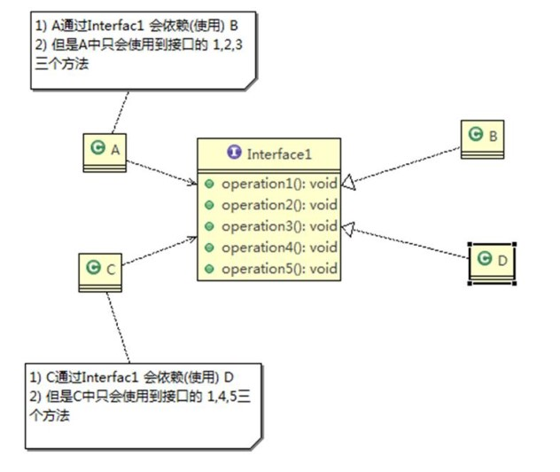

```
代码如下所示：
```

```java
interface Interface1{
	void operation1();
	void operation2();
	void operation3();
	void operation4();
	void operation5();
}

class B implements Interface1{
	@Override
	public void operation1() {
		System.out.println("B    实现了    opreation1");
	}
	@Override
	public void operation2() {
		System.out.println("B    实现了    opreation2");
	}
	@Override
	public void operation3() {
		System.out.println("B    实现了    opreation3");
	}
	@Override
	public void operation4() {
		System.out.println("B    实现了    opreation4");
	}
	@Override
	public void operation5() {
		System.out.println("B    实现了    opreation5");
	}
}

class D implements Interface1{
	@Override
	public void operation1() {
		System.out.println("D    实现了    opreation1");
	}
	@Override
	public void operation2() {
		System.out.println("D    实现了    opreation2");
	}
	@Override
	public void operation3() {
		System.out.println("D    实现了    opreation3");
	}
	@Override
	public void operation4() {
		System.out.println("D    实现了    opreation4");
	}
	@Override
	public void operation5() {
		System.out.println("D    实现了    opreation5");
	}
}

class A { //A类通过接口Interface1 依赖(使用) B类,但是只用到1,2,3方法
	public void depend1zui(Interface1 i) {
		i.operation1();
	}
	public void depend2(Interface1 i) {
		i.operation2();
	}
	public void depend3(Interface1 i) {
		i.operation3();
	}
}

class C { //C类通过接口Interface1 依赖(使用) D类,但是只用到1,4,5方法
	public void depend1zui(Interface1 i) {
		i.operation1();
	}
	public void depend4(Interface1 i) {
		i.operation4();
	}
	public void depend5(Interface1 i) {
		i.operation5();
	}
}
```

```
将接口Interface1拆分成独立的几个接口，类A和类C分别与它们需要的接口建立依赖关系，也就是采用接口隔离原则。
接口Interface1中出现的方法，根据实际情况拆分成三个接口.如下图所示：
```

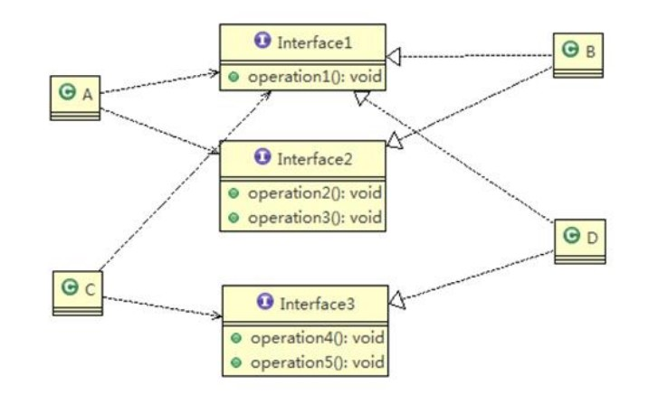

```
改造后代码如下所示：
```

```java
public class Demo1 {
	public static void main(String[] args) {
		A a = new A();
		a.depend1(new B());//这就是A类通过接口去依赖B类
		a.depend2(new B());
		a.depend3(new B());
		C c = new C();
		c.depend1(new D());
		c.depend4(new D());
		c.depend5(new D());
	}
}

interface Interface1{
	void operation1();
}
interface Interface2{
	void operation2();
	void operation3();
}
interface Interface3{
	void operation4();
	void operation5();
}

class B implements Interface1,Interface2{
	@Override
	public void operation1() {
		System.out.println("B    实现了    opreation1");
	}
	@Override
	public void operation2() {
		System.out.println("B    实现了    opreation2");
	}
	@Override
	public void operation3() {
		System.out.println("B    实现了    opreation3");
	}
}

class D implements Interface1,Interface3{
	@Override
	public void operation1() {
		System.out.println("D    实现了    opreation1");
	}
	@Override
	public void operation4() {
		System.out.println("D    实现了    opreation4");
	}
	@Override
	public void operation5() {
		System.out.println("D    实现了    opreation5");
	}
}

class A { //A类通过接口Interface1和Interface2 依赖(使用) B类,但是只用到1,2,3方法
	public void depend1(Interface1 i) {
		i.operation1();
	}
	public void depend2(Interface2 i) {
		i.operation2();
	}
	public void depend3(Interface2 i) {
		i.operation3();
	}
}

class C { //C类通过接口Interface1和Interface3 依赖(使用) D类,但是只用到1,4,5方法
	public void depend1(Interface1 i) {
		i.operation1();
	}
	public void depend4(Interface3 i) {
		i.operation4();
	}
	public void depend5(Interface3 i) {
		i.operation5();
	}
}
```


## 1.4.依赖倒转原则

```
依赖倒转原则指的是：
1)高层模块不应依赖于低层模块，二者都应依赖于其抽象。
2)抽象不应该依赖细节，细节应该依赖抽象。
3)依赖倒转的中心思想是面向接口编程。
4)依赖倒转原则是基于这样的设计理念：相对于细节的多变性，抽象的东西要稳定得多。以抽象为基础搭建的架构要比以细节为基础的架构要稳定得多。在java中，抽象指的是接口或抽象类，细节就是具体得实现类。
5)使用接口或抽象类得目的是制定好规范，而不涉及任何具体操作，把展现细节的任务交给它们的实现类去完成。
```

```
先看下面一个案例:
```

```java
public class Demo1 {
	public static void main(String[] args) {
		Person person = new Person();
		person.receive(new Email());
	}
}

//完成Person接收消息的功能
//方式1完成
//缺点：方法里写死了指定Email类，如果我们不接收Email,而是微信呢？
class Person{
	public void receive(Email e) {
		System.out.println(e.getInfo());
	}
}

class Email{
	public String getInfo() {
		return "电子邮件内容：Hello World";
	}
}
```

```
解决思路：
	引入一个IReceiver接口，表示接收的工具，这样Person就与接口发生依赖。
	这样，无论是那种通讯工具，只要实现IReceiver接口即可,这样就符合依赖倒转原则了。
改进方案：
```

```java
public class Demo1 {
	public static void main(String[] args) {
		Person person = new Person();
		person.receive(new Email());
		person.receive(new Weixin());
		person.receive(new QQ());
	}
}

//完成Person接收消息的功能
class Person{
	public void receive(IReceiver i) {
		System.out.println(i.getInfo());
	}
}

interface IReceiver{
	public String getInfo();
}
/////////////////////////////////////////////////////////////////////////////////
class Email implements IReceiver{
	@Override
	public String getInfo() {
		return "电子邮件内容：Hello World";
	}
}
class Weixin implements IReceiver{
	@Override
	public String getInfo() {
		return "微信内容：Hello World";
	}
}
class QQ implements IReceiver{
	@Override
	public String getInfo() {
		return "QQ内容：Hello World";
	}
}
```

```java
依赖传递的三种方式和应用案例如下：
1)接口传递
//开关的接口
interface IOpenAndClose{
	public void open(ITv itv);
}

interface ITv{
	public void play();
}

//实现接口
class Impl implements IOpenAndClose{
	@Override
	public void open(ITv itv) {
		itv.play();
	}
}
//////////////////////////////////////////////////////////////////////////
2)构造方法传递
interface IOpenAndClose{
	public void open();
}

interface ITv {
	public void play();
}

class Impl implements IOpenAndClose{
	public ITv iTv;//成员
	public Impl(ITv iTv) {//构造器
		this.iTv = iTv;
	}
	@Override
	public void open() {
		this.iTv.play();
	}
}
////////////////////////////////////////////////////////////////////////   
3)setter方式传递
interface IOpenAndClose{
	public void setTv(ITv itv);
	public void open();
}

interface ITv {
	public void play();
}

class Impl implements IOpenAndClose{
	private ITv iTv;

	@Override
	public void setTv(ITv tv) {
		this.iTv = tv;
	}
	
	@Override
	public void open() {
		this.iTv.play();
	}
}
```

```
依赖倒转原则的注意事项和细节:
1)低层模块尽量都要有抽象类和接口，或者两者都有，程序稳定性更好。
2)变量的声明类型尽量是抽象类或接口，这样我们的变量引用和实际对象间，就存在一个缓冲层，利于程序的扩展和优化。
3)继承时遵循里氏替换原则。
```


## 1.5.里氏替换原则

```
引入：
```

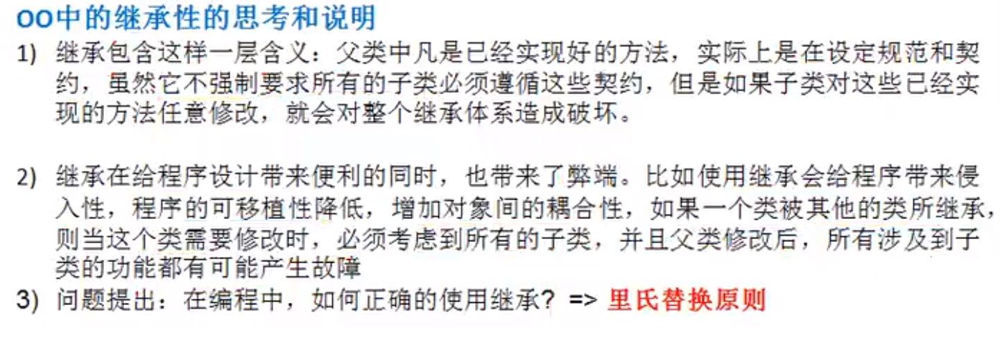

```
基本介绍：
```

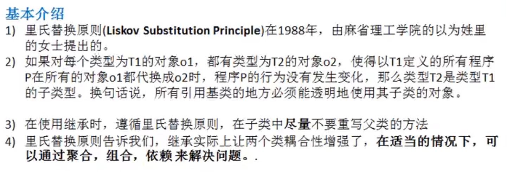

```java
问题案例如下：
public class Demo1 {
	public static void main(String[] args) {
		A a = new A();
		System.out.println("11-3 =  "+a.fun1(11, 3));
		System.out.println("11-8 =  "+a.fun1(11, 8));
		System.out.println("==========================");
		B b = new B();
		System.out.println("11-3 =  "+b.fun1(11, 3));
		System.out.println("11-8 =  "+b.fun1(11, 8));
		System.out.println("11+3+9 = "+b.fun2(11, 3));
	}
}

class A{
	public int fun1( int a, int b ) {
		return a-b;
	}
}

class B extends A{
	@Override //重写了父类的fun1(int a, int b)
	public int fun1( int a, int b ) {
		return a+b;
	}
	
	public int fun2(int a,int b) {
		return fun1(a,b)+9;
	}
}

```

```
解决方法：
```

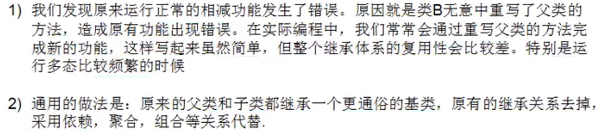

```java
public class Demo2 {
	public static void main(String[] args) {
		AA aa = new AA();
		System.out.println("11-3 =  "+aa.fun1(11, 3));
		System.out.println("11-8 =  "+aa.fun1(11, 8));
		System.out.println("==========================");
		BB bb = new BB();
		System.out.println("11-3 =  "+bb.fun1(11, 3));
		System.out.println("11-8 =  "+bb.fun1(11, 8));
		System.out.println("11-3+9 = "+bb.fun2(11, 3));
	}
}

//创建一个个国家基础的类
abstract class Base{
	public abstract int fun1(int a, int b);
}

class AA extends Base{
	@Override
	public int fun1(int a, int b) {
		return a-b;
	}
}

class BB extends Base{
	//如果B类需要使用A类的方法，使用组合关系
	private AA aa = new AA();
	
	@Override
	public int fun1(int a, int b) {
		return a+b;
	}
	
	public int fun2(int a,int b) {
		return aa.fun1(a, b)+9;
	}

}

```


## 1.6.开闭原则

```
基本介绍:
```

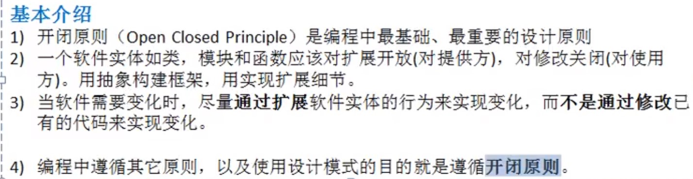

```
代码案例略过
```


## 1.7.迪米特法则

```
基本介绍：
```

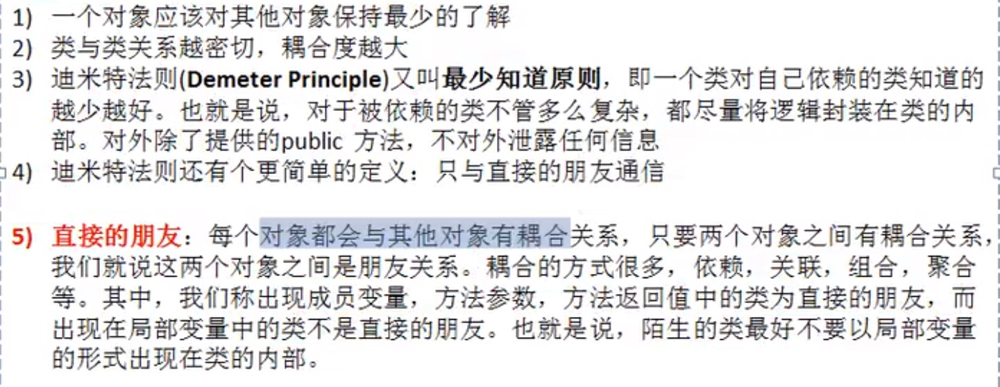

```
迪米特法则的注意事项和细节：
1)迪米特法则的核心是降低类之间的耦合。
2)但是注意：由于每个类都减少了不必要的依赖，因此迪米特法则只是要求降低类间(对象间)的耦合关系，并不是要求完全没有依赖关系。
```


## 1.8合成复用原则

```
基本介绍：
原则是尽量使用 合成/聚拢 的方式，而不是使用继承。
```

```
案例代码略过
```


## 1.9设计原则核心思想

```

```

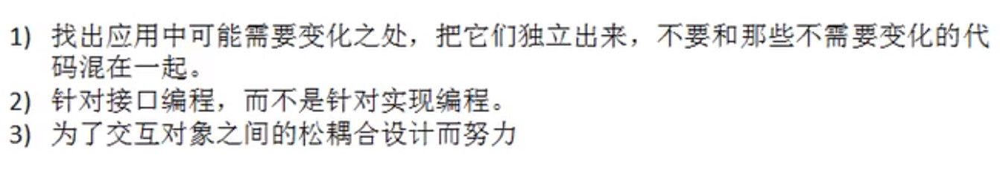


# 2.UML

```
略过
```


# 3.类图6大关系

```
依赖，泛化，实现，依赖，聚合，组合.
```


# 4.设计模式概述

```
分类:
```

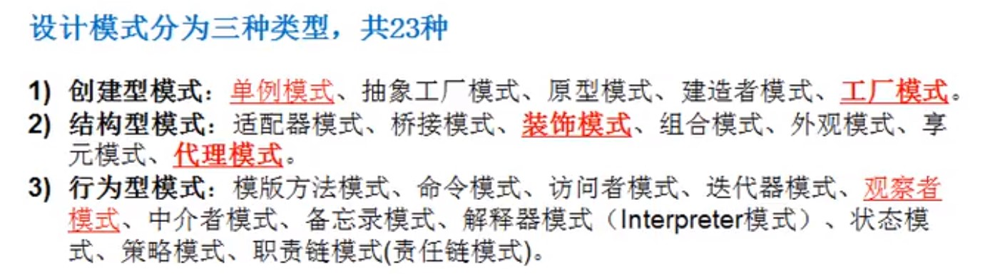


# 5.单例模式

## 5.1概述

```
所谓类的单例设计模式，就是采取一定的方法保证在整个软件系统中，对某个类只能存在一个对象实例，并且该类只提供一个取得其对象实例的方法(静态方法)。

比如Hibernate的SessionFactory,它充当数据源的代理，并负责创建Session对象。SessionFactory并不是轻量级的，一般情况下，一个项目通常只需要一个SessionFactory就够了，这就会使用到单例模式。
```

```
单例模式分八种：
1)饿汉式(静态常量)
2)饿汉式(静态代码块)
3)懒汉式(线程不安全)
4)懒汉式(线程安全，同步方法)
5)懒汉式(同步代码块)
6)双重检查
7)静态内部类
8)枚举
```

## 5.2.饿汉式(静态常量)

```
步骤如下：
1)构造器私有化
2)类的内部创建对象
3)向外暴露一个静态的公共方法
```

```java
public class Test01 {
	public static void main(String[] args) {
		Singleton01 instance = Singleton01.getInstance();
		Singleton01 instance2 = Singleton01.getInstance();
		System.out.println(instance == instance2);
	}
}

/**
 * 饿汉式(静态常量)
 * @author Leemi
 */
class Singleton01{
	//1.构造器私有化,外部就不能new了
	private Singleton01() {}
	
	//2.本类内部创建一个对象实例
	private final static Singleton01 instance = new Singleton01();
	
	//3.提供公有的静态方法，返回实例对象
	public static Singleton01 getInstance() {
		return instance;
	}
	
}
```

```
优缺点说明：
1)优点：这种写法比较简单，就是在类装载的时候就完成实例化。避免了线程同步问题。
2)缺点：在类装载的时候就完成实例化，没有达到lazy loading的效果，如果从始至终没有用到这个对象，就会造成内存浪费。
3)
```

## 5.3.饿汉式(静态代码块)

```
类似于上面 饿汉式(静态常量)，不再啰嗦.
```

```java
public class Test02 {
	public static void main(String[] args) {
		Singleton02 instance = Singleton02.getInstance();
		Singleton02 instance2 = Singleton02.getInstance();
		System.out.println(instance == instance2);
	}
}

/**
 * 饿汉式(静态代码块)
 * @author Leemi
 */
class Singleton02{
	//1.构造方法私有化
	private Singleton02() {}
	
	private static Singleton02 instance;
	
	//2.在静态代码块中创建对象
	static {
		Singleton02 instance = new Singleton02();
	}
	
	//3.对外提供一个公有的静态方法，返回实例对象
	public static Singleton02 getInstance() {
		return instance;
	}
	
}
```

## 5.4.懒汉式(线程不安全)

```java
public class Test03 {
	public static void main(String[] args) {
		Singleton03 instance = Singleton03.getInstance();
		Singleton03 instance2 = Singleton03.getInstance();
		System.out.println(instance == instance2);
	}
}

/**
 * 懒汉式(线程不安全)
 * @author Leemi
 */
class Singleton03{
	private static Singleton03 instance;
	
	//构造器私有化
	private Singleton03() {}
	
	//对外提供一个静态方法，当使用到该方法时才去创建对象
	public static Singleton03 getInstance() {
		if( instance == null ) {
			instance = new Singleton03();
		}
		return instance;
	}
}
```

```java
优缺点：
1)起到了lazy loading的效果，但是只能再单线程下使用。
2)如果在多线程下，一个线程进入了 if( instance == null ) 判断，还未来得及往下执行，另一个语句也也通过了这个判断语句，这时便会产生多个实例对象。所有在多线程环境下不能使用这种方式。
```

## 5.5懒汉式(线程安全,同步方法)

```java
public class Test04 {
	public static void main(String[] args) {
		Singleton04 instance = Singleton04.getInstance();
		Singleton04 instance2 = Singleton04.getInstance();
		System.out.println(instance == instance2);
	}
}

/**
 * 懒汉式(同步方法)
 * @author Leemi
 */
class Singleton04{
	private static Singleton04 instance;
	
	private Singleton04() {}
	
	//用synchronized把这个方法同步
	public static synchronized Singleton04 getInstance() {
		if( instance == null ) {
			instance = new Singleton04();
		}
		return instance;
	}
}
```

```
优缺点说明：
1)解决了线程安全问题。
2)效率太低了，每次getInstace()都要进入同步方法。而这个方法只要执行一次实例化代码就够了。后面想获得该类实例对象，只要return 就好了。
```

## 5.6.懒汉式(同步代码块)

```java
public class Test05 {
	public static void main(String[] args) {
		Singleton05 instance = Singleton05.getInstance();
		Singleton05 instance2 = Singleton05.getInstance();
		System.out.println(instance == instance2);
	}
}

/**
 * 懒汉式(同步代码块)
 * @author Leemi
 */
class Singleton05{
	private static Singleton05 instance;
	
	private Singleton05() {}
	
	public static Singleton05 getInstance() {
		if( instance == null ) {
			synchronized (Singleton05.class) {
				instance = new Singleton05();
			}
		}
		return instance;
	}
}
```

```Java
优缺点说明：
1)这本意是为了对第四种方法进行改进，因为第四种方法效率太低。
2)但是线程不安全，因为当第一个线程 正在判断 if( instance == null ) 还未来得及往下执行，同时其他线程通过了 if( instance == null ) ，便会产生多个实例对象。
```

## 5.7.双重检查

```java
public class Test06 {
	public static void main(String[] args) {
		Singleton06 instance = Singleton06.getInstance();
		Singleton06 instance2 = Singleton06.getInstance();
		System.out.println(instance == instance2);
	}
}

/**
 * 双重检查
 * @author Leemi
 */
class Singleton06{
	private static volatile Singleton06 instance;
	
	private Singleton06() {}
	
	//双重检查，既保证线程安全又提高效率
	public static Singleton06 getInstance() {
		if( instance == null ) {//第一次判断
			synchronized (Singleton06.class) {
				if( instance == null ) {//第二次判断
					instance = new Singleton06();
				}
			}
		}
		return instance;
	}
}

```

```java
优缺点说明：
1)进行了两次判断，解决了第五种方法的线程安全问题。
2)外面一层判断避免了每次都进入 synchronized 同步，提高了效率.
3)结论：线程安全，效率也高，而且是lazy loading,推荐使用。
```

## 5.8静态内部类

```java
public class Test07 {
	public static void main(String[] args) {
		Singleton07 instance = Singleton07.getInstance();
		Singleton07 instance2 = Singleton07.getInstance();
		System.out.println(instance == instance2);
	}
}

/**
 * 静态内部类
 * @author Leemi
 */
class Singleton07{
	
	private Singleton07() {}
	
	//写一个静态内部类，该类中有一个静态属性Singleton07 instance
	private static class Inner{
		private static final Singleton07 instance = new Singleton07();
	}
	
	//对外提供一个静态方法,直接返回静态内部类Inner的静态属性Singleton07 instance
	public static Singleton07 getInstance() {
		return Inner.instance;
	}
	
}


```

```
优缺点说明：
1)这种方法采用了类装载机制来保证初始化实例时只有一个线程。
2)在装载外部类Singleton07的时候，内部类Inner不会被立即装载。当调用getInstance()方法的时候，才会装载内部类Inner,从而完成Singleton07的实例化。
3)类的静态属性只会在第一次加载该类的时候进行初始化，所以JVM保证了线程安全性。
4)优点：线程安全，利用静态内部类的特点进行延迟加载。推荐使用。
```

## 5.9枚举

```java
public class Test08 {
	public static void main(String[] args) {
		Singleton08 instance = Singleton08.INSTANCE;
		Singleton08 instance2 = Singleton08.INSTANCE;
		System.out.println(instance == instance2);
		instance.sayOK();
	}
}

/**
 * 枚举
 * @author Leemi
 */
enum Singleton08{
	INSTANCE;
	public void sayOK() {
		System.out.println("OK!!!!!!");
	}
}
```

```
特点：
利用jdk1.5开始有的枚举类型来实现单例，不仅能避免多线程同步问题，而且还能防止反序列化重新创建新的对象。
推荐使用。
```

## 5.10.单例在jdk中的应用

```
在jdk中，java.lang.Runtime就是经典的单例模式.经典的饿汉式
```

```java
public class Runtime {
    
    private static Runtime currentRuntime = new Runtime();
    
    public static Runtime getRuntime() {
        return currentRuntime;
    }
    
    private Runtime() {}
    
    //当然剩下很多略去了
}
```


# 6.简单工程模式

```
略过
```


# 7.工厂方法模式

```

```


# 8.抽象工厂模式

```
抽象工厂模式：定义了一个interface用于创建相关或有依赖关系的对象簇，而无序指明工厂类。
```

## 8.1.工厂模式在jdk中的应用

```
Calendar类
```

## 8.2.工厂模式小结

```
1)工厂模式的意义：
将实例化对象的代码提取出来，放到一个类中同一管理和维护，达到和主项目的依赖关系解耦。从而提高项目的扩展和维护性。
```


# 9.原型模式

```
基本介绍：
1)原型模式是指：用原型实例指定创建对象的种类，并且通过拷贝这些原型，创建新的对象。
2)原型模式是一种创建型模式，允许一个对象再创建另一个可定制的对象，无需知道如何创建的细节。
3)工作原理：通过将一个对象传给那个要发动创建的对象，这个要发动创建的对象通过请求原型对象拷贝它们自己来实施创建，即:对象.clone() 。
```

```
原型模式再spring中的应用，如下图：
```

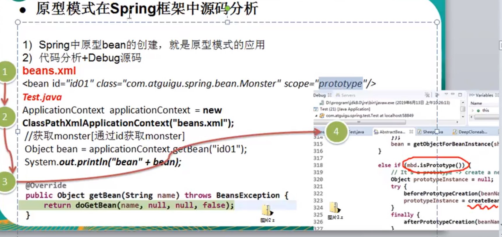

```
浅拷贝：
如果是基本数据类型，就是拷贝一份值；
如果是引用数据类型，就是不同的引用指向同一个实例。再这种情况下，在一个对象里修改该变量会影响到另一个对象的该成员变量值;
浅拷贝是默认使用clone()方法实现的；
```

```
深拷贝:
1)复制对象的所有基本数据类型的成员变量值；
2)为所有引用数据类型的成员变量申请存储空间，并复制每个引用数据类型成员变量所引用的对象，直到该对象可达所有的对象。也就是说，对象进行深拷贝要对整个对象进行拷贝；
3)实现深拷贝的方式有两种：重写clone方法 或 通过对象序列化；
```

```
clone()方法不会执行构造函数。
对象拷贝的时候构造函数是不会执行的，原因在于拷贝是直接在堆中进行，这其实也可以理解，new的时候，JVM要走一趟类加载流程，这个流程非常麻烦，在类加载流程中会调用构造函数，最后生成的对象会放到堆中，而拷贝就是直接拷贝堆中的现成的二进制对象，然后重新一个分配内存块。
```


# 10.建造者模式

```

```


# 11.适配器模式

```
基本介绍：
1)适配器模式将某个类的接口转换成客户端期望的另一个接口表示，主要目的是兼容性，让原本因为接口不匹配而不能一起工作的两个类可以协同工作。其别名为包装器。
2)主要分为三类：
	类适配器模式，
	对象适配器模式，
	接口适配器模式。
```

```
工作原理：
1)将一个类的接口转换成另一种接口，让原本接口不兼容的类可以兼容。
2)从用户角度看不到被适配者，是解耦的。
3)用户调用适配器转化出来的目标接口方法，适配器再调用被适配者的相关接口方法。
4)用户收到反馈结果，感觉只是和目标接口交互，如下图：
```

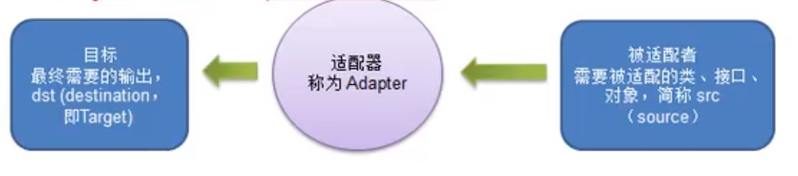

```
类适配器案例代码如下：
```

```java
//220V电源
public class Src220V {
	//输出220伏的电压
	public int outPut220() {
		int src = 220;
		System.out.println("插座电压 = "+src);
		return src;
	}
}

//适配接口
public interface IV5V {
	//输出5伏电压
	public int outPut5V();
}

//适配器类，将220V转换成5V
public class Adapter extends Src220V implements IV5V{
	@Override
	public int outPut5V() {
		//首先获取到电源电压
		int src = outPut220();
		int result = src/44;//转成5伏
		return result;
	}
}

//手机类
public class Phone {
	//充电
	public void charge(IV5V i) {
		if( i.outPut5V() == 5 ) {
			System.out.println("电压为5伏，可以正常充电");
		}else {
			System.out.println("电压不对，不能充电！！！！！！！！");
		}
	}
}

//测试类
public class Test {
	public static void main(String[] args) {
		System.out.println("类适配器模式");
		Phone phone = new Phone();
		phone.charge(new Adapter());
	}
}

```

```java
类适配器注意：
1)Java中类是单继承，所以类适配器需要继承src类这一点算是缺点，因为者要求dst必须是接口，有一定局限性。
2)src类的方法再Adapter中都会暴露出来，也增加了使用成本。
3)由于其继承了src类，所以它可以根据需求重写src类的方法，使得Adapter的灵活性增强了。
```


```
对象适配器介绍：
1)基本思路和类适配器相同，只是将Adapter类做修改，不继承src类，而是持有src的实例。
2)根据合成复用原则，在系统中尽量使用关联关系来代替继承关系。
对象适配器案例代码如下：
```

```java
//被适配的类
public class Src220V {
	//提供220V电压
	public int output220V() {
		int src = 220;
		System.out.println("插座电压为： "+src);
		return src;
	}
}

//适配接口
public interface IV5V {
	public int output5V();
}

//适配器类
public class Adapter implements IV5V{
	private Src220V src220V;
    
	public Adapter(Src220V src220V) {
		this.src220V = src220V;
	}

	@Override
	public int output5V() {
		int res = 0;
		if( null!=src220V ) {
			//获取插座的220V电压
			int src = src220V.output220V();
			res = src/44;
		}
		return res;
	}
	
}


//手机类
public class Phome {
	public void charge(IV5V i) {
		if(i.output5V() == 5) {
			System.out.println("电压为5V，可以正常充电");
		}else {
			System.out.println("电压异常，不能充电");
		}
	}
}


//测试
public class Test {
	public static void main(String[] args) {
		System.out.println("===对象适配器===");
		Phome p = new Phome();
		p.charge(new Adapter(new Src220V()));
	}
}
```

```
对象适配器注意：
1)对象适配器和类适配器其实算是同一种思想，但是实现方式不同。根据合成复用原则，使用组合代替继承，所以它解决了类适配器必须继承src的局限性，也不再要求dst必须是接口。
```


```
接口适配器介绍：
1)当不需要全部实现接口提供的方法时，可先设计一个抽象类实现接口，并为该接口中的每个方法提供一个默认实现(空方法)，那么该抽象类的子类可以有选择性地覆盖父类地某些方法来实现需求。
示例代码如下：
```

```java
public interface MyI {
	public void operation1();
	public void operation2();
	public void operation3();
	public void operation4();
}

//抽象类Adapter空实现接口MyI里的所有方法
public abstract class Adapter implements MyI{
	public void operation1() {}
	public void operation2() {}
	public void operation3() {}
	public void operation4() {}
}

public class Test {
	public static void main(String[] args) {
		
		Adapter adapter = new Adapter() {
			//我们根据需求有选择性地重写方法
			@Override
			public void operation1() {
				System.out.println("使用了 operation1()");
			}
		};
		
		adapter.operation1();
	}
}
```


```
适配器模式应用:

```

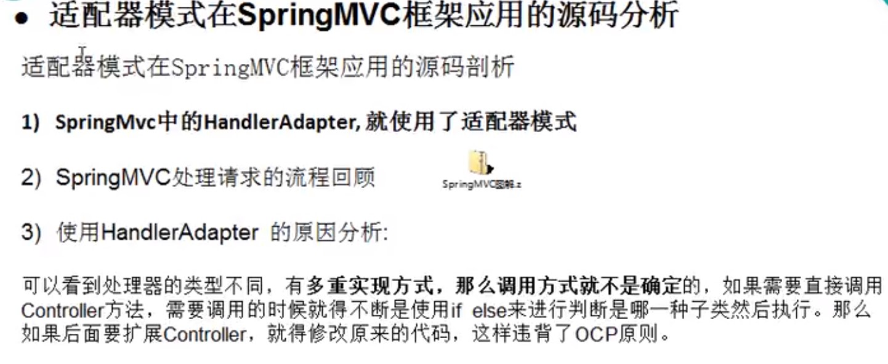


# 12.桥接模式

```
基本介绍：
1)桥接模式是指：将实现与抽象放在两个不同的类层次中，使两个层次可以独立改变。
2)桥接模式基于类的最小设计原则，通过使用封装，聚合及继承等行为让不同的类承担不同的职责。它的主要特点是把抽象与行为实现分离开来，从而可以保持各部分的独立性以及对应它们的功能扩展。
```

```
案例：
比如画图，有不同的形状和不同的颜色。
方案一：为每个颜色各提供每种形状；
方案二：根据实际需要对颜色和形状进行组合；
显然，方案二更加优化。

首先抽取出一个颜色接口Color,让不同的具体颜色1去实现这个接口；
然后抽取出一个抽象类Shape,该抽象类里持有Color类型的对象(Color实现类的对象)，调用这对象来完成具体的业务。
具体的形状类继承Shape抽象类.
```

```java
/**
 * 颜色接口
 * @author Leemi
 *
 */
public interface Color {
	public void paint(String shape);
}
```

```java
//颜色接口的各个具体实现类
public class White implements Color{
	@Override
	public void paint(String shape) {
		System.out.println("白色的    "+shape);
	}
}

public class Black implements Color{
	@Override
	public void paint(String shape) {
		System.out.println("黑色的    "+shape);
	}
}

public class Blue implements Color{
	@Override
	public void paint(String shape) {
		System.out.println("蓝色的    "+shape);
	}
}
```

```java
/**
 * 形状的抽象类
 * @author Leemi
 *
 */
public abstract class Shape {
	
	protected Color color;
	
	public Shape(Color color) {
		this.color = color;
	}
	
	protected abstract void draw() ;
}
```

```java
//各种具体形状的类
public class Circle extends Shape{

	public Circle(Color color) {
		super(color);
	}

	@Override
	public void draw() {
		super.color.paint("圆形");
	}

}

public class Square extends Shape{

	public Square(Color color) {
		super(color);
	}

	@Override
	public void draw() {
		super.color.paint("正方形");
	}

}
```

```java
public class Test {
	public static void main(String[] args) {
		
		//现在就可以组合任意形状和颜色了
		
		Shape shape1 = new Square(new White());
		shape1.draw();
		
		Shape shape2 = new Square(new Black());
		shape2.draw();
		
		Shape shape3 = new Circle(new Blue());
		shape3.draw();
		
	}
}

```

```
桥接模式注意：
1)实现了抽象和实现部分的分离，从而极大地提高了系统地灵活性，让抽象部分和实现部分分离开。这有助于系统的分层设计。
2)对于系统的高层部分，只需要知道抽象部分和实现部分的接口就可以了，其他部分由具体业务来完成。
3)桥接模式替代多层继承方案，减少了子类个数，降低系统的管理和维护成本。
4)桥接模式要求正确识别出系统中两个独立变化的维度，因此其使用范围有一定的局限性。
```

```
实际应用：JDBC
```


# 13.装饰者模式

```
定义：
动态地将新功能附加到对象上，在对象功能扩展方面，它比继承更有弹性，装饰者模式也体现了开闭原则(OCP).
```

```java
//饮料抽象类
public abstract class Drink {
	private String des ;
	
	public String getDes() {
		return this.des;
	}
	public void setDes(String des) {
		this.des = des;
	}
	
	public abstract float cost();
}
```

```java
//下面是两个饮料的具体子类

//意式特浓咖啡
public class Espresso extends Drink{
	public Espresso() {
		this.setDes("意式浓缩");
	}
	@Override
	public float cost() {
		return 2.3f;
	}
}

//美式咖啡
public class LongBlack extends Drink{
	public LongBlack() {
		this.setDes("美式");
	}
	@Override
	public float cost() {
		return 8.8f;
	}
}
```

```java
//调料装饰者抽象类
public abstract class Decorator extends Drink{
	public abstract String getDes();
}
```

```java
//牛奶调料类
public class Milk extends Decorator{
	
	private Drink drink;
	
	public Milk(Drink drink) {
		this.drink = drink;
	}

	@Override
	public String getDes() {
		return this.drink.getDes()+","+" 牛奶";
	}

	@Override
	public float cost() {
		return this.drink.cost() +1.1f;
	}

}

//巧克力调料类
public class Chocolate extends Decorator{

	private Drink drink;
	
	public Chocolate(Drink drink) {
		this.drink = drink;
	}
	
	@Override
	public String getDes() {
		return this.drink.getDes()+","+" 巧克力";
	}

	@Override
	public float cost() {
		return this.drink.cost()+4.6f;
	}

}
```

```java
public class Test {
	public static void main(String[] args) {
		
		//来一杯Espresso(或者换成LongBlack也行)
		Drink drink = new Espresso();
		System.out.println("状态1: "+drink.getDes()+" $ "+drink.cost());
		
		//加牛奶
		drink = new Milk(drink);
		System.out.println("状态2: "+drink.getDes()+" $ "+drink.cost());
		
		//加巧克力
		drink = new Chocolate(drink);
		System.out.println("状态3: "+drink.getDes()+" $ "+drink.cost());
	}
}
```

```
实际应用：
FileInputStream.
```


# 14.代理模式

## 14.1概念

```
基本介绍：
1)代理模式：为一个对象提供一个替身，以控制对这个对象的访问。即通过代理对象访问目标对象，这样做的好处是：可以在目标对象实现的基础上，增强额外的功能操作，即扩展目标对象的功能，
2)被代理的对象可以是远程对象，创建开销大的对象或需要安全控制的对象。
3)代理模式主要分三种：静态代理，动态代理，Cglib代理。
```

## 14.2静态代理

```
静态代理是指由程序员自己创建源码，在程序运行之前，代理类的字节码文件就已经存在。

静态代理在使用时，需要定义接口或父类，被代理对象(即目标对象)与代理对象实现共同的接口或继承共同的父类。

代理类和被代理类(委托类)需要实现共同的接口。
代理类的构造方法中需要传入被代理类(委托类)的对象。
代理类的对象通过调用被代理类(委托类)的对象来实现具体业务。
案例代码如下：
```

```java
//共同的接口
public interface ITeacherDao {
	void teach();
}
```

```java
//被代理的类(委托类)
public class TeacherImpl implements ITeacherDao{

	@Override
	public void teach() {
		System.out.println("老师授课中");
	}

}
```

```java
//代理类
public class TeacherProxy implements ITeacherDao{

	private ITeacherDao target;
	
	public TeacherProxy(ITeacherDao target) {
		this.target = target;
	}
	
	@Override
	public void teach() {
		System.out.println("代理开始");
		target.teach();
		System.out.println("代理结束");
	}

}
```

```java
public class Test {
	public static void main(String[] args) {
		
		//先创建目标对象(被代理者)
		ITeacherDao target = new TeacherImpl();
		
		//创建代理对象
		TeacherProxy proxy = new TeacherProxy(target);
		
		//通过代理对象，调用被代理对象的方法
		proxy.teach();
	}
}
```

## 14.3动态代理

```
基本介绍：
1)代理对象不需要实现接口，但是目标对象需要实现接口。
2)利用JDK的API,动态地在内存中构建代理对象。
3)动态代理也叫JDK代理，接口代理。
```

```
代码略过
```

## 14.4CGlib动态代理

```
基本介绍：
1)静态代理和java动态代理都要求被代理类实现一个接口，但有时候被代理类没有实现任何接口，这时候就可以用被代理类的子类实现代理，这就是cglib代理。
2)cglib代理也叫做子类代理，它在内存中构建一个子类对象，从而实现对目标对象功能的扩展，cglib代理也是动态代理的一种。
3)cglib是一个强大的高性能代码生成包，它可以在运行期扩展java类与实现java接口。它广泛地被许多AOP地框架使用，例如spring,实现方法拦截。
4)在AOP编程中如何实现动态代理：
	-目标对象需要实现接口，用JDK动态代理；
	-目标对象不需要实现接口，用cglib代理；
5)cglib包的底层是通过使用字节码处理框架ASM来转换字节码并生成新的类。
```

```
代码略过
```


# 15.观察者模式

```
观察者模式是一种对象行为模式。它定义对象间的一种一对多的依赖关系，当一个对象的状态发生改变时，所有依赖于它的对象都得到通知并被自动更新。在观察者模式中，主题是通知的发布者，它发出通知时并不需要知道谁是它的观察者，可以有任意数目的观察者订阅并接收通知
```

```
代码略过
```

```
观察者模式在jdk种的应用:
package java.util.Observable
```


# 16.生产消费模式

## 16.1 Object方法实现

``` 
使用Object类里的notiftyAll()和wait()实现。

wait() :当缓冲区已满/空 时，生产者/消费者 线程停止执行，放弃锁，使自己处于等待状态，让其他线程执行。
notifyAll() :当生产者向缓冲区放入一个产品 或者 当消费者从缓冲区取出一个产品，向其他等待的线程发出可执行通知，同时放弃锁，使自己处于等待状态.
```

```
示例代码如下：
```

```java

```

## 16.2 lock实现

```

```

## 16.3 阻塞队列实现

```

```

