# 1.volatile

## 1.1概念

​				volatile是java虚拟机提供的轻量级同步机制。

​				三大特性：保证可见性；不保证原子性；禁止指令重排；

## 1.2JMM可见性

​				Java内存模型，Java Memory Model，简称JMM。本身是一种抽象的概念，并不真实存在，它描述的是一组规则或规范，通过这组规范定义了程序中各个变量（包括实例字段，静态字段和构成数组对象的元素）的访问方式。


​				JMM要求的三个特性：

​					1.可见性；

​					2.原子性；

​					3.有序性；


​				由于JVM运行程序的实体是线程，每个线程创建时，JVM都会为其创建一个工作内存（有些地方称为栈空间），工作内存是每个线程的私有数据区域，而Java内存模型中规定所有变量都存储在主内存，主内存是共享内存区域，所有线程都可以访问，但线程对变量的操作（读取赋值等）必须在工作内存中进行，然后对变量进行操作，操作完成后再将变量写回主内存，不能直接操作主内存中的变量，各个线程中的工作内存中存储着主内存中的变量副本拷贝，因此不同线程间无法访问其他线程的工作内存，线程间的通信（传值）必须通过主内存来完成，其简要访问过程如下图：


​				JMM关于同步的规定：

​					1.线程解锁前，必须把共享变量的值刷新回主内存；

​					2.线程加锁前，必须读取主内存的最新值到自己的工作内存；

​					3.加锁解锁是同一把锁；

## 1.3volatile可见性

​				示例代码如下：

```java
/**
 * 1，验证volatile的可见性
 * 
 * @author Leemi
 *
 */
public class Demo1 {
	public static void main(String[] args) {
		MyData myData = new MyData();
		new Thread(() -> {
			System.out.println(Thread.currentThread().getName() + "\t come in");
			// 线程暂停一会儿
			try {
				TimeUnit.SECONDS.sleep(3);
			} catch (InterruptedException e) {
				e.printStackTrace();
			}
			myData.addTo60();
			System.out.println(Thread.currentThread().getName() + "\t updated num:" + myData.num);
		}, "AAA").start();

		// 第二个线程就是我们的main线程
		while (myData.num == 0) {
			// main线程就再这里一直等待，直到num!=0
		}
		System.out.println(Thread.currentThread().getName() + "\t main mission is over, now num is :" + myData.num);

	}
}

class MyData {
	volatile int num = 0;

	public void addTo60() {
		this.num = 60;
	}
}

```

## 1.4volatile不保证原子性

​				通过前面对JMM的介绍，我们知道各个线程对主内存中的共享变量的操作都是各个线程各自拷贝到各自的工作内存进行操作后再写到主内存中的。

​				这样就存在一个问题：

​				如果一个线程AAA修改了共享变量x的值但还未写入到主内存中时，另外一个线程BBB又对主内存中的同一个变量x进行操作，但此时AAA线程的工作内存中的共享变量x对线程BBB不可见，这种工作内存与主内存同步延迟现象造成了可见性问题。

​				首先看个volatile不保证原子性的案例，代码如下：

```java
/**
 * 2，验证volatile不保证原子性
 * @author Leemi
 *
 */
public class Demo2 {
	public static void main(String[] args) {
		MyData2 myData2 = new MyData2();
		
		for( int i=0; i<20; i++ ) {
			new Thread( ()->{
				for( int j=0; j<1000; j++ ) {
					myData2.addPP();
				}
			},String.valueOf(i) ).start();
		}
		
		//等待上面20歌线程结束后，main线程再看看num的最终值是多少
		while (Thread.activeCount() >2) {
			Thread.yield();
		}
		
		System.out.println(Thread.currentThread().getName()+"\t finally num is:"+myData2.num);
		
	}
}

class MyData2 {
	volatile int num = 0;
	public void addTo60() {
		this.num = 60;
	}	
	public void addPP() {
		this.num++;
	}
}

```

​				那么如何解决呢？可以使用juc包里面的AtomicInteger类。

​				java.util.concurrent.atomic包里面有很多保证原子性的类。


## 1.5volatile禁止指令重排

​				首先，何为指令重排？见下图:


​				volatile实现了禁止指令重排优化，从而避免了多线程环境下程序出现乱序执行的现象。

​				工作内存与主内存同步延迟现象导致的可见性问题可以使用synchronized或volatile关键字解决，它们都可以使一个线程修改后的变量立即对其他线程可见。

​				对于指令重排导致的可见性问题和有序性问题，可以用volatile解决，因为volatile的作用之一就是禁止指令重排序优化。

## 1.6volatile单例模式

​				单例模式有一种写法使用了"双端检索机制",代码如下：

```java
public class SingletonDemo {
	
	private static SingletonDemo instance = null;
	
	//构造方法私有化
	private SingletonDemo() {
		System.out.println(Thread.currentThread().getName()+"\t 我是构造方法 private SingletonDemo()");
	}
	
	//DCL (Double Check Lock) 双端检锁机制
	public static SingletonDemo getInstance() {
		if( instance == null ) {
			synchronized(SingletonDemo.class) {
				if( instance == null ) {
					instance = new SingletonDemo();
				}
			}
		}
		return instance;
	}
    
}
```

​				但是“双端检索机制不一定安全”，原因是有指令重排序存在，加入volatile可以禁止指令重排。

​				原因在于某一个线程执行到第一次检测，读到的instance不为null，instance的引用对象可能没有完成初始化。	SingletonDemo instance = new SingletonDemo()；可以分为以下三步（伪代码）：

​				memory = allocate(); //1.分配地址；

​				instance(memory); //2.初始化对象；

​				instance = memory; //3.设置instance指向刚分配的内存地址，此时instance != null;

​				步骤1和步骤2不存在依赖关系，而且无论重排前还是重排后，程序的执行结果在单线程中并没有改变，因此这种指令重排是允许的。就有可能执行顺序如下：

​				memory = allocate(); //1.分配地址；

​				instance = memory; //3.设置instance指向刚分配的内存地址，此时instance != null,但是对象还没有初始化;

​				instance(memory); //2.初始化对象；

​				但是指令重排只会保证串行语义的执行的一致性（单线程），并不会关系多线程之间语义的一致性。所以当一条线程访问instance不为null时，由于instance实例未必初始化完成，也就造成了线程安全问题。

​				使用volatile即可解决，上面代码修改一处地方：

```java
private static volatile SingletonDemo instance = null;
```


# 2.CAS

## 2.1引入

​				比较和交换（Conmpare And Swap）简称为CAS。

## 2.2CAS底层原理

### 2.2.1 Unsafe类

​				Unsafe类是java的核心类，由于java方法无法直接访问底层系统，需要通过本地（native）方法访问，Unsafe相当于一个后门，基于该类可以直接操作特定内存的数据。Unsafe存在于sun.misc中，其内部方法操作可以像C的指针一样直接操作内存，因为Java中CAS的操作的执行依赖于Unsafe类的方法。

​				注意！Unsafe类中的左右方法都是用native修饰的，也就是说Unsafe类中的方法都直接调用操作系统底层资源执行相应任务。


​				下面以 AtomicReference 的 compareAndSet 方法为例，分析CAS原理：


​				变量valueOffset，表示该变量值在内存中的偏移地址，因为Unsafe就是根据内存偏移地址来获取数据的。


​				上面这个是自旋锁原理（后面会详述）。


​				附注：变量value用volatile修饰，保证了多线程之间的内存可见性。


## 2.3概念

​				CAS全称Conmpare And Swap，它是一条CPU并发原语。它的功能是判断内存某个位置的值是否为预期值，如果是，则更改为新的值，这个过程是原子的。

​				CAS的并发原语体现在Java语言中就是sun.misc.Unsafe类中的各个方法。调用Unsafe类中的CAS方法，JVM会帮我们实现出CAS汇编指令。这是一种完全依赖于硬件的功能，通过它实现了原子操作。

​				再次强调！由于CAS是一种系统原语，原语属于操作系统用语范畴，是由若干条指令组成的，用于完成某个功能的一个过程，并且原语的执行必须是连续的，在执行过程中不允许被中断，也就是说，CAS是一条CPU的原子指令，不会造成所谓的数据不一致问题。

## 2.4CAS缺点

​				1.循环时间长，开销大：如果CAS失败，就会一直进行尝试，如果CAS长时间一直不成功，可能会给CPU带来很大的开销；

​				2.只能保证一个共享变量的原子操作;

​				3.引出ABA问题；

## 2.5 ABA问题

​				CAS算法会导致ABA问题。

​				CAS算法实现一个重要前提需要取出内存中某时刻的数据并在当下时刻比较并替换，那么这个时间差会导致数据的变化。比如说线程ONE从内存中取出A，这时候另一个线程TWO也从内存中取出A，并且线程TWO进行了一些操作将A变成了B，然后线程TWO又将B变回A，这时候线程ONE进行CAS操作发现内存中仍然是A，然后线程ONE操作成功。

​				尽管线程ONE的CAS操作成功，但并不代表这个过程没问题。

## 2.6原子引用

​				java.util.concurrent.atomic 包里的 AtomicReference<V> 类,示例代码如下：

```java
public class Demo2 {
	public static void main(String[] args) {
		User u1 = new User("张三",18);
		User u2 = new User("李四",19);
		AtomicReference<User> atomicReference = new AtomicReference<>();
		atomicReference.set(u1);
		
		System.out.println(atomicReference.compareAndSet(u1, u2)+"\t "+atomicReference.get().toString());
		System.out.println(atomicReference.compareAndSet(u1, u2)+"\t "+atomicReference.get().toString());
	}
}


class User{
	String name;
	int age;
	public User(String name, int age) {
		super();
		this.name = name;
		this.age = age;
	}
	@Override
	public String toString() {
		return "User [name=" + name + ", age=" + age + "]";
	}
}
```

## 2.7ABA问题解决

​				使用java.util.concurrent.atomic.AtomicStampedReference类,代码如下：

```java
/**
 * ABA问题解决
 * @author Leemi
 *
 */
public class Demo3 {
	
	static AtomicReference<Integer> atomicReference = new AtomicReference<>(100);
	static AtomicStampedReference<Integer> atomicStampReference= new AtomicStampedReference<>(100,1);
	
	public static void main(String[] args) {
		
		System.out.println("===============以下是ABA问题的产生================");
		new Thread( ()->{
			atomicReference.compareAndSet(100, 101);
			atomicReference.compareAndSet(101, 100);
		},"t1").start();
		
		new Thread( ()->{
			//t2线程暂停1秒，确保t1线程完成了一次ABA
			try {
				TimeUnit.SECONDS.sleep(1);
			} catch (InterruptedException e) {
				e.printStackTrace();
			}
			System.out.println(atomicReference.weakCompareAndSet(100, 2019)+"\t :"+atomicReference.get());
		}).start();
		
		try {
			TimeUnit.SECONDS.sleep(2);
		} catch (InterruptedException e) {
			e.printStackTrace();
		}
		
		System.out.println("===============以下是ABA问题的解决================");
		new Thread( ()->{
			int stamp = atomicStampReference.getStamp();
			System.out.println(Thread.currentThread().getName()+"\t 第一次版本号："+stamp);
			//t3进程暂停1秒，
			try {
				TimeUnit.SECONDS.sleep(1);
			} catch (InterruptedException e) {
				e.printStackTrace();
			}
			atomicStampReference.compareAndSet(100, 101, atomicStampReference.getStamp(), atomicStampReference.getStamp()+1);
			System.out.println(Thread.currentThread().getName()+"\t 第二次版本号："+atomicStampReference.getStamp());
			atomicStampReference.compareAndSet(101, 100, atomicStampReference.getStamp(), atomicStampReference.getStamp()+1);
			System.out.println(Thread.currentThread().getName()+"\t 第三次版本号："+atomicStampReference.getStamp());
		},"t3").start();
		
		new Thread( ()->{
			int stamp = atomicStampReference.getStamp();
			System.out.println(Thread.currentThread().getName()+"\t 第一次版本号："+stamp);
			//t4进程暂停3秒，保证t3线程完成一次ABA
			try {
				TimeUnit.SECONDS.sleep(3);
			} catch (InterruptedException e) {
				e.printStackTrace();
			}
			boolean flag = atomicStampReference.compareAndSet(100, 2019, stamp, stamp+1);
			System.out.println(Thread.currentThread().getName()+"\t "+flag+"\t 当前版本号："+atomicStampReference.getStamp());
			System.out.println(Thread.currentThread().getName()+"\t 当前最新值s："+atomicStampReference.getReference());
		},"t4").start();
		
	}
}

```


# 3.并发集合

## 3.1集合并发安全引入

​				例：ArratList 是线程不安全的。

```java
/**
 * 集合类不安全问题,举例ArrayList
 * @author Leemi
 *
 */
public class Demo1 {
	public static void main(String[] args) {
//		List<String> list = new ArrayList<>();//线程不安全
//		List<String> list = new Vector<>();//线程安全
		List<String> list = Collections.synchronizedList(new ArrayList<>());//线程安全
		
		for( int i=1; i<=30; i++ ) {
			new Thread(()->{
				list.add(UUID.randomUUID().toString().substring(0, 8));
				System.out.println(list);
			}).start();
		}
		
		//java.util.ConcurrentModificationException并发修改异常
	}
}
```

## 3.2写时复制

​				如果不使用Vector或Collections，还有别的方法保证线程安全吗？

​				有，可以使用java.util.concurrent.CopyOnWriteArrayList。它用到了写时复制。

```java
List<String> list = new CopyOnWriteArrayList<>();
```

​				

​				写时复制：

​				CopyOnWrite容器即写时复制容器。往一个容器添加元素的时候，不直接往Object[ ]里添加，而是将当前容器Object[ ] 进行Copy,复制出一个新的容器 Object[ ] elements，然后往新的容器 Object[ ] elements里添加元素，添加完元素后，再将原容器的引用指向新的容器 setArray(newElements)；这样做的好处是可以对CopyOnWrite容器进行并发地读，而不需要加锁，因为当前容器不会添加任何元素。所以CopyOnWrite容器也是一种读写分离地思想，读和写不同地容器。

​				源码如下：

```java
    public boolean add(E e) {
        final ReentrantLock lock = this.lock;
        lock.lock();
        try {
            Object[] elements = getArray();
            int len = elements.length;
            Object[] newElements = Arrays.copyOf(elements, len + 1);
            newElements[len] = e;
            setArray(newElements);
            return true;
        } finally {
            lock.unlock();
        }
    }
```

​				与CopyOnWriteArrayList类似地还有CopyOnWriteArraySet，ConcurrentHashMap。


# 4.Java锁

## 4.1公平非公平锁

​				-公平锁：多个线程按照申请锁的顺序来获取锁，类似排队打饭，先来后到；

​				-非公平锁：多个线程获取锁的顺序并不是按照申请锁的顺序，有可能后申请的线程比先申请的线程优先获取锁，在高并发情况下，有可能会造成优先级反转或饥饿现象。

​				并发包中的ReentrantLock的创建可以指定构造函数中的boolean变量来得到公平锁或非公平锁，默认是非公平锁；


​				关于二者区别：

​				公平锁：在并发环境中，每个线程在获取锁时会先查看此锁维护的等待队列，如果为空，或者当前线程是等待队列的第一个，就占有锁，否则就会加入到等待队列中，以后会按照FIFO的顺序从队列中取到自己；

​				非公平锁：比较粗鲁，上来就直接尝试占有锁，如果尝试失败，就再采用类似公平锁的那种方式；非公平锁的优点在于吞吐量比公平锁大。Synchronized也是非公平锁；


## 4.2可重入锁(递归锁)

​				可重入锁也叫递归锁，指的是同一线程外层函数获得锁之后，内层递归函数仍能获取该锁的代码，再同一个线程再外层方法获取锁的时候，在内层方法会自动获取锁。也就是说，线程可以进入任何一个它已经拥有的锁锁同步着的代码块。

​				ReentrantLock 和 Synchronized 就是典型的可重入锁；

​				可重入锁的最大作用就是避免死锁；！！！

​				示例代码如下：

```java
/**
 * 可重入锁
 * @author Leemi
 *
 */
public class Demo2 {
	public static void main(String[] args) throws Exception {
		Phone p = new Phone();
		
		new Thread(()->{
			try {
				p.sendMSM();
			} catch (Exception e) {
				e.printStackTrace();
			}
		},"t1").start();
		
		new Thread(()->{
			try {
				p.sendMSM();
			} catch (Exception e) {
				e.printStackTrace();
			}
		},"t2").start();
		TimeUnit.SECONDS.sleep(2);
		System.out.println("=========================");
		
		Thread t3 = new Thread(p, "t3");
		Thread t4 = new Thread(p, "t4");
		t3.start();
		t4.start();
	}
}

class Phone implements Runnable{
	
	public synchronized void sendMSM() throws Exception{
		System.out.println(Thread.currentThread().getName()+"\t sendMSM()");
		sendEmail();
	}
	public synchronized void sendEmail() throws Exception{
		System.out.println(Thread.currentThread().getName()+"\t ###########sendEmail()");
	}
	
	////////////////////////////////////////////////////////////
	Lock lock = new ReentrantLock();
	@Override
	public void run() {
		get();
	}
	public void get() {
		lock.lock();
		try {
			System.out.println(Thread.currentThread().getName()+"\t get()");
			set();
		}finally {
			lock.unlock();
		}
	}
	public void set() {
		lock.lock();
		try {
			System.out.println(Thread.currentThread().getName()+"\t set()");
		}finally {
			lock.unlock();
		}
	}
	
}

```


## 4.3自旋锁

​				自旋锁，是指尝试获取锁的线程不会立即阻塞，而是采用循环的方式去尝试获取锁，这样的好处是减少线程上下文切换的消耗，缺点是循环会消耗cpu。

​				示例代码如下：

```java
/**
 * 自旋锁
 * @author Leemi
 *
 */
public class Demo3 {
	
	//原子引用线程
	AtomicReference<Thread> atomicReference = new AtomicReference<>();
	
	public void myLock() {
		Thread thread = Thread.currentThread();
		System.out.println(Thread.currentThread().getName()+"\t come in! ");
		while( !atomicReference.compareAndSet(null, thread) ) {
			
		}
	}
	
	public void myUnlock() {
		Thread thread = Thread.currentThread();
		atomicReference.compareAndSet(thread, null);
		System.out.println(Thread.currentThread().getName()+"\t unlocked! ");
	}
	
	public static void main(String[] args) {
		Demo3 demo3 = new Demo3();
		
		new Thread( ()->{
			demo3.myLock();
			try {
				TimeUnit.SECONDS.sleep(5);
			} catch (InterruptedException e) {
				e.printStackTrace();
			}
			try {
				TimeUnit.SECONDS.sleep(5);
			} catch (InterruptedException e) {
				e.printStackTrace();
			}
			demo3.myUnlock();
		},"AAA").start();
		
		try {
			TimeUnit.SECONDS.sleep(1);
		} catch (InterruptedException e) {
			e.printStackTrace();
		}
		
		new Thread( ()->{
			demo3.myLock();
			try {
				TimeUnit.SECONDS.sleep(1);
			} catch (InterruptedException e) {
				e.printStackTrace();
			}
			demo3.myUnlock();
		},"BBB").start();
		
	}
	
}

```


## 4.4读写锁

​				独占锁：指该锁一次只能被一个线程所持有，ReentrantLock 和 Synchronized 都是独占锁；

​				共享锁：指该锁可以被多个线程所占有。对于ReentrantReadWriteLock，其读锁是共享锁，其写锁是独占锁。该锁的共享锁可保证并发读是非常高效的，读写，写读，写写的过程是互斥的。

​				示例代码如下：

```java
package com.interview.lock;

import java.util.HashMap;
import java.util.Map;
import java.util.concurrent.TimeUnit;
import java.util.concurrent.locks.ReentrantReadWriteLock;

/**
 * 读-读	能共存
 * 读-写	不能共存
 * 写-写	不能共存
 * @author Leemi
 *
 */
public class Demo4 {
	public static void main(String[] args) {
		MyCache myCache = new MyCache();
		
		for( int i=1; i<=5; i++ ) {
			final int tempInt = i;
			new Thread( ()->{
				myCache.put(tempInt+"", tempInt+"");
			},String.valueOf(i)).start();
		}
		
		for( int i=1; i<=5; i++ ) {
			final int tempInt = i;
			new Thread( ()->{
				myCache.get(tempInt+"");
			},String.valueOf(i)).start();
		}
		
	}
}

class MyCache{
	private volatile Map<String,Object> map = new HashMap<>();
	private ReentrantReadWriteLock rwLock =  new ReentrantReadWriteLock();
	
	public void put( String key, Object value ) {
		rwLock.writeLock().lock();
		try {
			System.out.println(Thread.currentThread().getName()+"正准备写入:\t "+key);
			try {TimeUnit.MICROSECONDS.sleep(300);} 
			catch (InterruptedException e) {e.printStackTrace();}
			map.put(key, value);
			System.out.println(Thread.currentThread().getName()+"写入完成");
		} finally {
			rwLock.writeLock().unlock();
		}
	}
	
	public void get( String key )  {
		rwLock.readLock().lock();
		try {
			System.out.println(Thread.currentThread().getName()+"正准备读 ");
			try {TimeUnit.MICROSECONDS.sleep(300);} 
			catch (InterruptedException e) {e.printStackTrace();}
			Object result = map.get(key);
			System.out.println(Thread.currentThread().getName()+"读取完成"+result);
		} finally {
			rwLock.readLock().unlock();
		}
	}
}

```


## 4.5CountDownLatch

​				一个同步辅助类，在完成一组正在其他线程中执行的操作之前，它允许一个或多个线程一直等待。 

用给定的*计数* 初始化 `CountDownLatch`。由于调用了 [`countDown()`](../../../java/util/concurrent/CountDownLatch.html#countDown())  方法，所以在当前计数到达零之前，[`await`](../../../java/util/concurrent/CountDownLatch.html#await())  方法会一直受阻塞。

​				示例代码如下：

```java
package com.interview.lock;

import java.util.concurrent.CountDownLatch;

public class Demo5 {
	public static void main(String[] args) throws Exception {
		
		CountDownLatch countDownLatch = new CountDownLatch(6);
		
		for( int i=1; i<=6; i++ ) {
			new Thread( ()->{
				System.out.println(Thread.currentThread().getName()+"号学生上完自习走人");
				countDownLatch.countDown();
			}).start();
		}
		
		countDownLatch.await();
		System.out.println("==========================班长关教室");
	}
}

```


## 4.6CylicBarrier

​				CylicBarrier意思是可循环使用的屏障。它要做的事情是，让一组线程到达一个屏障（也可以见同步点）时被阻塞，直到最后一个线程到达屏障时，屏障才会开门，所有被屏障拦截的线程才会继续干活，线程进入屏障通过CylicBarrier的await( )方法。

​				示例代码如下：

```java
package com.interview.lock;

import java.util.concurrent.BrokenBarrierException;
import java.util.concurrent.CyclicBarrier;

public class Demo6 {
	public static void main(String[] args) {
		CyclicBarrier cyclicBarrier = new CyclicBarrier(7, ()->{System.out.println("***召唤神龙");});
		
		for( int i=1; i<=7; i++ ) {
			final int temp = i;
			new Thread( ()->{
				System.out.println(Thread.currentThread().getName()+"收集到第\t "+temp+" \t颗龙珠");
				try {
					cyclicBarrier.await();
				} catch (InterruptedException | BrokenBarrierException e) {
					e.printStackTrace();
				}
			},String.valueOf(i)).start();
		}
		
	}
}

```


## 4.7Semaphore

​				信号量主要用于两个目的：一个是用于多个共享资源的互斥使用；另一个是用于控制并发线程数量；

​				示例代码如下：

```java
package com.interview.lock;

import java.util.concurrent.Semaphore;
import java.util.concurrent.TimeUnit;

public class Demo7 {
	public static void main(String[] args) {
		Semaphore semaphore = new Semaphore(3);//模拟三个停车位
		
		for( int i=1; i<=6; i++ ) {//模拟6部汽车
			new Thread(()->{
				try {
					semaphore.acquire();//占有停车位
					System.out.println(Thread.currentThread().getName()+"\t 抢到车位");
					TimeUnit.SECONDS.sleep(3);//每辆车在车位上停3秒
					System.out.println(Thread.currentThread().getName()+"\t 离开车位");
				} catch (InterruptedException e) {
					e.printStackTrace();
				} finally {
					semaphore.release();//释放停车位
				}
			},String.valueOf(i)).start();
		}
	}
}

```


# 5.阻塞队列

## 5.1概念

​				阻塞队列，顾名思义。首先它是一个队列，而一个阻塞队列在数据结构中所起的作用大致如下图所示：

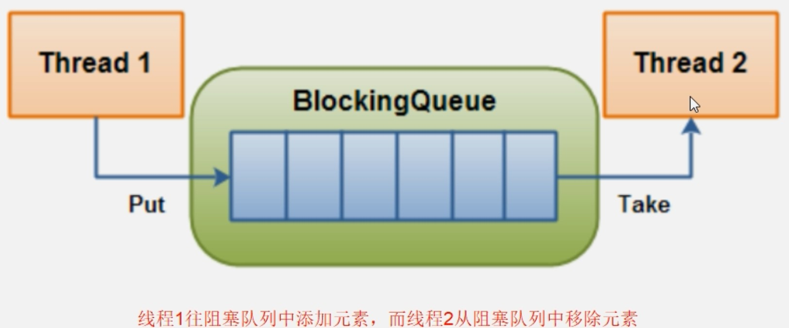

​		-当阻塞队列是空的时，从队列中获取元素的操作将会被阻塞。

​		-当阻塞队列是满的时，往队列里添加元素的操作将会被阻塞。


​		简而言之就是：

​		试图从空的队列中获取元素的线程将会被阻塞，直到其他的线程往空的队列插入新的元素；

​		同样，试图往已经满的队列中添加新元素的线程也会被阻塞，直到其他线程从队列中移除一个或者多个元素或者完全清空队列后使得队列变得重新空闲后才能新增；

## 5.2用途

​				在多线程领域：所谓阻塞，在某些情况下会挂起线程（即阻塞），一旦条件满足，被挂起的线程又会自动被唤醒。

​				为什么需要BlockongQueue?

​				好处是我们不需要关心上面时候需要阻塞线程，什么时候需要唤醒线程，因为这一切BlockongQueue都给你一手包办了。

​				在concurrent包发布之前，在多线程环境下，我们每个程序员都必须自己去控制这些细节，尤其还要兼顾效率和安全，而这会带来不小的复杂度。

## 5.3简介

​				BlockingQueue接口继承 Queue接口，Queue接口继承Connection接口；

​				BlockingQueue有七个实现类，入下图所示:

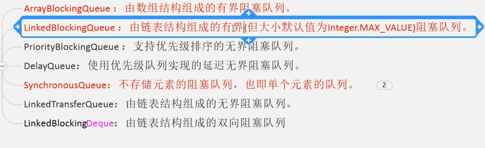


## 5.4主要方法

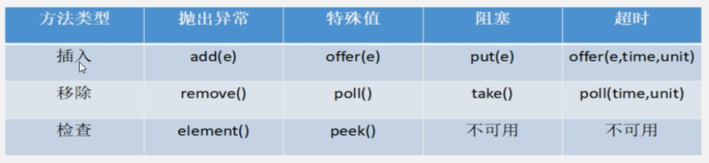


### 5.4.1抛异常

​				add(e):插入元素，当队列满时，再往队列里add插入新元素会抛java.lang.IllegalStateException: Queue full；

​				remove(): 移除元素，返回被移除的元素，当队列空时，再往队列里remove元素会抛java.util.NoSuchElementException；

​				element() 方法返回队首元素，若队列为空，则抛java.util.NoSuchElementException；

​				代码如下：

```java
import java.util.concurrent.ArrayBlockingQueue;
import java.util.concurrent.BlockingQueue;

public class Demo1 {
	public static void main(String[] args) {
		
		BlockingQueue<String> blockingQueue = new ArrayBlockingQueue<>(3);
		
		System.out.println(blockingQueue.add("a"));
		System.out.println(blockingQueue.add("b"));
		System.out.println(blockingQueue.add("c"));
//		System.out.println(blockingQueue.add("d"));//满时再添加新元素会抛异常
		
		System.out.println(blockingQueue.element());//返回队首元素
		
		System.out.println(blockingQueue.remove());
		System.out.println(blockingQueue.remove());
		System.out.println(blockingQueue.remove());
//		System.out.println(blockingQueue.remove());//空了再移除元素会抛异常
		
		
		System.out.println(blockingQueue);
	}
}

```

### 5.4.2返回布尔值

​				上面说的直接抛异常不太友好，现在介绍offer()和pull()；

​				offer(e): 插入方法，成功返回true,失败返回false；

​				pull():移除方法，返回被移除的元素，若队列为空，则返回null；

​				peek():查看队首元素，若队列为空，返回null；

​				代码如下:

```java
import java.util.concurrent.ArrayBlockingQueue;
import java.util.concurrent.BlockingQueue;

public class Demo2 {
	public static void main(String[] args) {
		
		BlockingQueue<String> blockingQueue = new ArrayBlockingQueue<>(3);
		
		System.out.println(blockingQueue.offer("a"));
		System.out.println(blockingQueue.offer("b"));
		System.out.println(blockingQueue.offer("c"));
		System.out.println(blockingQueue.offer("x"));
		
		System.out.println(blockingQueue.peek());
		
		System.out.println(blockingQueue.poll());
		System.out.println(blockingQueue.poll());
		System.out.println(blockingQueue.poll());
		System.out.println(blockingQueue.poll());
		
		System.out.println(blockingQueue.peek());
		System.out.println(blockingQueue);
	}
}

```

### 5.4.3阻塞和超时控制

​				-put(e) :当队列满时，生产者线程继续往队列put元素，队列会一直阻塞生产线程直到put数据or响应中断退出；

​				-take(): 当队列空时，消费者线程试图从队列里take元素，队列会一直阻塞消费者线程直到队列可用；

​				代码如下：

```java
import java.util.concurrent.ArrayBlockingQueue;
import java.util.concurrent.BlockingQueue;

public class Demo3 {
	public static void main(String[] args) throws Exception {
		
		BlockingQueue<String> blockingQueue = new ArrayBlockingQueue<>(3);
		
		blockingQueue.put("a");
		blockingQueue.put("b");
		blockingQueue.put("c");
		System.out.println("=============");
//		blockingQueue.put("d");
		
		blockingQueue.take();
		blockingQueue.take();
		blockingQueue.take();
		System.out.println("=============");
//		blockingQueue.take();
		
		System.out.println(blockingQueue);
	}
}

```


​				但一直阻塞着也不好，offer(E e, long timeout, TimeUnit unit) 和 poll(long timeout, TimeUnit unit) 提供了过时不候的解决方案；

​				当阻塞队列满时，队列会阻塞生产者线程一段时间，超过时限后生产者线程会退出；

​				当阻塞队列空时，队列会阻塞消费者消除一段时间，超过时限后消费者线程会退出；

​				代码如下：

```java
import java.util.concurrent.ArrayBlockingQueue;
import java.util.concurrent.BlockingQueue;
import java.util.concurrent.TimeUnit;

public class Demo6 {
	public static void main(String[] args) throws Exception {
		
		BlockingQueue<String> blockingQueue = new ArrayBlockingQueue<>(3);
		
		System.out.println(blockingQueue.offer("a", 2L, TimeUnit.SECONDS));;
		System.out.println(blockingQueue.offer("b", 2L, TimeUnit.SECONDS));;
		System.out.println(blockingQueue.offer("c", 2L, TimeUnit.SECONDS));;
		System.out.println("===========================");
		System.out.println(blockingQueue.offer("d", 2L, TimeUnit.SECONDS));;
		
		System.out.println(blockingQueue.poll(2L, TimeUnit.SECONDS));
		System.out.println(blockingQueue.poll(2L, TimeUnit.SECONDS));
		System.out.println(blockingQueue.poll(2L, TimeUnit.SECONDS));
		System.out.println("===========================");
		System.out.println(blockingQueue.poll(2L, TimeUnit.SECONDS));
		
		
		System.out.println(blockingQueue);
	}
}

```

## 5.5.SynchronousQueue

​				与其他BlockingQueue不同，SynchronousQueue是一个不存储元素的BlockingQueue。(生产出来后马上被消费掉)。每一个 put 操作必须等待一个 take 操作，反之亦然。

​				代码如下：

```java
import java.util.concurrent.BlockingQueue;
import java.util.concurrent.SynchronousQueue;
import java.util.concurrent.TimeUnit;

public class Demo7 {
	public static void main(String[] args) {
		BlockingQueue<String> blockingQueue = new SynchronousQueue<>();
		
		new Thread( ()->{
			try {
				System.out.println(Thread.currentThread().getName()+"\t 准备put    a ");
				blockingQueue.put("a");
				System.out.println(Thread.currentThread().getName()+"\t 准备put    b ");
				blockingQueue.put("b");
				System.out.println(Thread.currentThread().getName()+"\t 准备put    c ");
				blockingQueue.put("c");
			} catch (InterruptedException e) {
				e.printStackTrace();
			}
		},"AAA").start();
		
		new Thread( ()->{
			try {
				TimeUnit.SECONDS.sleep(5);
				System.out.println(Thread.currentThread().getName()+"\t take \t"+blockingQueue.take());
				TimeUnit.SECONDS.sleep(5);
				System.out.println(Thread.currentThread().getName()+"\t take \t"+blockingQueue.take());
				TimeUnit.SECONDS.sleep(5);
				System.out.println(Thread.currentThread().getName()+"\t take \t"+blockingQueue.take());
			} catch (InterruptedException e) {
				e.printStackTrace();
			}
		},"BBB").start();
		
	}
}

```

## 5.6生产者消费者

### 5.6.1传统版

​				代码如下：

```java
import java.util.concurrent.locks.Condition;
import java.util.concurrent.locks.Lock;
import java.util.concurrent.locks.ReentrantLock;

/**
 * 生产者消费者模式-传统版
 * 案例：一个初始值为零的变量，两个线程对其交替操作，一个+1，一个-1，来5轮;
 * @author Leemi
 *
 */

class ShareData{
	private int num = 0;
	private Lock lock = new ReentrantLock();
	private Condition condition = lock.newCondition();
	
	public void increment() throws Exception{
		lock.lock();
		try {
			//1.判断
			while( num != 0 ) {
				//等待，不能生产
				condition.await();
			}
			//2.生产
			num++;
			System.out.println(Thread.currentThread().getName()+" \t"+num);
			//3.通知唤醒
			condition.signalAll();
		} finally {
			lock.unlock();
		}
	}
	
	public void decrement() throws Exception{
		lock.lock();
		try {
			//1.判断
			while( num == 0 ) {
				//等待，不能消费
				condition.await();
			}
			//2.消费
			num--;
			System.out.println(Thread.currentThread().getName()+" \t"+num);
			//3.通知唤醒
			condition.signalAll();
		} finally {
			lock.unlock();
		}
	}
}

public class Demo8 {
	public static void main(String[] args) {
		ShareData shareData = new ShareData();
		
		new Thread( ()->{
			for( int i=1; i<=5; i++ ) {
				try {
					shareData.increment();
				} catch (Exception e) {
					e.printStackTrace();
				}
			}
		},"AAA").start();
		
		new Thread( ()->{
			for( int i=1; i<=5; i++ ) {
				try {
					shareData.decrement();
				} catch (Exception e) {
					e.printStackTrace();
				}
			}
		},"BBB").start();
	}
}

```

### 5.6.2synchronized和lock区别

​		1.首先synchronized是java内置关键字，在jvm层面，Lock是个java接口；

​		2.synchronized不需要用户去手动释放锁，当synchronized代码执行完成后系统会自动让线程释放对锁的占用；而lock 需要用户去手动释放锁( unlock( ) ); 当程序出现异常时，synchronized，但lock不会自动释放，所以 lock.unlock( ) 必须放在try{ } finally{ } 的finally{} 语句中，防止出现异常后发生死锁；

​		3.synchronized不可中断，除非抛出异常或正常运行；lock可以中断，设置超时方法 tryLock(long timeout, TimeUnit unit) 如果锁在给定等待时间内没有被另一个线程保持，且当前线程未被中断，则获取该锁。或者 lock 使用 lockInterruptibly()  如果当前线程未被中断，则获取锁。

​		4.synchronized 是非公平锁；lock两者都可以，lock的实现类ReentrantLock的构造方法中出传入布尔值来决定是否公平，默认是不公平锁；

​		5.synchronized只有一个等待队列，任何情况的阻塞都是放在一个队列里面的，Lock可以创建多个Condition队列，不同的Condition控制不同的条件，每个Condition有单独的一个队列。Lock的实现类可以精确唤醒一个或几个线程。


​		下面是关于ReentrantLock精确唤醒指定线程的案例：

```java
import java.util.concurrent.locks.Condition;
import java.util.concurrent.locks.Lock;
import java.util.concurrent.locks.ReentrantLock;

class ShareResource{
	private int number = 1;
	private Lock lock = new ReentrantLock();
	private Condition c1 = lock.newCondition();
	private Condition c2 = lock.newCondition();
	private Condition c3 = lock.newCondition();
	
	public void print5() throws Exception {
		lock.lock();
		try {
			//1.判断
			while( number != 1 ) {
				c1.await();
			}
			//2.干活
			for( int i=1; i<=5; i++ ) {
				System.out.println(Thread.currentThread().getName()+"\t"+number);
			}
			//3.通知
			number = 2;
			c2.signal();
		} finally {
			lock.unlock();
		}
	}
	
	public void print10() throws Exception {
		lock.lock();
		try {
			//1.判断
			while( number != 2 ) {
				c2.await();
			}
			//2.干活
			for( int i=1; i<=10; i++ ) {
				System.out.println(Thread.currentThread().getName()+"\t"+number);
			}
			//3.通知
			number = 3;
			c3.signal();
		} finally {
			lock.unlock();
		}
	}
	
	public void print15() throws Exception {
		lock.lock();
		try {
			//1.判断
			while( number != 3 ) {
				c3.await();
			}
			//2.干活
			for( int i=1; i<=15; i++ ) {
				System.out.println(Thread.currentThread().getName()+"\t"+number);
			}
			//3.通知
			number = 1;
			c1.signal();
		} finally {
			lock.unlock();
		}
	}
}

/**
 * AAA打印5次，BBB打印10次，CCC打印15次，
 * 这样进行10轮
 * @author Leemi
 *
 */
public class Demo9 {
	public static void main(String[] args) {
		ShareResource shareResource = new ShareResource();
		
		new Thread( ()->{
			for( int i=1; i<=10; i++ ) {
				try {shareResource.print5();
				} catch (Exception e) {e.printStackTrace();}
			}
		},"AAA").start();
		
		new Thread( ()->{
			for( int i=1; i<=10; i++ ) {
				try {shareResource.print10();
				} catch (Exception e) {e.printStackTrace();}
			}
		},"BBB").start();
		
		new Thread( ()->{
			for( int i=1; i<=10; i++ ) {
				try {shareResource.print15();
				} catch (Exception e) {e.printStackTrace();}
			}
		},"CCC").start();
		
	}
}

```


### 5.6.3阻塞队列版

​				阻塞队列版的生产者消费者模式示例代码如下：

```java
import java.util.concurrent.ArrayBlockingQueue;
import java.util.concurrent.BlockingQueue;
import java.util.concurrent.TimeUnit;
import java.util.concurrent.atomic.AtomicInteger;

class MyResource{
	private volatile boolean flag = true;//默认开启，进行生产+消费
	private AtomicInteger atomicIntegr = new AtomicInteger();
	BlockingQueue<String> blockingQueue = null;
	
	public MyResource(BlockingQueue<String> blockingQueue) {
		super();
		this.blockingQueue = blockingQueue;
	}
	
	//生产
	public void myProd() throws Exception {
		String data = null;
		boolean retValue =false;
		while( flag ) {
			data = atomicIntegr.incrementAndGet()+"";
			retValue = blockingQueue.offer(data, 2L, TimeUnit.SECONDS);
			if(retValue) {
				System.out.println(Thread.currentThread().getName()+"\t 成功插入队列: \t"+data);
			}else {
				System.out.println(Thread.currentThread().getName()+"\t 没能插入队列: \t"+data);
			}
			TimeUnit.SECONDS.sleep(1);//为了看得清晰加的
		}
		System.out.println(Thread.currentThread().getName()+"叫停生产");
	}
	
	//消费
	public void myConsume() throws Exception {
		String result = null;
		while( flag ) {
			result = blockingQueue.poll(2L, TimeUnit.SECONDS);
			if( null==result || result.equalsIgnoreCase("") ) {
				flag = false;
				System.out.println(Thread.currentThread().getName()+"\t 超过2秒没有取到蛋糕，退出消费");
				System.out.println();
				return;
			}
			System.out.println(Thread.currentThread().getName()+"\t 成功消费队列元素：\t"+result);
		}
	}
	
	public void stop() {
		this.flag = false;
	}
}

public class Demo10 {
	public static void main(String[] args) {
		MyResource myResource = new MyResource(new ArrayBlockingQueue<>(10));
		
		new Thread( ()->{
			System.out.println(Thread.currentThread().getName()+"\t 生产线程启动");
			try {
				myResource.myProd();
			} catch (Exception e) {
				e.printStackTrace();
			}
		},"Producer").start();
		
		new Thread( ()->{
			System.out.println(Thread.currentThread().getName()+"\t 消费线程启动");
			try {
				myResource.myConsume();
			} catch (Exception e) {
				e.printStackTrace();
			}
		},"Consumer").start();
		
		//5秒后叫停
		try {
			TimeUnit.SECONDS.sleep(5);
		} catch (InterruptedException e) {
			e.printStackTrace();
		}
		System.out.println("5秒后叫停");
		myResource.stop();
		
	}
}

```


# 6.Callable接口

​				创建线程的2种基本方式，一种是直接继承Thread，另外一种就是实现Runnable接口。

​				这2种方式都有一个缺陷就是：在执行完任务之后无法获取执行结果。如果需要获取执行结果，就必须通过共享变量或者使用线程通信的方式来达到效果，这样使用起来就比较麻烦。

​				而自从Java1.5开始，就提供了Callable和Future，通过它们可以在任务执行完毕之后得到任务执行结果。


# 7.线程池

## 7.1概念

​				线程池做的工作主要是控制运行的线程的数量，处理过程中将任务放入队列，然后再线程创建后启动这些任务，如果线程数量超过了上限，则超过部分的线程就排队等候，要先等前面的线程执行完毕，再从队列中取出任务执行。

​				主要特点为：

​				线程复用；控制最大并发数；管理线程；

​				第一：降低资源消耗，通过重复利用已经创建的线程降低线程创建和销毁所带来的消耗；

​				第二：提高响应速度。当任务到达时，任务可以不需要等到线程创建就能立即执行；

​				第三：提高线程的可管理性。线程是稀缺资源，如果无限制地创建，不仅会消耗系统资源，还会降低系统的稳定性，使用线程池可以进行同一的分配，调优和监控；

## 7.2创建线程池常用方式

​				Java中线程池是通过Executor框架实现的，该框架中用到了Executor，Executors，ExecutorService，ThreadPoolExecutor这几个类。

​				创建线程池主要使用以下三种方式：

```java
Executors.newFixedThreadPool( int n );//固定大小的线程池
Executors.newSingleThreadExecutor();//单个线程的线程池
Executors.newCachedThreadPool();//缓存线程池
```

​			代码如下：

```java
import java.util.concurrent.ExecutorService;
import java.util.concurrent.Executors;

public class Demo1 {
	public static void main(String[] args) {
//		ExecutorService threadPool = Executors.newFixedThreadPool(5);//一池5个处理线程
//		ExecutorService threadPool = Executors.newSingleThreadExecutor();//一池1个处理线程
		ExecutorService threadPool = Executors.newCachedThreadPool();//一池不确定个处理线程
		
		try {
			//模拟10个用户，每个用户就是来自外部的请求
			for( int i=1; i<=10; i++ ){
				threadPool.execute( ()->{
					System.out.println(Thread.currentThread().getName()+"\t 办理业务");
				});
			}
		} catch( Exception e ) {
			e.printStackTrace();
		} finally {
			threadPool.shutdown();
		}
	}
}

```


三种方式区别：

```java
Executors.newFixedThreadPool(5):
特点：
    1.创建一个定长线程池，可控制线程并发数，超出的线程会在队列中等待；
    2.newFixedThreadPool创建的线程池corePoolSize和maximumPoolSize的值值相等的，它用的是LinkedBlockingQueue;

public static ExecutorService newFixedThreadPool(int nThreads) {
    return new ThreadPoolExecutor(nThreads, nThreads,
                                  0L, TimeUnit.MILLISECONDS,
                                  new LinkedBlockingQueue<Runnable>());
}

public ThreadPoolExecutor(int corePoolSize,
                          int maximumPoolSize,
                          long keepAliveTime,
                          TimeUnit unit,
                          BlockingQueue<Runnable> workQueue) {
    this(corePoolSize, maximumPoolSize, keepAliveTime, unit, workQueue,
         Executors.defaultThreadFactory(), defaultHandler);
}
```

```java
Executors.newSingleThreadExecutor():
特点：
    1.创建一个单线程化的线程池，它只会用唯一的工作线程来执行任务，保证所有任务按照指定顺序执行；
    2.newSingleThreadExecutor将corePoolSize和maximumPoolSize都设置为1，它使用的是LinkedBlockingQueue；
    
public static ExecutorService newSingleThreadExecutor() {
    return new FinalizableDelegatedExecutorService
        (new ThreadPoolExecutor(1, 1,
                                0L, TimeUnit.MILLISECONDS,
                                new LinkedBlockingQueue<Runnable>()));
}

public ThreadPoolExecutor(int corePoolSize,
                          int maximumPoolSize,
                          long keepAliveTime,
                          TimeUnit unit,
                          BlockingQueue<Runnable> workQueue) {
    this(corePoolSize, maximumPoolSize, keepAliveTime, unit, workQueue,
         Executors.defaultThreadFactory(), defaultHandler);
}
```

```java
Executors.newCachedThreadPool():
特点：
    1.创建一个可缓存的线程池，如果线程池长度超过处理需要，可灵活回收空闲线程，若无可回收，则新建线程；
    2.newCachedThreadPool将corePoolSize设置为0，将maximumPoolSize设置为Integer.MAX_VALUE,，使用的是SynchronousQueue，也就是说来了任务就创建线程运行，当线程空闲超过60秒，就销毁线程；
    
public static ExecutorService newCachedThreadPool() {
    return new ThreadPoolExecutor(0, Integer.MAX_VALUE,
                                  60L, TimeUnit.SECONDS,
                                  new SynchronousQueue<Runnable>());
}

public ThreadPoolExecutor(int corePoolSize,
                          int maximumPoolSize,
                          long keepAliveTime,
                          TimeUnit unit,
                          BlockingQueue<Runnable> workQueue) {
    this(corePoolSize, maximumPoolSize, keepAliveTime, unit, workQueue,
         Executors.defaultThreadFactory(), defaultHandler);
}
```


三种创建方式适用场景：

​		-Executors.newFixedThreadPool(int n)：执行长期任务，性能好很多；

​		-Executors.newSingleThreadExecutor()：一个任务一个任务执行的场景；

​		-Executors.newCachedThreadPool()：执行很多短期异步的小程序或者负载较轻的服务器；


## 7.3线程池七大参数

​				ThreadPoolExecutor构造方法如下：

```java
    /**
     * Creates a new {@code ThreadPoolExecutor} with the given initial
     * parameters.
     *
     * @param corePoolSize the number of threads to keep in the pool, even
     *        if they are idle, unless {@code allowCoreThreadTimeOut} is set
     * @param maximumPoolSize the maximum number of threads to allow in the
     *        pool
     * @param keepAliveTime when the number of threads is greater than
     *        the core, this is the maximum time that excess idle threads
     *        will wait for new tasks before terminating.
     * @param unit the time unit for the {@code keepAliveTime} argument
     * @param workQueue the queue to use for holding tasks before they are
     *        executed.  This queue will hold only the {@code Runnable}
     *        tasks submitted by the {@code execute} method.
     * @param threadFactory the factory to use when the executor
     *        creates a new thread
     * @param handler the handler to use when execution is blocked
     *        because the thread bounds and queue capacities are reached
     * @throws IllegalArgumentException if one of the following holds:<br>
     *         {@code corePoolSize < 0}<br>
     *         {@code keepAliveTime < 0}<br>
     *         {@code maximumPoolSize <= 0}<br>
     *         {@code maximumPoolSize < corePoolSize}
     * @throws NullPointerException if {@code workQueue}
     *         or {@code threadFactory} or {@code handler} is null
     */
    public ThreadPoolExecutor(int corePoolSize,
                              int maximumPoolSize,
                              long keepAliveTime,
                              TimeUnit unit,
                              BlockingQueue<Runnable> workQueue,
                              ThreadFactory threadFactory,
                              RejectedExecutionHandler handler) {
        if (corePoolSize < 0 ||
            maximumPoolSize <= 0 ||
            maximumPoolSize < corePoolSize ||
            keepAliveTime < 0)
            throw new IllegalArgumentException();
        if (workQueue == null || threadFactory == null || handler == null)
            throw new NullPointerException();
        this.acc = System.getSecurityManager() == null ?
                null :
                AccessController.getContext();
        this.corePoolSize = corePoolSize;
        this.maximumPoolSize = maximumPoolSize;
        this.workQueue = workQueue;
        this.keepAliveTime = unit.toNanos(keepAliveTime);
        this.threadFactory = threadFactory;
        this.handler = handler;
    }
```


```java
1.int corePoolSize：线程池中的常驻核心线程数。

	在创建了线程池后，当有请求任务来了后，就会安排池中的线程去执行请求任务，近似理解为今日值班线程。
    当线程池中的线程数目达到 corePoolSize 后，就会把到达的任务放到缓存队列当中。
```


```java
2.int maximumPoolSize: 线程池能够容纳同时执行的最大线程数，此值必须大于等于1。
```


```
3.long keepAliveTime：多余的空闲线程的存活时间。当前线程池中的线程数量超过corePoolSize时候，当空闲时间达到keepAliveTime时，多余的空闲线程会被销毁，只保留corePoolSize个线程。
	默认情况下，只有当线程池中的线程数量大于corePoolSize时，keepAliveTime才会起作用，直到线程池中的线程数不大于corePoolSize。
```


```
4.TimeUnit unit：keepAliveTime的时间单位；
```


```
5. BlockingQueue<Runnable> workQueue ：任务队列，被提交但尚未被执行的任务（可以理解为侯客排队区）。
```


```
6.ThreadFactory threadFactory：表示生成线程池中工作线程的线程工厂，用于创建线程一般用默认的即可。	
```


```
7. RejectedExecutionHandler handler :拒绝策略，表示当队列满了并且工作线程大于线程池的最大线程数（maximumPoolSize）时如何拒绝请求执行的runnable策略。
```


## 7.4底层工作原理

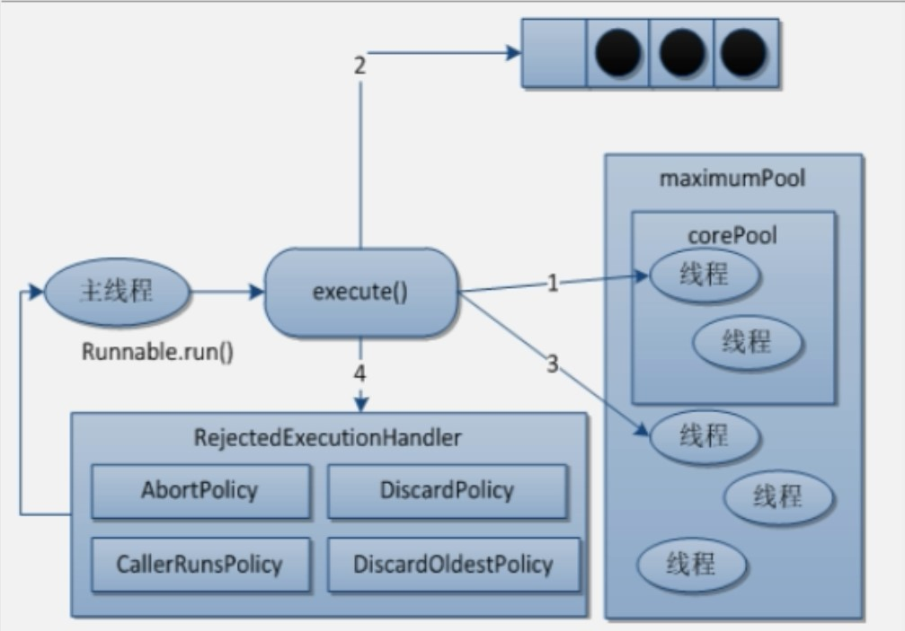


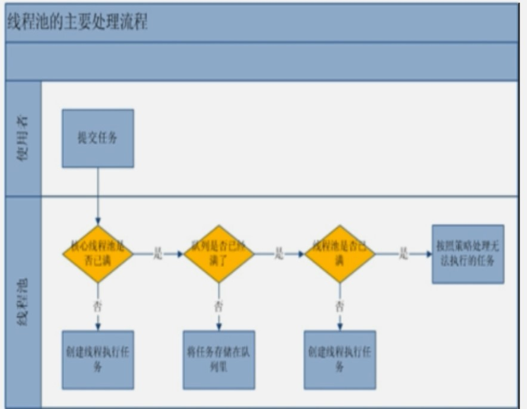


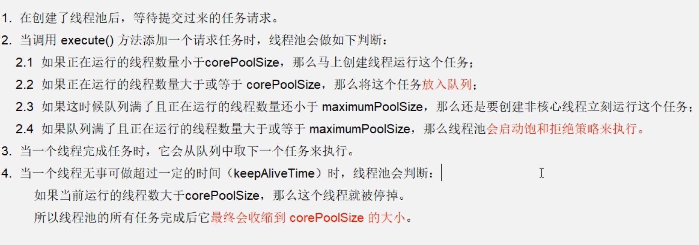


## 7.5线程池拒绝策略

​				当等待队列满了，再也塞不下新任务了，同时，线程池中的线程数也到达上限了，无法继续为新任务服务。这时我们就需要拒绝策略机制合理地处理这个问题。

​				JDK内置的4种拒绝策略如下：

```
1.AbortPolicy（默认）：直接抛出RejectedExecutionException异常阻止系统正常运行。
```

```
2.CallerRunsPolicy:"调用者运行"一种调节机制，该策略既不会抛弃任务，也不会抛异常，而是将某些任务回退到调用者，从而降低新任务的流量。
```

```
3.DiscardOldestPolicy:抛弃队列种等待最久的任务，然后把当前任务加入队列种尝试再次提交当前任务。
```

```
4.DiscardPolicy:直接丢弃任务，不予任何处理也不抛异常。如果任务允许丢失，这是最好的一种方案。
```

​				以上4种内置拒绝策略均实现了RejectedExecutionHandler接口。


## 7.5实际使用

​				面试题：三种常用的创建线程池发方法(固定数，单一，可变)，你在工作中用哪个？

​				答：超级大坑，答案是一个都不用！！！ 我们生产上只用自定义的。

​				

​				JDK种已经提供了Executors,为什么不用？

​				理由如下：


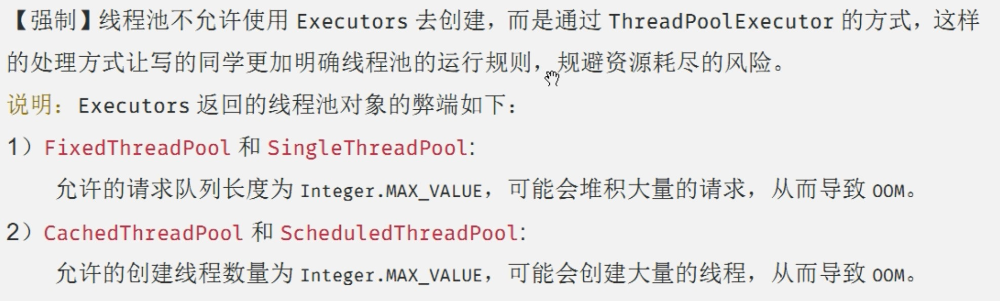


## 7.6手写线程池

​				面试题：你在工作中是如何使用线程池的？是否自定义过线程池使用？

​				自定义线程池如下：

```java
import java.util.concurrent.BlockingQueue;
import java.util.concurrent.ExecutorService;
import java.util.concurrent.Executors;
import java.util.concurrent.LinkedBlockingQueue;
import java.util.concurrent.RejectedExecutionHandler;
import java.util.concurrent.ThreadFactory;
import java.util.concurrent.ThreadPoolExecutor;
import java.util.concurrent.TimeUnit;

/**
 * 自定义线程池
 * @author Leemi
 *
 */
public class Demo2 {
	public static void main(String[] args) {
		
		int corePoolSize = 2;
		int maximumPoolSize = 5;
		long keepAliveTime = 1L;
		TimeUnit timeUnit = TimeUnit.SECONDS;
		BlockingQueue<Runnable> workQueue = new LinkedBlockingQueue<Runnable>(3);
		ThreadFactory threadFactory = Executors.defaultThreadFactory();
		RejectedExecutionHandler handler = new ThreadPoolExecutor.DiscardPolicy();
		
		ExecutorService threadPool = new ThreadPoolExecutor(corePoolSize, maximumPoolSize
										,keepAliveTime, timeUnit
										,workQueue
										,threadFactory
										,handler);
		
		try {
			//模拟10个用户，每个用户就是来自外部的请求
			for( int i=1; i<=20; i++ ){
				threadPool.execute( ()->{
					System.out.println(Thread.currentThread().getName()+"\t 办理业务");
				});
			}
		} catch( Exception e ) {
			e.printStackTrace();
		} finally {
			threadPool.shutdown();
		}
	}
}

```


## 7.7合理配置线程池

​				面试题：配置线程池要考虑什么？

​				那要看是cpu密集型还是IO密集型

```java
CPU密集型：
    CPU密集的意思是该任务需要大量的运算，而没有阻塞，CPU一直全速运行。
    CPU密集任务只有在真正的多核CPU上才可能得到加速（通过多线程）。

CPU密集型任务配置尽可能少的线程数量：
    一般公式：(CPU核数+1)个线程。
```

```java
IO密集型(分两种)：
    1.由于IO密集型任务线程不是一直在执行任务，则应配置尽可能多的线程，如CPU核数*2；
    2.任务需要大量的IO，即大量的阻塞。
    	在单线程上运行IO密集型任务会导致浪费大量CPU运算能力浪费在等待。所以IO密集型任务中使用多线程可以大大加速程序运行，即时在单核CPU上，这种加速主要就是利用了被浪费掉的阻塞时间。
    	IO密集型号时，大部分线程都阻塞，故需要多配置线程数：
    参考公式： CPU核数/(1-阻塞系数)，阻塞系数在0.8~0.9之间。
    比如8核CPU： 8/(1-0.9) = 80 线程。
```


# 8死锁编码及定位分析

## 8.1概念

​				死锁是指两个或两个以上的进程在执行过程中，因争夺资源而造成的一种互相等待现象，若无外力干涉，那它们将都无法推进下去，如果系统资源充足，进程的资源请求都能够得到满足，死锁出现的可能性就很低，否则就会因争夺优有限资源而陷入死锁。

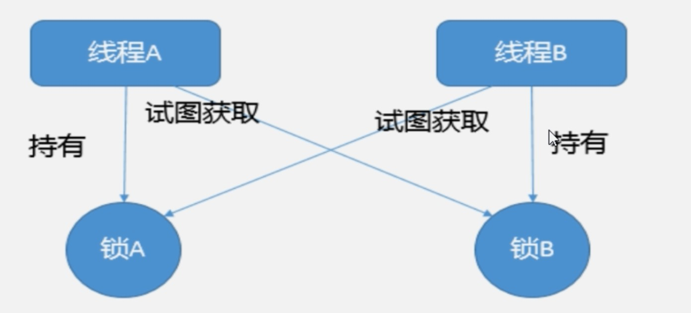


```java
产生死锁的主要原因：
    1.系统资源不足；
    2.进程运行推进的顺序不合适；
    3.资源分配不当；
```


## 8.2例子

典型的死锁案例代码如下：

```java
import java.util.concurrent.TimeUnit;
/**
 * 死锁案例
 * 
 * @author Leemi
 *
 */
class HoldLockThread implements Runnable {
	private String lockA;
	private String lockB;

	public HoldLockThread(String lockA, String lockB) {
		this.lockA = lockA;
		this.lockB = lockB;
	}

	@Override
	public void run() {
		synchronized (lockA) {
			System.out.println(Thread.currentThread().getName() + "\t 自己持有：\t" + lockA + "\t尝试获得\t" + lockB);
			// 为了看得更清楚，暂停2秒
			try {
				TimeUnit.SECONDS.sleep(2);
			} catch (InterruptedException e) {
				e.printStackTrace();
			}
			
			synchronized (lockB) {
				System.out.println(Thread.currentThread().getName() + "\t 自己持有：\t" + lockB + "\t尝试获得\t" + lockA);
			}
		}
	}
}

public class Demo3 {
	public static void main(String[] args) {
		String lockA = "lockA";
		String lockB = "lockB";
		
		new Thread( new HoldLockThread(lockA, lockB), "Thread111" ).start();
		new Thread( new HoldLockThread(lockB, lockA), "Thread222" ).start();
	}
}

```


## 8.3解决

```java
1.jps定位进程号
```

```java
2.jstack找到死锁查看
```


# 9.JVM 

## 9.1GC Root

```java
首先，什么是垃圾？
    简单地说就是内存中已经不再被使用到的空间就是垃圾。
```

```java
进行垃圾回收，如何判断一个对象是否可以被回收？
    -引用计数法；
    -枚举根结点做可达性分析(根搜索路径);
```

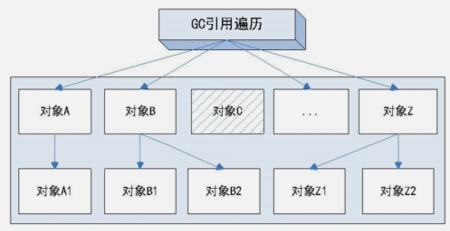

```java
为了解决循环计数法引用计数的问题，Java使用了可达性分析方法。
所谓"GC Roots"或者说 tracking GC 的“根集合”就是一组必须活跃的引用。
基本思路就是通过一系列名为“GC Roots”的对象作为引用起始点，从这个被称为GC Roots的对象开始向下搜索，如果一个对象到遍历到的（可达到的）对象就被判定为存活，没有被遍历到的就被判定为死亡。
```

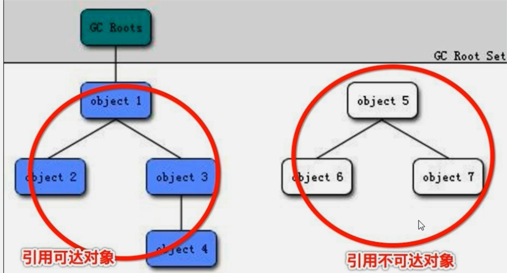


```
那么，在java中，哪些可以做为GC Root 对象呢？
主要有以下四种：
	-虚拟机栈,(栈帧中的局部变量区，也叫做局部变量表)；
	-方法区中的类静态属性引用的对象；
	-方法区中常量引用的对象；
	-本地方法栈中 JNI (Native方法)引用的对象；
```


## 9.2 JVM参数


```java
JVM参数类型：
    -标配参数；
    -x参数(了解)；
    -xx参数(重要)；
```


```java
标配参数：
    java -version;
	java -help;
	等
```

```
x参数(了解)：
	-Xint 解释执行；
	-Xcomp 第一次使用就编译成本地代码；
	-Xmixed	混合模式；
```

```
xx类型(重要)：
	-Boolean	类型；
	-KV	        类型(键值对);
	-jinfo举例，如何查看当前运行程序的配置；
```


下面着重介绍xx类型：

```
Boolean类型：
	公式：XX:+或者-某个属性值；
		+表示开启，
		-表示关闭。

如何查看一个正在运行中的java程序的某个jvm参数是否开启，以及这个参数的具体值是多少？
jps -l (查看当前运行的java进程)
jinfo -flag 参数名 进程号   (查看某个java进程的指定参数值)
jinfo -flags 进程号 (查看某个java进程所有的参数)

案例：以是否打印GC收集细节为例。
如下图所示，默认没有开启打印GC收集细节。
```

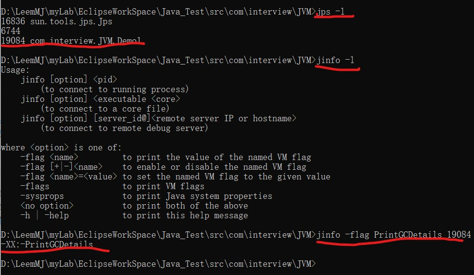

```java
以eclipse为例，在 run configurations中添加配置：
    -XX:+PrintGCDetails
运行程序，通过命令查看，发现PrintGCDetails已经开启(如下如所示)：
```

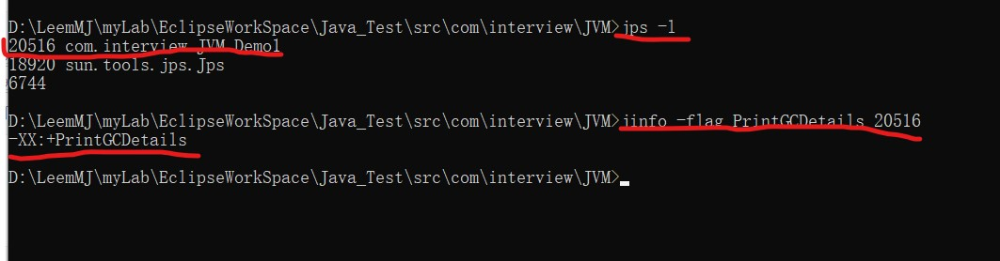


```
KV设值类型:
	公式：-XX:属性key=value值
	
以元空间大小(MetaSpacSize)为例：
默认元空间大小如下图所示：
```

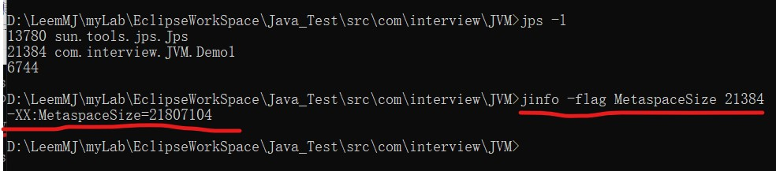

```
以eclipse为例，在 run configurations中添加配置：
    -XX:MetaSpacSize=100M
再次查看，如下图所示(单位是kb)：
```

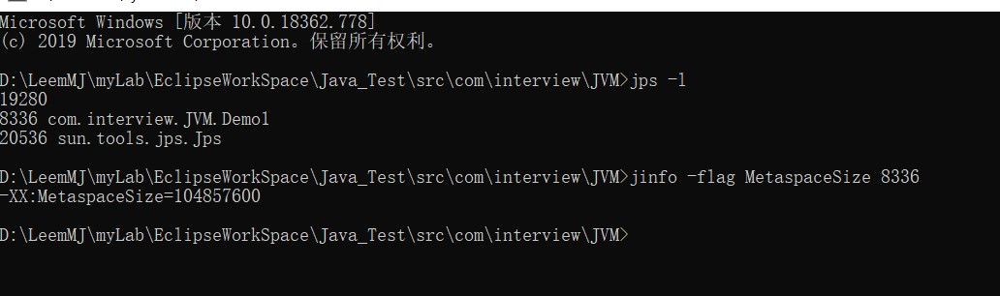


```java
谈谈 -Xms 和 -Xmx  ?
    -Xms 等价于 -XX:InitialHeapSize
    -Xmx 等价于 -XX:MaxHeapSize
    
```


## 9.3JVM默认值

```java
-XX:+PrintFlagsInitial  （查看初始默认参数）
    公式：java -XX:+PrintFlagsInitial (-version)
        会出来超级多参数，如下图所示：
```

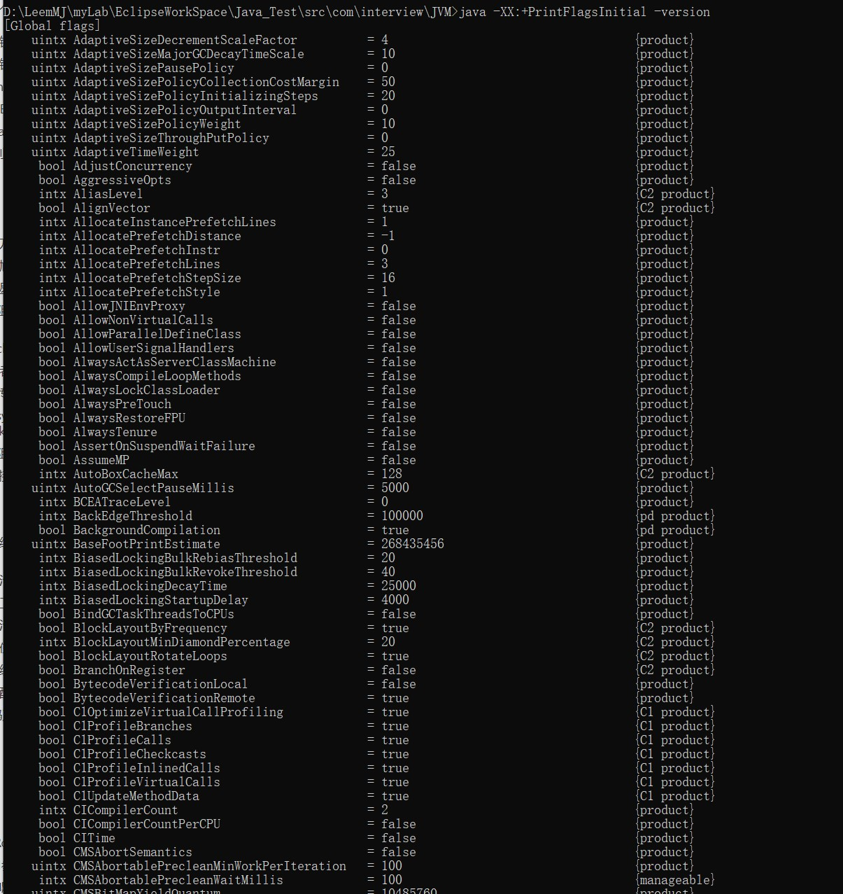

```
-XX:+PrintFlagsFinal (查看修改更新)
语法：java -XX:+PrintFlagsFinal -version
```

```
PrintFlagsInitial 或者 PrintFlagsFinal
出来的属性值中 有的是 "=" , 有的是":="
	"=" 表示这个属性值就是初始值，没被修改过
	":=" 表示这个属性值被修改过了。
```


## 9.4工作用过的JVM参数

```
初始堆内存大小默认为物理内存的 1/64
最大堆内存大小默认为物理内存的 1/4
```

```
工作中常用的 JVM 参数主要如下所示：
```

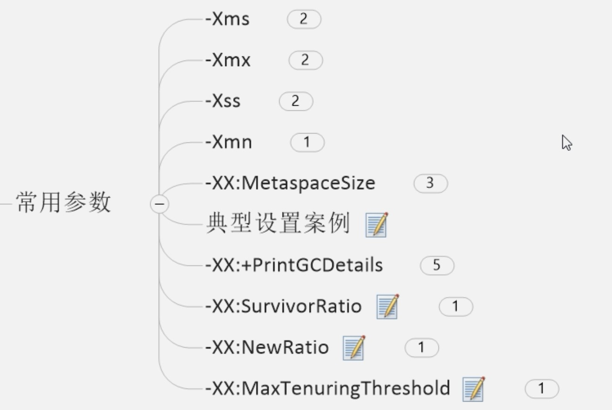

```Java
下面，开始逐个介绍.
```


```java
-Xms:初始堆内存大小，默认为物理内存的1/64
    等价于：-XX:InitialHeapSize
-Xmx:最大堆内存大小，默认为物理内存的1/4
```


```
-Xss:设置单个线程的大小，一般默认为512k~1024k
	等价于：-XX:ThreadStackSize
	在windows 下执行jps -flag ThreadStackSize 进程号，会发现值是零,如下图所示
```

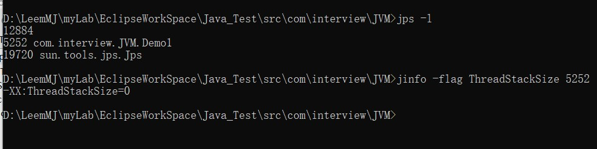

```
关于该属性默认值大小，见下图官方文档:
```

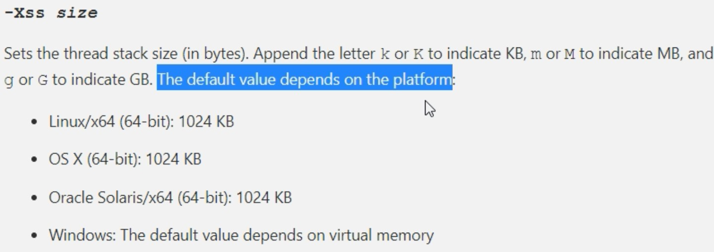

```
以Eclipse为例，设置 -Xss127k,则插看该值就为自定义设置的值，如下图所示：
```

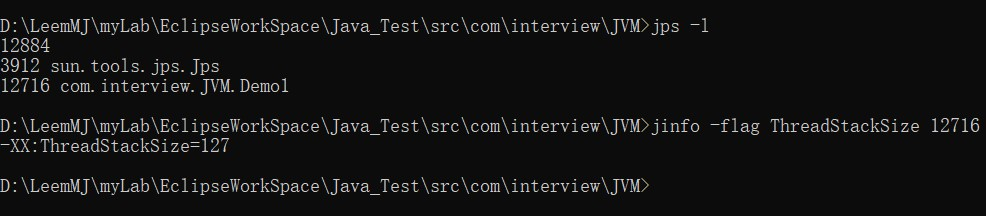


```java
-Xmn 设置年轻代大小
```

```java
-XX:MetaspaceSize 设置元空间大小.
    元空间的本质和永久代类似，都是堆JVM规范中方法区的实现，但是元空间和永久代最大的区别在于：
    元空间并不在虚拟机中，而是使用本地内存。因此，默认情况下，元空间的大小受本地内存限制。
```

```java
典型配置案例(如下图所示):
```

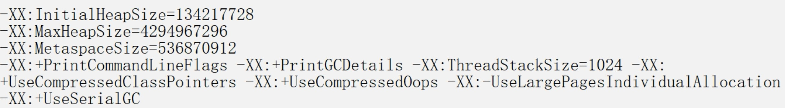


```java
-XX:+PrintGCDetails   输出详细GC收集日志信息.
    故意设置：
    	-XX:+PrintGCDetails
		-Xms10m
		-Xmx10m
    打印日志如下图所示：
```

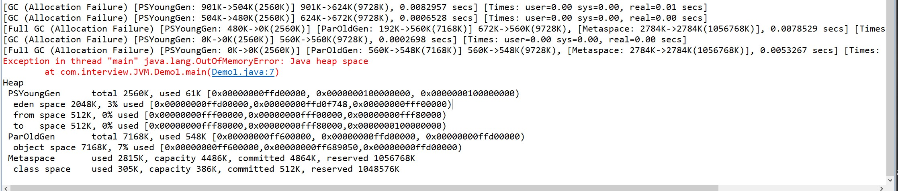

```
那么，如何阅读呢？
```

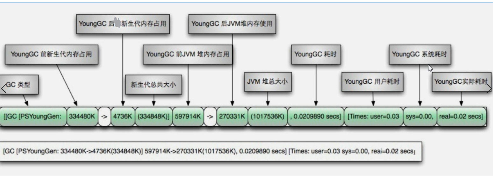

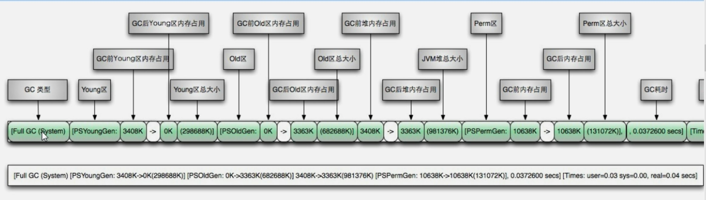

```java
不管是young gc 还是 gull gc,总结1如下：
```


```java
-XX:SurvivorRatio
```

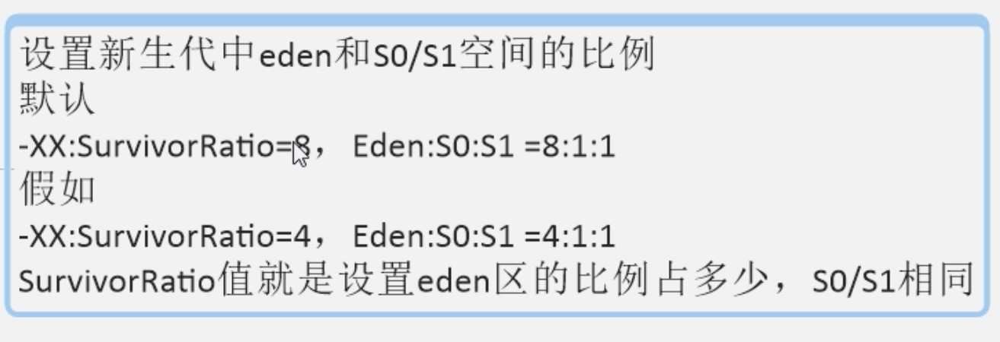


```java
-XX:NewRatio
```

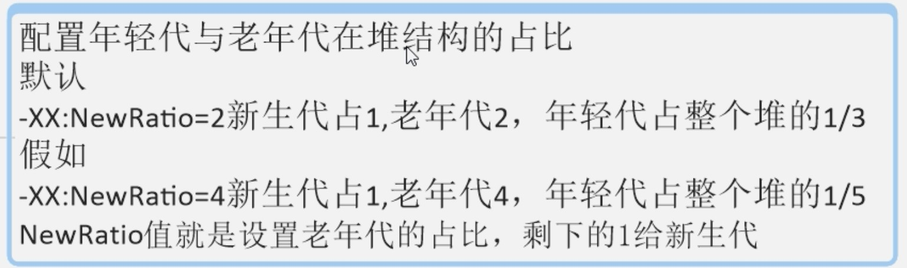


```
-XX:MaxTenuringThreshold
```


## 9.5各种引用

```java
主要分为4类：
    强引用；
    软引用；
    若引用；
    虚引用；
```

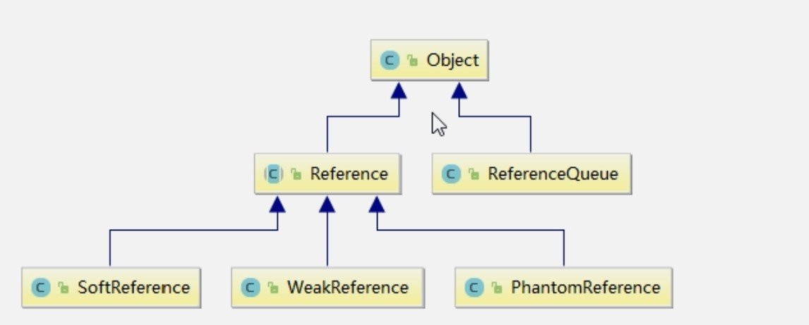


## 9.6强引用

```java
	当内存不足时，JVM开始垃圾回收，对于强引用的对象，就算是出现了OOM也不会对该对象进行回收,死都不收.
    强引用是我们最常见的普通对象引用,只要还有强引用指向一个对象,就能标明对象还"活着",垃圾收集器不会碰这种对象.在Java中最常见的就是强引用,把一个对象赋给一个引用变量,这个引用变量就是一个强引用.当一个对象被强引用变量引用时,它处于可达状态.它是不可能被垃圾回收机制回收的,即使该对象以后永远都不会被用到,JVM也不会回收它.因此强引用是造成Java内存泄漏的主要原因之一.
    对于一个普通的对象,如果没有其他的引用关系,只要超过了引用的作用域或者显式地将相应(强)引用赋值为null,一般认为就是可以被垃圾收集的了(当然具体回收时机还是要看垃圾收集策略).
    案例代码如下:
```

```java
/**
 * 强引用案例
 * @author Leemi
 *
 */
public class Demo1 {
	public static void main(String[] args) {
		Object obj1 = new Object();//这样的定义默认就是强引用
		Object obj2 = obj1;;
		
		obj1 = null;
		System.gc();
		
		System.out.println(obj1);//为null
		System.out.println(obj2);//还是指向Object对象，没有被回收
	}
}

```


## 9.7软引用

```java
	软引用是一种相对强引用弱化了一些的引用,需要用java.lang.ref.SoftReference类来实现,可以让对象豁免一些垃圾收集.
    对于软引用的对象来说:
		当系统内存充足时,不会被回收;
		当系统内存不足时,会被回收;
	软引用通常用在对内存敏感的程序中,比如高速缓存就用到了软引用,内存够用的时候就保留,不够用就回收.
    示例代码如下：
```

```java
import java.lang.ref.SoftReference;

/**
 * 软引用案例
 * @author Leemi
 *
 */
public class Demo2 {
	public static void main(String[] args) {
//		memoryEnough();
		memoryNotEnough();
	}
	
	//内存充足的时候
	public static void memoryEnough() {
		Object o1 = new Object();
		SoftReference<Object> softReference = new SoftReference<>(o1);
		System.out.println(o1);
		System.out.println(softReference.get());
		
		o1=null;
		System.gc();
		
		System.out.println(o1);
		System.out.println(softReference.get());
	}
	
	//内存不足的时候
	//故意产生大对象并配置小内存，让它产生OOM,看软引用回收情况
	//设置 -Xms5m -Xmx5m -XX:+PrintGCDetails
	public static void memoryNotEnough() {
		Object o1 = new Object();
		SoftReference<Object> softReference = new SoftReference<>(o1);
		System.out.println(o1);
		System.out.println(softReference.get());
		
		o1 = null;
		
		try {
			byte[] arr = new byte[30*1024*1024];
		} catch( Throwable t) {
			t.printStackTrace();
		} finally {
			System.out.println(o1);
			System.out.println(softReference.get());
		}
	}
}

```


## 9.8弱引用

```java
用java.lang.WeakReference类来实现，它比软引用的生命周期更短。
对于只有弱引用的对象来说，只要垃圾回收机制一运行，不管JVM的内存空间是否足够，都会回收该对象占用的内存。
示例代码如下：
```

```java
import java.lang.ref.WeakReference;

public class Demo3 {
	public static void main(String[] args) {
		Object o1 = new Object();
		WeakReference<Object> weakReference = new WeakReference<Object>(o1);
		System.out.println(o1);
		System.out.println(weakReference.get());
		
		o1 = null;
		System.gc();
		System.out.println("=========");
		
		System.out.println(o1);
		System.out.println(weakReference.get());
	}
}

```


## 9.9软弱引用适用场景

```java

```

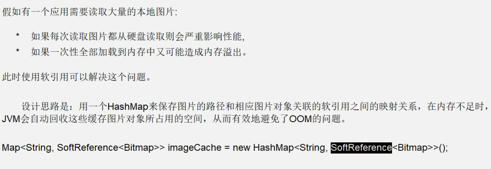