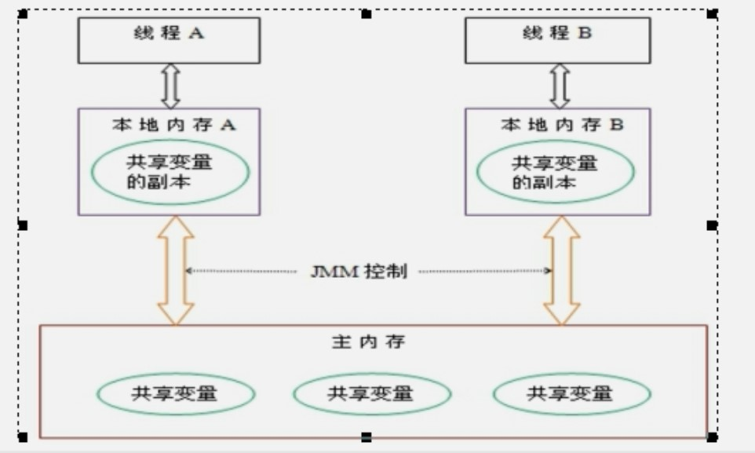
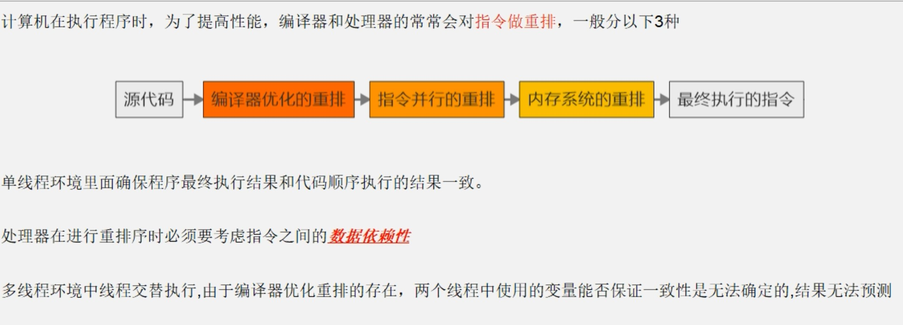
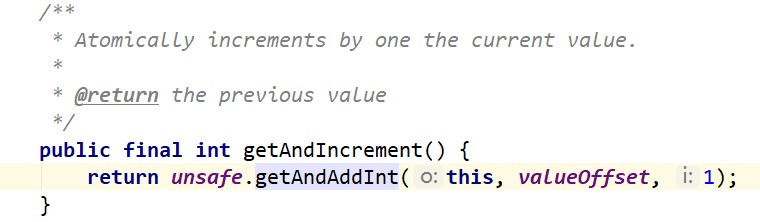
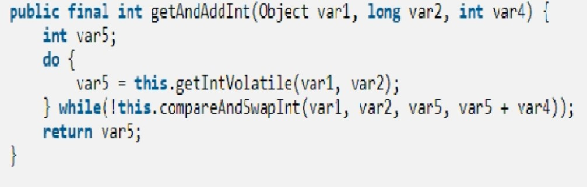
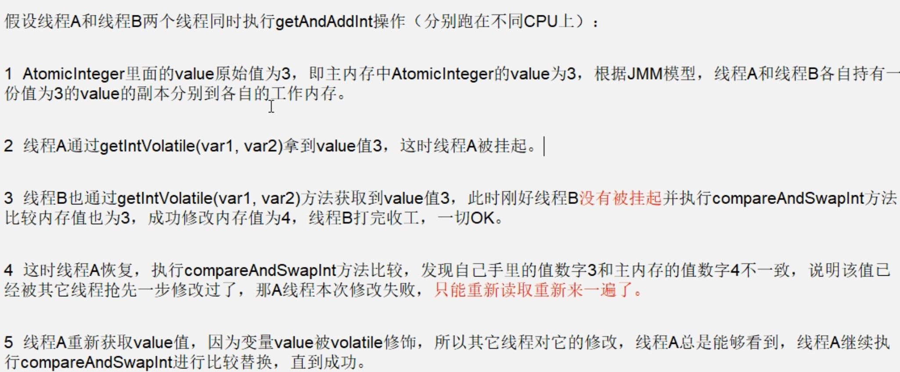
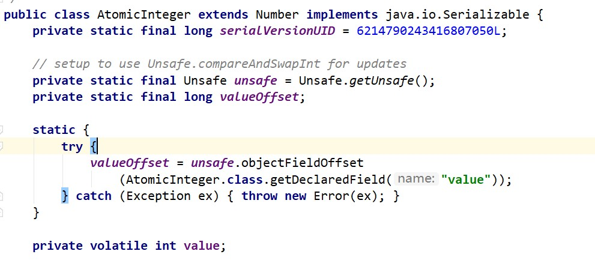

# 1.volatile

## 1.1概念

​				volatile是java虚拟机提供的轻量级同步机制。

​				三大特性：保证可见性；不保证原子性；禁止指令重排；

## 1.2JMM可见性

​				Java内存模型，Java Memory Model，简称JMM。本身是一种抽象的概念，并不真实存在，它描述的是一组规则或规范，通过这组规范定义了程序中各个变量（包括实例字段，静态字段和构成数组对象的元素）的访问方式。


​				JMM要求的三个特性：

​					1.可见性；

​					2.原子性；

​					3.有序性；


​				由于JVM运行程序的实体是线程，每个线程创建时，JVM都会为其创建一个工作内存（有些地方称为栈空间），工作内存是每个线程的私有数据区域，而Java内存模型中规定所有变量都存储在主内存，主内存是共享内存区域，所有线程都可以访问，但线程对变量的操作（读取赋值等）必须在工作内存中进行，然后对变量进行操作，操作完成后再将变量写回主内存，不能直接操作主内存中的变量，各个线程中的工作内存中存储着主内存中的变量副本拷贝，因此不同线程间无法访问其他线程的工作内存，线程间的通信（传值）必须通过主内存来完成，其简要访问过程如下图：



​				JMM关于同步的规定：

​					1.线程解锁前，必须把共享变量的值刷新回主内存；

​					2.线程加锁前，必须读取主内存的最新值到自己的工作内存；

​					3.加锁解锁是同一把锁；

## 1.3volatile可见性

​				示例代码如下：

```java
/**
 * 1，验证volatile的可见性
 * 
 * @author Leemi
 *
 */
public class Demo1 {
	public static void main(String[] args) {
		MyData myData = new MyData();
		new Thread(() -> {
			System.out.println(Thread.currentThread().getName() + "\t come in");
			// 线程暂停一会儿
			try {
				TimeUnit.SECONDS.sleep(3);
			} catch (InterruptedException e) {
				e.printStackTrace();
			}
			myData.addTo60();
			System.out.println(Thread.currentThread().getName() + "\t updated num:" + myData.num);
		}, "AAA").start();

		// 第二个线程就是我们的main线程
		while (myData.num == 0) {
			// main线程就再这里一直等待，直到num!=0
		}
		System.out.println(Thread.currentThread().getName() + "\t main mission is over, now num is :" + myData.num);

	}
}

class MyData {
	volatile int num = 0;

	public void addTo60() {
		this.num = 60;
	}
}

```

## 1.4volatile不保证原子性

​				通过前面对JMM的介绍，我们知道各个线程对主内存中的共享变量的操作都是各个线程各自拷贝到各自的工作内存进行操作后再写到主内存中的。

​				这样就存在一个问题：

​				如果一个线程AAA修改了共享变量x的值但还未写入到主内存中时，另外一个线程BBB又对主内存中的同一个变量x进行操作，但此时AAA线程的工作内存中的共享变量x对线程BBB不可见，这种工作内存与主内存同步延迟现象造成了可见性问题。

​				首先看个volatile不保证原子性的案例，代码如下：

```java
/**
 * 2，验证volatile不保证原子性
 * @author Leemi
 *
 */
public class Demo2 {
	public static void main(String[] args) {
		MyData2 myData2 = new MyData2();
		
		for( int i=0; i<20; i++ ) {
			new Thread( ()->{
				for( int j=0; j<1000; j++ ) {
					myData2.addPP();
				}
			},String.valueOf(i) ).start();
		}
		
		//等待上面20歌线程结束后，main线程再看看num的最终值是多少
		while (Thread.activeCount() >2) {
			Thread.yield();
		}
		
		System.out.println(Thread.currentThread().getName()+"\t finally num is:"+myData2.num);
		
	}
}

class MyData2 {
	volatile int num = 0;
	public void addTo60() {
		this.num = 60;
	}	
	public void addPP() {
		this.num++;
	}
}

```

​				那么如何解决呢？可以使用juc包里面的AtomicInteger类。

​				java.util.concurrent.atomic包里面有很多保证原子性的类。


## 1.5volatile禁止指令重排

​				首先，何为指令重排？见下图:




​				volatile实现了禁止指令重排优化，从而避免了多线程环境下程序出现乱序执行的现象。

​				工作内存与主内存同步延迟现象导致的可见性问题可以使用synchronized或volatile关键字解决，它们都可以使一个线程修改后的变量立即对其他线程可见。

​				对于指令重排导致的可见性问题和有序性问题，可以用volatile解决，因为volatile的作用之一就是禁止指令重排序优化。

## 1.6volatile单例模式

​				单例模式有一种写法使用了"双端检索机制",代码如下：

```java
public class SingletonDemo {
	
	private static SingletonDemo instance = null;
	
	//构造方法私有化
	private SingletonDemo() {
		System.out.println(Thread.currentThread().getName()+"\t 我是构造方法 private SingletonDemo()");
	}
	
	//DCL (Double Check Lock) 双端检锁机制
	public static SingletonDemo getInstance() {
		if( instance == null ) {
			synchronized(SingletonDemo.class) {
				if( instance == null ) {
					instance = new SingletonDemo();
				}
			}
		}
		return instance;
	}
    
}
```

​				但是“双端检索机制不一定安全”，原因是有指令重排序存在，加入volatile可以禁止指令重排。

​				原因在于某一个线程执行到第一次检测，读到的instance不为null，instance的引用对象可能没有完成初始化。	SingletonDemo instance = new SingletonDemo()；可以分为以下三步（伪代码）：

​				memory = allocate(); //1.分配地址；

​				instance(memory); //2.初始化对象；

​				instance = memory; //3.设置instance指向刚分配的内存地址，此时instance != null;

​				步骤1和步骤2不存在依赖关系，而且无论重排前还是重排后，程序的执行结果在单线程中并没有改变，因此这种指令重排是允许的。就有可能执行顺序如下：

​				memory = allocate(); //1.分配地址；

​				instance = memory; //3.设置instance指向刚分配的内存地址，此时instance != null,但是对象还没有初始化;

​				instance(memory); //2.初始化对象；

​				但是指令重排只会保证串行语义的执行的一致性（单线程），并不会关系多线程之间语义的一致性。所以当一条线程访问instance不为null时，由于instance实例未必初始化完成，也就造成了线程安全问题。

​				使用volatile即可解决，上面代码修改一处地方：

```java
private static volatile SingletonDemo instance = null;
```


# 2.CAS

## 2.1引入

​				比较和交换（Conmpare And Swap）简称为CAS。

## 2.2CAS底层原理

### 2.2.1 Unsafe类

​				Unsafe类是java的核心类，由于java方法无法直接访问底层系统，需要通过本地（native）方法访问，Unsafe相当于一个后门，基于该类可以直接操作特定内存的数据。Unsafe存在于sun.misc中，其内部方法操作可以像C的指针一样直接操作内存，因为Java中CAS的操作的执行依赖于Unsafe类的方法。

​				注意！Unsafe类中的左右方法都是用native修饰的，也就是说Unsafe类中的方法都直接调用操作系统底层资源执行相应任务。


​				下面以 AtomicReference 的 compareAndSet 方法为例，分析CAS原理：



​				变量valueOffset，表示该变量值在内存中的偏移地址，因为Unsafe就是根据内存偏移地址来获取数据的。



​				上面这个是自旋锁原理（后面会详述）。




​				附注：变量value用volatile修饰，保证了多线程之间的内存可见性。



## 2.3概念

​				CAS全称Conmpare And Swap，它是一条CPU并发原语。它的功能是判断内存某个位置的值是否为预期值，如果是，则更改为新的值，这个过程是原子的。

​				CAS的并发原语体现在Java语言中就是sun.misc.Unsafe类中的各个方法。调用Unsafe类中的CAS方法，JVM会帮我们实现出CAS汇编指令。这是一种完全依赖于硬件的功能，通过它实现了原子操作。

​				再次强调！由于CAS是一种系统原语，原语属于操作系统用语范畴，是由若干条指令组成的，用于完成某个功能的一个过程，并且原语的执行必须是连续的，在执行过程中不允许被中断，也就是说，CAS是一条CPU的原子指令，不会造成所谓的数据不一致问题。

## 2.4CAS缺点

​				1.循环时间长，开销大：如果CAS失败，就会一直进行尝试，如果CAS长时间一直不成功，可能会给CPU带来很大的开销；

​				2.只能保证一个共享变量的原子操作;

​				3.引出ABA问题；

## 2.5 ABA问题

​				CAS算法会导致ABA问题。

​				CAS算法实现一个重要前提需要取出内存中某时刻的数据并在当下时刻比较并替换，那么这个时间差会导致数据的变化。比如说线程ONE从内存中取出A，这时候另一个线程TWO也从内存中取出A，并且线程TWO进行了一些操作将A变成了B，然后线程TWO又将B变回A，这时候线程ONE进行CAS操作发现内存中仍然是A，然后线程ONE操作成功。

​				尽管线程ONE的CAS操作成功，但并不代表这个过程没问题。

## 2.6原子引用

​				java.util.concurrent.atomic 包里的 AtomicReference<V> 类,示例代码如下：

```java
public class Demo2 {
	public static void main(String[] args) {
		User u1 = new User("张三",18);
		User u2 = new User("李四",19);
		AtomicReference<User> atomicReference = new AtomicReference<>();
		atomicReference.set(u1);
		
		System.out.println(atomicReference.compareAndSet(u1, u2)+"\t "+atomicReference.get().toString());
		System.out.println(atomicReference.compareAndSet(u1, u2)+"\t "+atomicReference.get().toString());
	}
}


class User{
	String name;
	int age;
	public User(String name, int age) {
		super();
		this.name = name;
		this.age = age;
	}
	@Override
	public String toString() {
		return "User [name=" + name + ", age=" + age + "]";
	}
}
```

## 2.7ABA问题解决

​				使用java.util.concurrent.atomic.AtomicStampedReference类,代码如下：

```java
/**
 * ABA问题解决
 * @author Leemi
 *
 */
public class Demo3 {
	
	static AtomicReference<Integer> atomicReference = new AtomicReference<>(100);
	static AtomicStampedReference<Integer> atomicStampReference= new AtomicStampedReference<>(100,1);
	
	public static void main(String[] args) {
		
		System.out.println("===============以下是ABA问题的产生================");
		new Thread( ()->{
			atomicReference.compareAndSet(100, 101);
			atomicReference.compareAndSet(101, 100);
		},"t1").start();
		
		new Thread( ()->{
			//t2线程暂停1秒，确保t1线程完成了一次ABA
			try {
				TimeUnit.SECONDS.sleep(1);
			} catch (InterruptedException e) {
				e.printStackTrace();
			}
			System.out.println(atomicReference.weakCompareAndSet(100, 2019)+"\t :"+atomicReference.get());
		}).start();
		
		try {
			TimeUnit.SECONDS.sleep(2);
		} catch (InterruptedException e) {
			e.printStackTrace();
		}
		
		System.out.println("===============以下是ABA问题的解决================");
		new Thread( ()->{
			int stamp = atomicStampReference.getStamp();
			System.out.println(Thread.currentThread().getName()+"\t 第一次版本号："+stamp);
			//t3进程暂停1秒，
			try {
				TimeUnit.SECONDS.sleep(1);
			} catch (InterruptedException e) {
				e.printStackTrace();
			}
			atomicStampReference.compareAndSet(100, 101, atomicStampReference.getStamp(), atomicStampReference.getStamp()+1);
			System.out.println(Thread.currentThread().getName()+"\t 第二次版本号："+atomicStampReference.getStamp());
			atomicStampReference.compareAndSet(101, 100, atomicStampReference.getStamp(), atomicStampReference.getStamp()+1);
			System.out.println(Thread.currentThread().getName()+"\t 第三次版本号："+atomicStampReference.getStamp());
		},"t3").start();
		
		new Thread( ()->{
			int stamp = atomicStampReference.getStamp();
			System.out.println(Thread.currentThread().getName()+"\t 第一次版本号："+stamp);
			//t4进程暂停3秒，保证t3线程完成一次ABA
			try {
				TimeUnit.SECONDS.sleep(3);
			} catch (InterruptedException e) {
				e.printStackTrace();
			}
			boolean flag = atomicStampReference.compareAndSet(100, 2019, stamp, stamp+1);
			System.out.println(Thread.currentThread().getName()+"\t "+flag+"\t 当前版本号："+atomicStampReference.getStamp());
			System.out.println(Thread.currentThread().getName()+"\t 当前最新值s："+atomicStampReference.getReference());
		},"t4").start();
		
	}
}

```


# 3.并发集合

## 3.1集合并发安全引入

​				例：ArratList 是线程不安全的。

```java
/**
 * 集合类不安全问题,举例ArrayList
 * @author Leemi
 *
 */
public class Demo1 {
	public static void main(String[] args) {
//		List<String> list = new ArrayList<>();//线程不安全
//		List<String> list = new Vector<>();//线程安全
		List<String> list = Collections.synchronizedList(new ArrayList<>());//线程安全
		
		for( int i=1; i<=30; i++ ) {
			new Thread(()->{
				list.add(UUID.randomUUID().toString().substring(0, 8));
				System.out.println(list);
			}).start();
		}
		
		//java.util.ConcurrentModificationException并发修改异常
	}
}
```

## 3.2写时复制

​				如果不使用Vector或Collections，还有别的方法保证线程安全吗？

​				有，可以使用java.util.concurrent.CopyOnWriteArrayList。它用到了写时复制。

```java
List<String> list = new CopyOnWriteArrayList<>();
```

​				

​				写时复制：

​				CopyOnWrite容器即写时复制容器。往一个容器添加元素的时候，不直接往Object[ ]里添加，而是将当前容器Object[ ] 进行Copy,复制出一个新的容器 Object[ ] elements，然后往新的容器 Object[ ] elements里添加元素，添加完元素后，再将原容器的引用指向新的容器 setArray(newElements)；这样做的好处是可以对CopyOnWrite容器进行并发地读，而不需要加锁，因为当前容器不会添加任何元素。所以CopyOnWrite容器也是一种读写分离地思想，读和写不同地容器。

​				源码如下：

```java
    public boolean add(E e) {
        final ReentrantLock lock = this.lock;
        lock.lock();
        try {
            Object[] elements = getArray();
            int len = elements.length;
            Object[] newElements = Arrays.copyOf(elements, len + 1);
            newElements[len] = e;
            setArray(newElements);
            return true;
        } finally {
            lock.unlock();
        }
    }
```

​				与CopyOnWriteArrayList类似地还有CopyOnWriteArraySet，ConcurrentHashMap。


# 4.Java锁

## 4.1公平非公平锁

​				-公平锁：多个线程按照申请锁的顺序来获取锁，类似排队打饭，先来后到；

​				-非公平锁：多个线程获取锁的顺序并不是按照申请锁的顺序，有可能后申请的线程比先申请的线程优先获取锁，在高并发情况下，有可能会造成优先级反转或饥饿现象。

​				并发包中的ReentrantLock的创建可以指定构造函数中的boolean变量来得到公平锁或非公平锁，默认是非公平锁；


​				关于二者区别：

​				公平锁：在并发环境中，每个线程在获取锁时会先查看此锁维护的等待队列，如果为空，或者当前线程是等待队列的第一个，就占有锁，否则就会加入到等待队列中，以后会按照FIFO的顺序从队列中取到自己；

​				非公平锁：比较粗鲁，上来就直接尝试占有锁，如果尝试失败，就再采用类似公平锁的那种方式；非公平锁的优点在于吞吐量比公平锁大。Synchronized也是非公平锁；


## 4.2可重入锁(递归锁)

​				可重入锁也叫递归锁，指的是同一线程外层函数获得锁之后，内层递归函数仍能获取该锁的代码，再同一个线程再外层方法获取锁的时候，在内层方法会自动获取锁。也就是说，线程可以进入任何一个它已经拥有的锁锁同步着的代码块。

​				ReentrantLock 和 Synchronized 就是典型的可重入锁；

​				可重入锁的最大作用就是避免死锁；！！！

​				示例代码如下：

```java
/**
 * 可重入锁
 * @author Leemi
 *
 */
public class Demo2 {
	public static void main(String[] args) throws Exception {
		Phone p = new Phone();
		
		new Thread(()->{
			try {
				p.sendMSM();
			} catch (Exception e) {
				e.printStackTrace();
			}
		},"t1").start();
		
		new Thread(()->{
			try {
				p.sendMSM();
			} catch (Exception e) {
				e.printStackTrace();
			}
		},"t2").start();
		TimeUnit.SECONDS.sleep(2);
		System.out.println("=========================");
		
		Thread t3 = new Thread(p, "t3");
		Thread t4 = new Thread(p, "t4");
		t3.start();
		t4.start();
	}
}

class Phone implements Runnable{
	
	public synchronized void sendMSM() throws Exception{
		System.out.println(Thread.currentThread().getName()+"\t sendMSM()");
		sendEmail();
	}
	public synchronized void sendEmail() throws Exception{
		System.out.println(Thread.currentThread().getName()+"\t ###########sendEmail()");
	}
	
	////////////////////////////////////////////////////////////
	Lock lock = new ReentrantLock();
	@Override
	public void run() {
		get();
	}
	public void get() {
		lock.lock();
		try {
			System.out.println(Thread.currentThread().getName()+"\t get()");
			set();
		}finally {
			lock.unlock();
		}
	}
	public void set() {
		lock.lock();
		try {
			System.out.println(Thread.currentThread().getName()+"\t set()");
		}finally {
			lock.unlock();
		}
	}
	
}

```


## 4.3自旋锁

​				自旋锁，是指尝试获取锁的线程不会立即阻塞，而是采用循环的方式去尝试获取锁，这样的好处是减少线程上下文切换的消耗，缺点是循环会消耗cpu。

​				示例代码如下：

```java
/**
 * 自旋锁
 * @author Leemi
 *
 */
public class Demo3 {
	
	//原子引用线程
	AtomicReference<Thread> atomicReference = new AtomicReference<>();
	
	public void myLock() {
		Thread thread = Thread.currentThread();
		System.out.println(Thread.currentThread().getName()+"\t come in! ");
		while( !atomicReference.compareAndSet(null, thread) ) {
			
		}
	}
	
	public void myUnlock() {
		Thread thread = Thread.currentThread();
		atomicReference.compareAndSet(thread, null);
		System.out.println(Thread.currentThread().getName()+"\t unlocked! ");
	}
	
	public static void main(String[] args) {
		Demo3 demo3 = new Demo3();
		
		new Thread( ()->{
			demo3.myLock();
			try {
				TimeUnit.SECONDS.sleep(5);
			} catch (InterruptedException e) {
				e.printStackTrace();
			}
			try {
				TimeUnit.SECONDS.sleep(5);
			} catch (InterruptedException e) {
				e.printStackTrace();
			}
			demo3.myUnlock();
		},"AAA").start();
		
		try {
			TimeUnit.SECONDS.sleep(1);
		} catch (InterruptedException e) {
			e.printStackTrace();
		}
		
		new Thread( ()->{
			demo3.myLock();
			try {
				TimeUnit.SECONDS.sleep(1);
			} catch (InterruptedException e) {
				e.printStackTrace();
			}
			demo3.myUnlock();
		},"BBB").start();
		
	}
	
}

```


## 4.4读写锁

​				独占锁：指该锁一次只能被一个线程所持有，ReentrantLock 和 Synchronized 都是独占锁；

​				共享锁：指该锁可以被多个线程所占有。对于ReentrantReadWriteLock，其读锁是共享锁，其写锁是独占锁。该锁的共享锁可保证并发读是非常高效的，读写，写读，写写的过程是互斥的。

​				示例代码如下：

```java
package com.interview.lock;

import java.util.HashMap;
import java.util.Map;
import java.util.concurrent.TimeUnit;
import java.util.concurrent.locks.ReentrantReadWriteLock;

/**
 * 读-读	能共存
 * 读-写	不能共存
 * 写-写	不能共存
 * @author Leemi
 *
 */
public class Demo4 {
	public static void main(String[] args) {
		MyCache myCache = new MyCache();
		
		for( int i=1; i<=5; i++ ) {
			final int tempInt = i;
			new Thread( ()->{
				myCache.put(tempInt+"", tempInt+"");
			},String.valueOf(i)).start();
		}
		
		for( int i=1; i<=5; i++ ) {
			final int tempInt = i;
			new Thread( ()->{
				myCache.get(tempInt+"");
			},String.valueOf(i)).start();
		}
		
	}
}

class MyCache{
	private volatile Map<String,Object> map = new HashMap<>();
	private ReentrantReadWriteLock rwLock =  new ReentrantReadWriteLock();
	
	public void put( String key, Object value ) {
		rwLock.writeLock().lock();
		try {
			System.out.println(Thread.currentThread().getName()+"正准备写入:\t "+key);
			try {TimeUnit.MICROSECONDS.sleep(300);} 
			catch (InterruptedException e) {e.printStackTrace();}
			map.put(key, value);
			System.out.println(Thread.currentThread().getName()+"写入完成");
		} finally {
			rwLock.writeLock().unlock();
		}
	}
	
	public void get( String key )  {
		rwLock.readLock().lock();
		try {
			System.out.println(Thread.currentThread().getName()+"正准备读 ");
			try {TimeUnit.MICROSECONDS.sleep(300);} 
			catch (InterruptedException e) {e.printStackTrace();}
			Object result = map.get(key);
			System.out.println(Thread.currentThread().getName()+"读取完成"+result);
		} finally {
			rwLock.readLock().unlock();
		}
	}
}

```


## 4.5CountDownLatch

​				一个同步辅助类，在完成一组正在其他线程中执行的操作之前，它允许一个或多个线程一直等待。 

用给定的*计数* 初始化 `CountDownLatch`。由于调用了 [`countDown()`](../../../java/util/concurrent/CountDownLatch.html#countDown())  方法，所以在当前计数到达零之前，[`await`](../../../java/util/concurrent/CountDownLatch.html#await())  方法会一直受阻塞。

​				示例代码如下：

```java
package com.interview.lock;

import java.util.concurrent.CountDownLatch;

public class Demo5 {
	public static void main(String[] args) throws Exception {
		
		CountDownLatch countDownLatch = new CountDownLatch(6);
		
		for( int i=1; i<=6; i++ ) {
			new Thread( ()->{
				System.out.println(Thread.currentThread().getName()+"号学生上完自习走人");
				countDownLatch.countDown();
			}).start();
		}
		
		countDownLatch.await();
		System.out.println("==========================班长关教室");
	}
}

```

